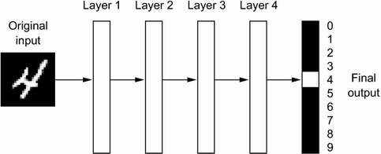
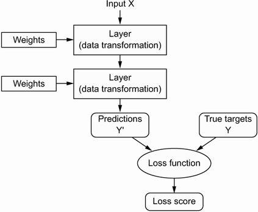
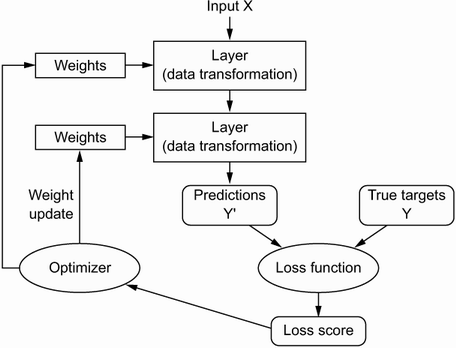

<title>Deep Learning with Python: Chapter 1</title>

# Deep Learning with Python

This article is part 1/13 (?) of a series of articles named *Deep Learning with Python*.

In this series, I will read through the second edition of *Deep Learning with Python* by François Chollet.
Articles in this series will sequentially review key concepts, examples, and interesting facts from each chapter of the book.

## Why this book?

There are a few reasons why I picked this book over others:

1. I've heard this book referred to as the "bible of deep learning" from engineers within the AI community
1. The author is quite knowledgeable (see `About the author` section below)
1. Opportunity for me to learn a new ML framework. This book teaches Tensorflow and Keras vs PyTorch which I am already familiar with. It'll be useful for me to compare and contrast the frameworks.
1. Originally published in 2017 and recently updated in 2021 to include 1/3 new content (Transformers) and 75% refreshed content

## About the author

Directly from the book...

> François Chollet is the creator of Keras, one of the most widely used deep learning frameworks.
> He is currently [as of April 2022] a software engineer at Google, where he leads the Keras team.
> In addition, he does research on abstraction, reasoning, and how to achieve greater generality in artificial intelligence.

---
# Chapter 1: What is deep learning?

This chapter provides essential context around artificial intelligence (AI), machine learning (ML), and deep learning (DL).

---
## Artificial Intelligence

<figure class="right">
    
    <figcaption>Deep learning is a subfield of machine learning, which is a subfield of artificial intelligence</figcaption>
</figure>

AI can be described as *the effort to automate intellectual tasks normally performed by humans*.
Artificial intelligence is a general field that encompasses machine learning and deep learning.

### Symbolic AI
Early AI programs from 1950s - such as Chess AI - involved hardcoded rules crafted by programmers.
This approach is known as *symbolic AI*, and was the dominant paradigm in AI from the 50s to the late 1980s.
Symbolic AI reached its peak popularity during the *expert systems* boom of the 80s.

Symbolic AI is successful when applied to well-defined, logical problems like Chess or Go.
However, symbolic AI fails when solving more complex, fuzzy problems because it's not possible to hardcode rules for such tasks.
Perceptual tasks normally performed by humans - such as image classification, speech recognition, or natural language processing - are especially complex and cannot be accurately distilled into a set of rules.

By the early 1990s, expert systems were proven expensive to maintain, difficult to scale, and limited in scope.
Interest in AI dwindled until the late 2000s when new machine learning approaches were developed.

---
## Machine Learning

> Could a general-purpose computer "originate" anything, or would it always be bound to dully execute processes we humans fully understand?
> Could it learn from experience?
> Could it show creativity?
>
> *- Ada Lovelace's remarks on the invention of the Analytical Engine, 1843*

Lovelace's remark was later quoted by AI pioneer Alan Turing as "Lady Lovelace's objection" in his landmark paper "Computing Machinery and Intelligence".
Alan Turing's paper introduced the *Turing test* as well as key concepts that would come to shape AI.

### Classical Programming vs Machine Learning

<figure class="right">
    
    <figcaption>Classical programming vs machine learning</figcaption>
</figure>

Classical programming is the usual way to make a computer perform useful tasks.
A human programmer designs explicit *rules* - a computer program - to be followed.
The computer, given a set of rules and input data, outputs appropriate answers.

*Machine Learning* flips this concept around: the computer looks at the input data and the appropriate answers, and figures out what the rules should be.
ML systems are *trained* rather than explicitly programmed.
Presented with many examples of a task (training data), the machine finds statistical structures in the examples and eventually allows the system to determine rules for automating the task.

### What's needed to do Machine Learning?

1. *Input data points*:
For example, if the task is speech recognition, the data points could be sound files of people speaking.
If the task is image classification, they could be pictures.
2. *Examples of the expected output*:
In a speech-recognition task, these could be human-generated transcripts of sound files.
In an image task, expected outputs could be tags such as "cat", "dog", "bird", etc.
3. *A way to measure whether the algorithm is doing a good job*:
This is required in order to determine the distance between the algorithm's current output and its expected output.
The measurement is used as a feedback signal to adjust the algorithm.
This adjustment step is what we call *learning*.

### How does a machine learn?

*Learning*, in the context of ML, describes an automatic search process for data transformations that produces useful representations of data.
The search process is guided by some feedback signal.

A machine learning model transforms its input data into meaningful outputs, a process that is "learned" from exposure to examples of inputs and outputs during training.
Therefore, the central problem in ML is to *meaningfully transform data*.
The transformations and representations are amenable to simpler rules for solving the task at hand.

In other words, ML's purpose is to learn useful *representations* of the input data at hand - representations that get us closer to the expected output.

### Machine Learning simplified

In short, machine learning is searching for useful representations and rules over some input data, within a predefined space of possibilities, by performing data transformations and using guidance from a feedback signal.
This simple idea allows for solving a remarkably broad range of intellectual tasks, from speech recognition to autonomous driving.

If that's not simple enough: Machine learning is about mapping inputs to labels - such as images of a cat to the label "cat" - by observing many examples of inputs and targets.

---
## Deep Learning

Deep learning is a specific subfield of machine learning.
It's a new take on learning representations from data that puts emphasis on learning successive layers of increasingly meaningful representations.
The "deep" in "deep learning" refers to successive layers of representations.
How many layers contributes to a model of the data is called the *depth* of the model.

Most approaches to machine learning focus on learning only one or two layers of representations of the data; hence they're sometimes called *shallow learning*.
Modern deep learning, on the other hand, often involves tens or even hundreds of successive layers of representations.

### Neural Networks

<figure class="right">
    
    <figcaption>High-level overview of neural network layers</figcaption>
</figure>

In DL, representations are learned via models called *neural networks*, structured in literal layers stacked on top of each other.
Although the term "neural network" refers to neurobiology, and some central concepts in DL were developed in part by inspiration from our understanding of the brain, deep learning models are **not** models of the brain.

<figure class="right">
    
    <figcaption>Data representations learned at each layer</figcaption>
</figure>

Given an input, such as an image, the neural network applies a sequence of simple data transformations to the image at each successive layer, creating a different data representation at each layer.
As the image travels through the layers, representations become increasingly different from the original image and increasingly informative about the final result.

You can think of a deep network as a multistage *information distillation* process, where information goes through successive filters and come out increasingly *purified*.

### Layers, Weights, and Parameters

Recall that each layer performs a simple data transformation to the input in order to create a more pure, or simple, data representation.
The specification of what a layer does to its input data - *how* the input is transformed - is stored in the layer's *weights*, which in essence are a bunch of numbers.

Technically, we'd say that the transformation implemented by a layer is *parametrized* by its weights.
Weights are sometimes called the *parameters* of a layer.

<figure class="center">
    
    <figcaption>Layers parametrized by their weights</figcaption>
</figure>

### How does a neural network learn?

In this context of DL and neural networks, *learning* means finding a set of values for the weights of all layers in a network, such that the network will correctly map example inputs to their associated targets.
The correct set of weights is found by measuring how far the output is from what was expected, and adjusting the weights such that the output is incrementally closer to the expected output.

The output measurement and weight adjustment are the jobs of the network's *loss function* and *optimizer*, respectively.

### Loss Function and Optimizer

The network's *loss function* - also sometimes called the *objective* or *cost* function - compares the network's prediction against the true target (what you wanted/expected the network to output), and computes a loss score.
This loss score captures how well the network is doing during training.

<figure class="center">
    
    <figcaption>Loss function measures the quality of the network's output</figcaption>
</figure>

The fundamental trick in deep learning is to use this score as a feedback signal for slightly adjusting the value of the layers' weights.
The weight adjustment should move in a direction that will lower, or minimize, the loss score for the current example.

<figure class="center">
    
    <figcaption>Loss score used as a feedback signal to adjust weights</figcaption>
</figure>

The weight adjustment is the job of the network's *optimizer*, which implements what's called the *backpropagation* algorithm: the central algorithm in DL.
The next chapter explains in more detail how backpropagation works.

### Neural Network training loop

Initially, the weights of the network are assigned random values, so the network implements a series of random transformation.
Naturally, the network's output is far from what it should ideally be, and the loss score is accordingly very high
With every example the network processes, the weights are slightly adjusted in the correct direction, and the loss score decreases.

This is the *training loop*, which, repeated a sufficient number of times (typically tens of iterations over thousands of examples), yields weight values that minimize the loss function.

A network with minimal loss is one for which the outputs are as close as they can be to the targets: a trained network.

### Deep Learning simplified

Technically, deep learning is a multistage way to learn data representations.
It's a simple idea with simple mechanisms that - when sufficiently scaled, ends up looking like magic.

---
## What has Deep Learning achieved so far?

Deep learning rose to prominence in the early 2010s, following the boom of publicly-available data on the internet (images, videos from widespread use of cell phones and cameras) and faster processors.
It has achieved nothing short of a revolution in the field of machine learning, producing remarkable results on perceptual tasks and even natural language processing tasks - problems involving skills that eem natural and intuitive to humans but have long been elusive for machines.

More specifically, deep learning has enabled the following breakthroughs, all in historically difficult areas of machine learning:

* Near-human-level...
    * Image classification
    * Speech transcription
    * Handwriting transcription
    * Autonomous driving
* Dramatically improved...
    * Machine translation
    * Text-to-speech conversion
    * Ad targeting
    * Search results on the web
* Digital assistants such as Google Assistant, Apple Siri, and Amazon Alexa
* Superhuman Go, Chess, video game playing
* Ability to answer natural language questions