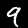
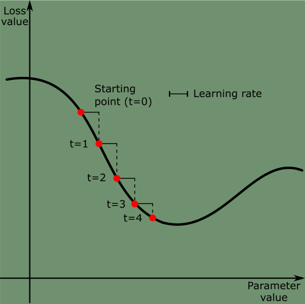
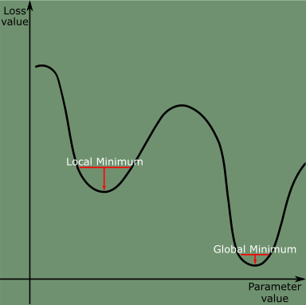
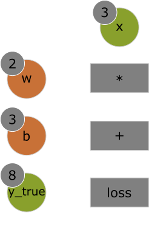
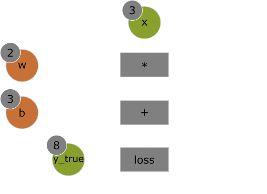
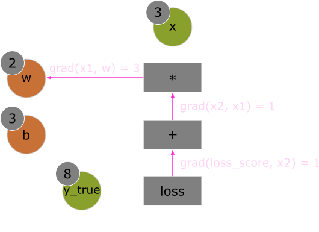

<title>Deep Learning with Python: Chapter 2 - Mathematical building blocks of neural networks</title>


# Deep Learning with Python  <!-- omit in toc -->

This article is part 2/13 (?) of a series of articles named *Deep Learning with Python*.

In this series, I will read through the second edition of *Deep Learning with Python* by François Chollet.
Articles in this series will sequentially review key concepts, examples, and interesting facts from each chapter of the book.

<details>
    <summary>Table of Contents</summary>

- [Chapter 2: The mathematical building blocks of neural networks](#chapter-2-the-mathematical-building-blocks-of-neural-networks)
    - [First look at neural networks](#first-look-at-neural-networks)
        - [The problem](#the-problem)
        - [Defining the network architecture](#defining-the-network-architecture)
        - [Preparing the model for training](#preparing-the-model-for-training)
        - [Preparing the data](#preparing-the-data)
        - ["Fitting" (Training) the model](#fitting-training-the-model)
        - [Making predictions with the trained model](#making-predictions-with-the-trained-model)
        - [Evaluating the model on new data](#evaluating-the-model-on-new-data)
    - [Data representations: Tensors](#data-representations-tensors)
        - [Scalars (rank-0 tensors)](#scalars-rank-0-tensors)
        - [Vectors (rank-1 tensors)](#vectors-rank-1-tensors)
        - [Matrices (rank-2 tensors)](#matrices-rank-2-tensors)
        - [Rank-3 and higher-rank tensors](#rank-3-and-higher-rank-tensors)
        - [Key attributes](#key-attributes)
    - [Real-world examples of data tensors](#real-world-examples-of-data-tensors)
        - [Vector](#vector)
        - [Timeseries data or sequence data](#timeseries-data-or-sequence-data)
        - [Image data](#image-data)
        - [Video data](#video-data)
    - [Tensor operations](#tensor-operations)
        - [Basic operations](#basic-operations)
        - [Element-wise operations](#element-wise-operations)
        - [Broadcasting](#broadcasting)
        - [Tensor product](#tensor-product)
        - [Tensor reshaping](#tensor-reshaping)
        - [Geometric interpretations](#geometric-interpretations)
    - [How neural networks learn](#how-neural-networks-learn)
        - [Gradient: The derivative of tensor operations](#gradient-the-derivative-of-tensor-operations)
        - [Gradient descent](#gradient-descent)
        - [Variants of gradient descent](#variants-of-gradient-descent)
        - [Gradient descent with momentum](#gradient-descent-with-momentum)
        - [Backpropagation](#backpropagation)
        - [Backpropagation algorithm](#backpropagation-algorithm)
        - [TensorFlow's gradient tape](#tensorflows-gradient-tape)
    - [Recap: Looking back at our first example](#recap-looking-back-at-our-first-example)
        - [Input](#input)
        - [Layers](#layers)
        - [Loss function and optimizer](#loss-function-and-optimizer)
        - [Training loop](#training-loop)
    - [Summary](#summary)
</details>

---
# Chapter 2: The mathematical building blocks of neural networks

This chapter covers...

* A first example of a neural network
* Tensors and tensor operations
* How neural networks learn via backpropagation and gradient descent

Understanding deep learning requires familiarity with many simple mathematical concepts: *tensors*, *tensor operations*, *differentiation*, *gradient descent*, and so on.
This chapter will build on the concepts above without getting overly technical.
The use of precise, unambiguous executable code, instead of mathematical notation, will allow most programmers to easily grasp these concepts.

---
## First look at neural networks

Concrete example of a neural network (NN) with the use of the Python library `Keras` to learn how to classify handwritten digits.

### The problem

The problem we're trying to solve here is to classify grayscale images of handwritten digits (28x28 pixels) into their 10 categories (digits 0 through 9).
This problem is commonly referred to as the "Hello World" of deep learning - it's what you do to verify your algorithms are working as expected.

> **NOTE: Classification problem keywords**
>
> In ML classification problems, a **category** is called a **class**.
> Data points - such as individual train or test images - are called **samples**.
> The class associated with a specific sample is called a **label**.

We'll be using the MNIST dataset: a set of 60,000 training images, plus 10,000 test images, assembled by the National Institute of Standards and Technology (the NIST in MNIST) in the 1980s.

The MNIST dataset is preloaded in `Keras`, in the form of four `NumPy` arrays

```python
from tensorflow.keras.datasets import mnist
(train_images, train_labels), (test_images, test_labels) = mnist.load_data()
```
Let's take a peek at the shape of the data.
We should see 60,000 training images and labels, 10,000 test images and labels.

```python
>>> train_images.shape
(60000, 28, 28)
>>> len(train_labels)
60000
>>> train_labels
array([5, 0, 4, ..., 5, 6, 8], dtype=uint8)
>>>
>>> test_images.shape
(10000, 28, 28)
>>> len(test_labels)
10000
>>> test_labels
array([7, 2, 1, ..., 4, 5, 6], dtype=uint8)
```

Let's look at a sample image using the `matplotlib` library:

```python
import matplotlib.pyplot as plt
digit = train_images[4]
plt.imgshow(digit, cmap=plt.cm.binary)
plt.show()
```
<details>
    <summary>Sample image</summary>
    <figure class="center">
        
        <figcaption>Sample image from MNIST dataset, train_images[4]</figcaption>
    </figure>

</details>


Lastly, let's look at what label corresponds to the previous image:

```python
>>> train_labels[4]
9
```

### Defining the network architecture

The core building block of a neural network is the *layer*.
A layer can be considered as a data filter: data goes in, and comes out more purified - more useful.
Specifically, layers extract *representations* out of the input data.

In deep learning models, simple layers are chains together to form a *data distillation* network.
Deep learning models could be visualized as a sieve for data processing - successive layers refining input data more and more.

The following example is a two-layer neural network.
We aren't expected to know exactly what the example means - we'll learn throughout the next two chapters.

The model consists of a sequence of two `Dense` layers, which are densely connected (also called *fully connected*).
The second layer is a 10-way *softmax classification* layer, which means it will return an array of 10 probability scores (summing to 1).
Each score will be the probability that the current digit image belongs to on our of 10 digit classes.

```python
from tensorflow import keras
from tensorflow.keras import layers
model = keras.Sequential([
    layers.Dense(512, activation="relu"),
    layers.Dense(10, activation="softmax")
])
```

### Preparing the model for training

Before we begin training, we must compile three more things, in addition to the training and testing data, as part of the *compilation* step:
We brushed over the jobs of the loss score and optimizer in the previous chapter.
The specifics of their jobs will be made clear throughout the next two chapters.

1. *An optimizer*: How the model will update itself - its weights - based on the training data it sees, so as a to improve its performance
1. *A loss function*: How the model will measure its performance on the training data and how it will be able to steer itself in the more correct direction
1. *Metrics to monitor during training and testing*: For now, we'll only care about accuracy - the fraction of images that were correctly classified

```python
model.compile(optimizer="rmsprop",
              loss="sparse_categorical_crossentropy",
              metrics=["accuracy"])
```

### Preparing the data

Before training, we'll preprocess the data to ensure consistent data shapes and scales during training.
We'll reshape the data into the shape the model expects and scale it so that all values are in the [0, 1] interval instead of [0, 255] interval.

The training image data will transform from a `uint8 ` array of shape `(60000, 28, 28)` with values between [0, 255] to a `float32` array of shape `(60000, 28*28)` with values between [0, 1].
The same reshaping and reformatting process is applied to the testing image data.

```python
train_images = train_images.reshape((60000, 28*28))
train_images = train_images.astype("float32") / 255
test_images = test_images.reshape((10000, 28*28))
test_images = test_images.astype("float32") / 255
```

### "Fitting" (Training) the model

With the data properly pre-processed, we are finally read to train the model!
In Keras, training the model is done via a call to the model's `fit()` method - we *fit* the model to its training data.

```python
>>> model.fit(train_images, train_labels, epochs=5, batch_size=128)
Epoch 1/5
60000/60000 [==========================] - 5s - loss: 0.2524 - acc: 0.9273
Epoch 2/5
51328/60000 [====================>.....] - ETA: 1s - loss: 0.1035 - acc: 0.9692
```

The model swiftly reaches a decent accuracy of 96% after roughly 2 epochs of fitting to the training data.

### Making predictions with the trained model

Now that the model is trained, we can use it to make class predictions on the *new*, unseen data - such as the testing images.

```python
>>> test_digit = test_images[0]
>>> prediction = model.predict(test_digit)
>>> prediction
array([1.0726176e-10, 1.6918376e-10, 6.1314843e-08, 8.4106023e-06,
       2.9967067e-11, 3.0331331e-09, 8.3651971e-14, 9.9999106e-01,
       2.6657624e-08, 3.8127661e-07], dtype=float32)
```

Each index *i* in `predictions[0]` corresponds to the probability that `prediction` belongs to class *i*.
In this example, the highest probability is index 7, meaning the model believes that `test_digit` is the number 7.

We can verify if the model's prediction is correct by comparing the prediction against the test_labels data.

```python
>>> predictions.argmax()  # Return the index of the highest probability
7
>>> predictions[7]
0.99999106
>>> test_labels[0]
7
>>> predictions.argmax() == test_labels[0]
True
```

### Evaluating the model on new data

We can evaluate the model's accuracy against data it has never seen before using the model's `evaluate()` method.
This method will allow us to compute the average accuracy against an entire test set.

```python
>>> test_loss, test_acc = model.evaluate(test_images, test_labels)
>>> print(f"test_acc: {test_acc}")
test_acc: 0.9785
```

This concludes our first example.
We just saw how easy it is to build and train a neural network classification model in less than 15 lines of Python code.

Let's learn more about data representations and how the neural network interprets and refines input data using tensors.

---
## Data representations: Tensors

*Tensors* are fundamental data structures used in machine learning.
At its core, a tensor is a container for data - usually numeric data.
Matrices (2D arrays) are considered to be rank-2 tensors.

Therefore, tensors are generalizations of matrices to an arbitrary number of *dimensions*.
Note that in the context of tensors, a dimension is often called an *axis*.

Let's take a look at definitions and examples of rank-0 to rank-3 and higher tensors.

### Scalars (rank-0 tensors)

A tensor that contains only one number is called a *scalar* - or scalar tensor, rank-0 tensor, or 0D tensor.
Using NumPy's `ndim` attribute, you'll notice a scalar tensor has 0 *axes* (`ndim == 0`).
The number of axes of a tensor is also called its *rank*.

```python
>>> import numpy as np
>>> x = np.array(22)
>>> x
array(12)
>>> x.ndim
0
```

### Vectors (rank-1 tensors)

An array of numbers is called a *vector* - or rank-1 tensor, 1D tensor, tensor of rank 1.
A rank-1 tensor has exactly one axis.

```python
>>> x = np.array([15, 2, 3, 11, 93])
>>> x
array([15, 2, 3, 11, 93])
>>> x.ndim
1
```

The vector above has five entries and so is called a *5-dimensional vector*.
It's important to not confuse a 5D *vector* with a 5D *tensor*.
A 5D vector has a single axis and has five dimensions along its axis.
A 5D tensor - or *tensor of rank 5* -  on the other hand, has five axes and any number of dimensions along each axes.

### Matrices (rank-2 tensors)

An array of vectors is a *matrix* - or rank-2 tensor, 2D tensor, tensor of rank 2.
A matrix has two axes often referred to as *rows* and *columns*.

```python
>>> x = np.array([[4, 8, 15, 16, 23, 42],
                  [24, 2, 61, 51, 8, 3],
                  [44, 3, 52, 62, 9, 9]])
>>> x.ndim
2
```

The entries from the first axis are called the *rows*, and the entries from the second axis are called the *columns*.
`[4, 8, 15, 16, 23, 42]` is the first row of `x`, and `[4, 24, 44]` is the first column.

### Rank-3 and higher-rank tensors

If you insert matrices (rank-2 tensors) into an array, you obtain a rank-3 tensor.
Rank-3 tensors can be visualized as a cube of numbers.

```python
>>> x = np.array([[[4, 18, 15, 6, 23, 22],
                   [5, 32, 61, 1, 28, 23],
                   [6, 33, 52, 2, 29, 29]],
                  [[4, 18, 15, 6, 23, 42],
                   [5, 32, 61, 1, 28, 23],
                   [6, 33, 52, 2, 29, 29]]])
>>> x.ndim
3
```

Inserting rank-3 tensors in an array will create a rank-4 tensor, and so on.
In deep learning, we'll generally only work with rank-0 to rank-4 tensors.
Although, rank-5 tensors may be used if processing video data.

### Key attributes

- *Number of axes (rank)*: For instance, a rank-3 tensor has three axes, and a matrix has two axes. This is also called the tensor's `ndim` in Python libraries such as NumPy or TensorFlow.
- *Shape*: This is a tuple of integers that describes how many dimensions the tensor has along each axis.
For instance, a matrix with shape `(3, 5)` has three rows and five columns.
A vector with a single element could have the shape `(5,)`, whereas a scalar has an empty shape, `()`.
Lastly, a rank-3 tensor, such as the example above, has shape `(2, 3, 5)`.
- *Data type*: Usually called the` dtype` in Python libraries, this is the type of the data contained in the tensor.
For instance, a tensor's type could be `float16`, `float32`, `uint8`, and so on.
It's also possible to come across `string` tensors in TensorFlow.

---
## Real-world examples of data tensors

- *Vector data*: Rank-2 tensors of shape `(samples, features)`, where each sample is a vector of numerical attributes ("features")
- *Timeseries data or sequence data*: Rank-3 tensors of shape `(samples, timesteps, features)`, where each sample is a sequence (of length `timesteps`) of feature vectors
- *Images*: Rank-4 tensors of shape `(samples, height, width, channels)`, where each sample is a 2D grid of pixels, and each pixel is represented by a vector of values ("channels").
- *Video*: Rank-5 tensors of shape `(samples, frames, height, width, channels)`, where each sample is a sequence (of length `frames`) of images

### Vector

This is one of the most common use cases of tensors.
Each data point in a dataset is encoded as a vector.
A batch of data will be encoded as a rank-2 tensor - that is, an array of vectors - where the first axis is the `samples axis` and the second axis is he `features axis`.

Let's look at an example:

- A dataset of cars, where we consider each car's make, model, manufactured year, and odometer reading.
Each car can be characterized as a vector of 4 values.
An entire dataset of 100,000 cars can be stored in a rank-2 tensor of shape `(100000, 4)`.

### Timeseries data or sequence data

Whenever time matters in your data - or the notion of sequential order - it makes sense to store it in a rank-3 tensor with an explicit time axis.
Each sample can be encoded as a sequence of vectors (a rank-2 tensor), and thus a batch of data will be encoded as a rank-3 tensor.

<font style="color:red">TODO: Insert rank-3 timeseries data tensor</font>

By convention, the time axis is always the second axis.
Let's take a look at an example:

- A dataset of a MotoGP rider's lap around Laguna Seca.
Every percentage of lap completed, we store the motorcycle's speed, lean angle, throttle input, brake input, and steering input.
Ideally, it would be as close to realtime as possible instead of every single percentage, but let's keep it simple.
Thus, every lap is encoded as a 5D vector of shape `(101, 5)`, where 101 is 0 percent to 100 percent, inclusive.
An entire race (assuming 30 laps) is encoded as a rank-3 tensor of shape `(30, 101, 5)`.

- A dataset of stock prices.
Every minute, we store the current price of the stock, the highest price in the past minute, and the lowest price in the past minute.
Thus, every minute is encoded as a 3D vector, an entire day of trading is encoded as a matrix of shape `(390, 3)` (there are 390 minutes in a trading day), and 365 days' worth of data can be stored in a rank-3 tensor of shape `(365, 390, 3)`.
Here, each sample would be one day's worth of data.


### Image data

Images usually have three dimensions: height, width, and color channels.
Grayscale images (black-and-white images, like our MNIST images) have only a single color channel.
Colored images typically have three color channels: RGB (red, green, blue).

A batch of 500 grayscale images of size 256x256 could thus be stored in a rank-4 tensor of shape `(500, 256, 256, 1)`, whereas a batch of 500 *colored* images could be stored in a tensor a shape `(500, 256, 256, 3)`.

<font style="color:red">TODO: Insert rank-4 image data tensor</font>

### Video data

Video data is one of the few types of real-world data for which rank-5 tensors are used.
A video can be simplified as a sequence of frames, each frame being a color image.

Each frame can be stores in a rank-3 tensor `(height, width, color_channel)`.
A sequence of frames can be stored in a rank-4 tensor `(frames, height, width, color_channel)`.
Therefore, a batch of videos can be stored in a rank-5 tensor of shape `(samples, frames, height, width, color_channel)`.

For instance, a 20-second, 1920x1080 video clip sampled at 10 frames per second would have 200 frames.
A batch of 5 such video clips would be stored in a tensor of shape `(5, 200, 1920, 1080, 3)`.
That's a total of 6,220,800,000 values!

---
## Tensor operations

Similar to how to computer programs can be reduced to a small set of binary operations (AND, OR, XOR, and so on), all transformations learned by deep neural networks can be reduced to a handful of *tensor operations*.

### Basic operations

- *Addition*: `t1 + t2`
- *Subtraction*: `t1 - t2`
- *Element-wise multiplication*: `t1 * t2`
- *Element-wise division*: `t1 / t2`
- *Exponentiation*: `t1 ** t2`
- *Modulo*: `t1 % t2`
- *Floor division*: `t1 // t2`
- *Element-wise maximum*: `tf.maximum(t1, t2)`
- *Element-wise minimum*: `tf.minimum(t1, t2)`
- *Element-wise greater than*: `tf.greater(t1, t2)`
- *Element-wise less than*: `tf.less(t1, t2)`
- *Element-wise greater than or equal to*: `tf.greater_equal(t1, t2)`
- *Element-wise less than or equal to*: `tf.less_equal(t1, t2)`
- *Element-wise equality*: `tf.equal(t1, t2)`
- *Element-wise not equal*: `tf.not_equal(t1, t2)`

More operations can be found in the `tf.math` module's API documentation here:
[https://www.tensorflow.org/api_docs/python/tf/math](https://www.tensorflow.org/api_docs/python/tf/math)


### Element-wise operations

Element-wise operations are applied independently to each entry in the tensors being considered.
The `relu`, addition, and other operations listed above are all element-wise operations.

Recall in our initial example, we built our model by sequentially stacking `Dense` layers.
Each layer is a fully-connected layer with an `activation` function.
The first layer was a `Dense` layer with 512 nodes and activation function `relu`, like so:

```python
keras.layers.Dense(512, activation="relu")
```

From a Python standpoint, we could use `for` loops to implement a naive element-wise operation.
Take a look below at a naive Python implementation of the `relu` and addition operations.

```python
def naive_relu(x):
    """Relu is the equivalent of `max(x, 0)`, or `np.maximum(x, 0.)` for NumPy tensors"""
    assert len(x.shape) == 2  # x is a rank-2 NumPy tensor
    x = x.copy()  # Avoid overwriting the input tensor
    for i in range(x.shape[0]):
        for j in range(x.shape[1]):
            x[i, j] = max(x[i, j], 0)
    return x

def naive_addition(x, y):
    """Naive implementation of `x+y`, where x and y are rank-2 NumPy tensors"""
    assert len(x.shape) == 2
    assert x.shape == y.shape
    x = x.copy()  # Avoid overwriting the input tensor
    for i in range(x.shape[0]):
        for j in range(x.shape[1]):
            x[i, j] += y[i, j]
    return x
```

In practice, when working with NumPy arrays, it's best to utilize NumPy's highly-optimized, built-in functions rather than create naive implementations.
NumPy's built-in functions are low-level, highly parallel, efficient tensor-manipulation routines that are typically implemented in C.

As seen below in a simple example, the built-in functions are over 100x faster than naive implementations.
They're wicked fast!

```python
import numpy as np
import time

x = np.random.random((20, 100))
y = np.random.random((20, 100))

t0 = time.time()

# This takes 0.02 seconds
for _ in range(1000):
    z = x + y  # Element-wise addition
    z = np.maximum(z, 0.)  # Element-wise relu
    print(f"Took: {time.time() - t0:.2f} seconds")

# This takes 2.45 seconds
for _ in range(1000):
    z = naive_addition(x, y)
    z = naive_relu(z)
    print(f"Took: {time.time() - t0:.2f} seconds")
```

### Broadcasting

Broadcasting is the process of performing element-wise operations on tensors with different shapes.
For example, consider two tensors `t1` and `t2` with shapes `(2, 3)` and `(3,)`.
The result of `t1 + t2` is a tensor `t3` of shape `(2, 3)` and the result of `t1 * t2` is a tensor `t4` of shape `(2, 3)`.

Below is the simplest example of multiplying tensor `a` by scalar `b`.
This example and the image following were taken directly from NumPy's documentation found [here](https://numpy.org/doc/stable/user/basics.broadcasting.html).

I encourage reading NumPy's documentation - at least read the *NumPy fundamentals* section - to gain a deep understanding of the topics discussed in this article.

```python
>>> a = np.array([1.0, 2.0, 3.0])
>>> b = 2.0
>>> a * b

array([ 2.,  4.,  6.])
```

<figure class="right ">
    
    <figcaption>Scalar `b` is "stretched" to become the same shape as `a`</figcaption>
</figure>

Simply put, the scalar `b` is *stretched* - the original scalar is copied - to become a tensor of same shape as `a`.

Getting a little more technical - broadcasting consists of two steps:

1. Axes (called *broadcast axes*) are added to the smaller tensor to match the `ndim` of the larger tensor
1. The smaller tensor is repeated alongside these new axes to match the full shape of the larger tensor

Values from `b` are not actually copied - and `b` is not actually reshaped - as that would be resource-intensive and computationally wasteful.
Rather, NumPy is smart enough to use the original scalar value without making copies so that broadcasting operations are as memory and resource efficient as possible.

```python
import numpy as np
"""Example of how broadcasting "stretches" a vector into a matrix"""
x = np.random.random((28, 10))  # random matrix with shape (28, 10)
y = np.random.random((10,))     # random vector with shape (10,)

# add empty first axis to y, y.shape == (1, 10)
y = np.expand_dims(y, axis=0)
# repeat y 28 times along axis 0, shape == (28, 10)
y_stretched = np.concatenate([y] * 28, axis=0)

assert x.shape == y_stretched.shape
```

The stretching of scalar `b` qualifies the pair of variables for element-wise operations that take two input tensors.
One of the most common and useful broadcasting applications include the *tensor product* or *dot product*.

### Tensor product

The *tensor product*, or *dot product*, is one of the most common tensor operations.
In NumPy, the tensor product is done using the `np.dot` function.
In mathematical notation, the dot product is denoted with a dot (⋅) symbol: `z = x ⋅ y`

```python
# two random, 28-dimension vectors
x = np.random.random((28,))
y = np.random.random((28,))
z = np.dot(x, y)

# the (dot) product of two vectors is a scalar
assert isinstance(z, (int, float))
```

The most common application of the dot product in deep learning may be between two matrices: `dot(x, y)`.
The dot product between two matrices is only possible when `x.shape[1] == y.shape[0]`.
The result is a matrix with shape `(x.shape[0], y.shape[1])`, where the coefficients are the vector products between the *rows* of `x` and the *columns* of `y`.

<font style="color:red">TODO: Insert photo of matrix dot-product</font>

More generally, we can take the dot product between higher-dimensional tensors following the same rules for shape compatibility as outlined earlier for the 2D case:
```
(a, b, c, d) ⋅ (d,)   -> (a, b, c)
(a, b, c, d) ⋅ (d, e) -> (a, b, c, e)
```

### Tensor reshaping

A third tensor operation that's crucial to deep learning is tensor reshaping.
We first encountered tensor reshaping earlier in the chapter when we [processed input images](#preparing-the-data) for our neural network.

```python
train_images = train_images.reshape((6000, 28*28))
```

Reshaping is the rearranging of a tensor's columns and rows.
Expectedly, the result is a tensor with the same number of elements as the original tensor, but with the new shape.
Consider the following example:

```python
>>> x = np.array([[1, 2, 3], [4, 5, 6]])
>>> x.shape
(2, 3)
>>> y = x.reshape((3, 2))
>>> y
array([[1, 2],
       [3, 4],
       [5, 6]])
>>> y.shape
(3, 2)
>>> z = y.reshape((6, 1))
>>> z
array([[1], [2], [3], [4], [5], [6]])
```

A common reshaping operation is the *flattening* of a tensor.
The *flattening* operation is simply the concatenation of all the elements of a tensor into a single vector.
```python
>>> x = np.array([[1, 2, 3], [4, 5, 6]])
>>> x.flatten()
array([1, 2, 3, 4, 5, 6])
```

A special case of the reshaping operation is the *transposing* of a tensor.
The transpose operation is simply the reverse of the reshaping operation.
```python
>>> x = np.array([[1, 2, 3], [4, 5, 6]])
>>> x.shape
(2, 3)
>>> y = x.transpose()
>>> y.shape
(2, 3)
>>> y
array([[1, 4], [2, 5], [3, 6]])

>>> x = np.zeros((200, 3))
>>> y = x.transpose()
>>> y.shape
(3, 200)
```

A seemingly useless case of tensor reshaping - generated by CoPilot - is when the new shape is a singleton.
For example, we can reshape a vector to a scalar:
```python
>>> x = np.array([1, 2, 3])
>>> x.shape
(3,)
>>> y = x.reshape(())
>>> y
1
>>> y.shape
()
```

### Geometric interpretations

The book goes into deep detail about the geometric interpretations of deep learning and tensors operations.

François compares tensor operations to vector/matrix addition, translation, rotation, scaling, and other geometric operations.
I believe these are fundamental concepts for understanding how data transformations are performed in neural networks as they provide a different perspective on the way data is processed.
However, I will not be covering these concepts in this article because they diverge from the high-level concepts I wish to cover.
I recommend reading the book's chapter on geometric interpretations of tensor operations.

---
## How neural networks learn

Each neural layer from our first model example transforms its input data as follows:

```python
output = relu(dot(input, W) + b)
```

In this expression, `W` and `b` are tensors from the layer attributes - `W` is the *weight* matrix and `b` is the *bias vector*.
These variables are also called the *trainable parameters* (`kernel` and `bias` attributes, respectively) of the layer.
The weights contain the information learned by the model from exposure to training data.

Upon initializing the model, the weights are randomly initialized - filled with random values.
What comes next is to gradually update the weights based on a feedback signal from the loss function.
The gradual adjustment of weights, also called *training*, is how the neural networks learn.
Training is what machine learning is all about!

The model trains in what's called a *training loop*.
At a high level, the following steps are repeated until the loss function converges:

1. Draw a batch of training sample, `x`, and corresponding target labels, `y_true`
2. Run the model on `x` - a step called the *forward pass* - to obtain predictions, `y_pred`
3. Compute the loss of the model on the batch, a measure of the mismatch between `y_true` and `y_pred`
4. Update all weights of the model in a way that slightly reduces the loss on the batch

Step 1 is easy: we load our dataset (images, tabular data, etc.) and their corresponding labels.
Step 2 and 3 are a handful of tensor operations and basic mathematics.
Step 4, however, is the most difficult part.
We will cover the high-level details of step 4 in the following *gradient descent* and *backpropagation* sections.

### Gradient: The derivative of tensor operations

> **NOTE: Assumptions**
>
> This section assumes that you are familiar with [tensor operations](#tensor-operations) and the concept of derivatives in calculus.
> Below are some helpful rules to keep in mind:
>
> - Gradients can be interpreted as the direction of steepest ascent of some function with respect to some variable.
> - Given a differential function, it's possible to find its minimum when the derivative is zero.
>     - For a neural network, the minimum can be found by solving for `grad(f(W), W) = 0` or `grad(loss_score, W) = 0` using gradient descent.

The derivative of a tensor operation (or tensor function) is called a gradient.
The concept of derivation can be applied to any function, as long as the surfaces they describe are continuous and smooth.
For example, the tensor operations used in our model - such as `relu`, `dot`, addition, etc. - are all continuous and smooth.

All of the functions used in our models (such as `dot` or `+`) transform their input in a smooth and continuous way.
Therefore, we can derive the gradient of all the tensor operations used in our model and use it to update the weights of the model.

For instance, if we look at `z = x + y`, we can determine that a small change in `x` will not change `z` much, but a large change in `x` will change `z` much more.
Furthermore, if we know the direction of the change in `x`, we can infer the direction of the change in `z`.
In mathematics, we called these *differentiable* functions.
We can use the inferred direction of change to update the model's weight in a way that will incrementally reduce the loss during training.

Mathematically, the gradient of a function represents the *curvature* of the multidimensional surface described by the function.
Simply put, **gradients characterize how the output of the function varies when its input parameters vary.**

### Gradient descent

Gradient descent is a common technique for optimizing neural networks by nudging the parameters of a neural network towards the minimum of the loss function.
Essentially, it's the process for solving the equation `grad(f(W), W) = 0`.
It's the key to figuring out what combination of weights can output the lowest loss.

Tying gradients back to weight updates and loss score, the gradient can be used to move the weights of the model towards the minimum of the loss function.
The weights are moved **opposite** to the direction of the gradient.

Why are weights moved in the opposite direction of the gradient?

The gradient - such as `grad(loss_score, W0)` - can be interpreted as the direction of **steepest ascent** of `loss_value = f(W)` with respect to `W0`, where `f` is the loss function.
Intuitively, moving `W1` in the opposite direction of the steepest ascent (`grad(loss_score, W0`) will move the weights closer to a lower point of the curve - hence the name, gradient **descent**.
When done incrementally during training, we see that the weights converge to the minimum of the loss function.

Let's update the training loop process from [above](#how-neural-networks-learn) to include gradient descent:

1. Draw a batch of training sample, `x`, and corresponding target labels, `y_true`
2. Run the model on `x` - a step called the *forward pass* - to obtain predictions, `y_pred`
3. Compute the loss of the model on the batch, a measure of the mismatch between `y_true` and `y_pred`
4. Compute the gradient of the loss with respect to the model's parameters - a step called the *backward pass*
5. Move the parameters a little in the opposite direction from the gradient - `W -= learning_rate * gradient` - thus reducing the loss on the batch.
    - The *learning rate* (`learning_rate`) would be a scalar responsible for modulating the magnitude of the descent - or how big of a step the weights are moved

<figure class="center" style="width:auto;">
    
    <figcaption>Gradient descent down a smooth and continuous 1D loss curve with a reasonably-sized learning rate </figcaption>
</figure>

It's important to pick a reasonable value for the `learning_rate`.
If it's too small, the descent down the curve will be take many iterations and may get stuck in a local minimum.
If it's too large, the updates will be too big and may take you to completely random locations on the curve.

### Variants of gradient descent

There exist multiple variants of gradient descent.
These variants are known as *optimizers* or *optimization algorithms*.

The variant used above is called *stochastic gradient descent* - more specifically, *mini-batch stochastic gradient descent (SGD)*.
SGD is a simple variant that looks only at the current value of the gradients.

Other variants - such as *Adagrad*, *RMSprop*, and so on - differ by taking into account previous weight updates when computing the next weight update.
This is an important concept called *momentum*.

### Gradient descent with momentum

Momentum is the process of using previous weight updates to compute the next weight update.
It addresses two issues with SGD:

1. Convergence speed
2. Local minima

<figure class="right">
    
    <figcaption>Smooth, continuous loss curve with local minimum and global minimum points</figcaption>
</figure>

Around a specific point in the figure beside, we can see there is a *local minimum* where moving left results in the loss increasing, but so does moving right.
If the parameters were optimized via SGD with a small learning rate, the loss would get stuck at the local minimum instead of the global minimum.

The concept of momentum is inspired from physics - such as a small ball rolling down the loss curve.
If the ball has enough momentum, it won't get stuck in the local minimum.

Momentum is implemented by moving the ball at each step based not only on the current slope value (current acceleration), but also on the current velocity (resulting from pass acceleration).
This means updating the parameter `w` based not only on the current gradient value, but also on previous parameter updates.
Take a look at this naive implementation:

```python
past_velocity = 0
momentum = 0.1
while loss > 0.01:
    w, loss, gradient = get_model_parameters()
    velocity = past_velocity * momentum - learning_rate * gradient
    w = w + momentum * velocity - learning_rate * gradient
    past_velocity = velocity
    update_model_parameters(w)
```

### Backpropagation

A neural network consists of many tensor operations chained together: `dot`, `relu`, `softmax`, and `+`.
Each operation has a simple, known derivative.
Backpropagation is the process of finding the derivative of the loss function with respect to the weights and biases of a neural network.

Mathematically, Calculus tells us that a chain of functions can be derived using the *chain rule*.
Consider the two functions `f` and `g`, and the composed `fg` such that `fg(x) = f(g(x))`:

```python
def fg(x):
    x1 = g(x)
    y = f(x1)
    return y
```

Mathematically, the chain rule states that `grad(y, x) == grad(y, x1) * grad(x1, x)`.
In English, the chain rule states that the derivative of `fg` with respect to `x` is the derivative of `f` with respect to `x1` times the derivative of `g` with respect to `x`.
This enables us to compute the derivative of `fg` as long as we know the derivatives of `f` and `g`.

Let's increase the size of the composed function to further understand why it's called the *chain* rule:

```python
def fghj(x):
    x1 = j(x)
    x2 = h(x1)
    x3 = g(x2)
    y = f(x3)
    return y
```

Then the chain rule states that `grad(y, x) == grad(y, x3) * grad(x3, x2) * grad(x2, x1) * grad(x1, x)`.
Let's dive deeper into the algorithm using computation graphs.


### Backpropagation algorithm

<figure class="right" style="width:auto;">
    
    <figcaption>Computation graph of a forward pass</figcaption>
</figure>

Using the backpropagation algorithm, we can get the gradient of the loss with respect to the weights and biases of the network.
Mathematically, we're solving the following equation: `grad(loss_score, w) = 0`.

*Computation graphs* are simple data structures that represent operations as data.
It's a directed acyclic graph of operations - in our case, tensor operations.
The image below is an example of a computation graph of a forward pass with input `x` and operations `*`, `+`, and `loss`, where `loss` is our loss function `loss_score = abs(y_true - x2)`.

The forward pass has input `x = 3` with parameters `w = 2` and `b = 3`, resulting in `loss_score = 1`.

Simple enough to read a computation graph, right?
Let's look at the computation graph of a backwards pass to learn how to compute the gradients.
Given the backward pass graph, we can compute the following gradients:

<figure class="right">
  
  <figcaption>Computation graph of backward pass</figcaption>
</figure>

- `grad(loss_score, x2) = 1`, because as `x2` varies by an amount epsilon, the `loss_score = abs(8 - x2)` changes by the same amount epsilon
- `grad(x2, x1) = 1`, because as `x1` varies by an amount epsilon, the `x2 = x1 + b = x1 + 1` changes by the same amount epsilon
- `grad(x2, b) = 1`, because as `b` varies by an amount epsilon, the `x2 = x1 + b = 6 + b` changes by the same amount epsilon
- `grad(x1, w) = 3`, because as `w` varies by an amount epsilon, the `x1 = w * x = 3 * x` changes by `3 * epsilon`

The chain rule says that we can obtain the derivative of a node with respect to another node by *multiplying the derivatives for each edge along the path linking the two nodes*.
Therefore, we can compute the gradient of the `loss_score` with respect to the weights (`grad(loss_score, w)`) using the chain rule.

For instance, the figure below shows the path from `loss_score` to `w`.
The path produces the following gradient calculation: `grad(loss_score, w) = grad(loss_score, x2) * grad(x2, x1) * grad(x1, w)`.

<figure class="right">
  
  <figcaption>Path to compute gradient of loss score with respect to weights</figcaption>
</figure>

By applying the chain rule to our graph, we obtain what we were looking for:

- `grad(loss_score, w) = 1 * 1 * 3 = 3`
- `grad(loss_score, b) = 1 * 1 * 1 = 1`

That's the backpropagation algorithm using a simple computation graph example.
The algorithm starts with the final loss score and works backward from the bottom layer to the top layers, computing the contribution of each parameter had to the loss score.

Now imagine a neural network with hundreds of layers and parameters.
Calculating the gradient by hand would be tedious, error-prone, and time-consuming.
That's why TensorFlow provides a way to compute the gradients for us through *automatic differentiation*.

### TensorFlow's gradient tape

The API through used to leverage TensorFlow's automatic differentiation is the `GradientTape`.
It's a Python context that will "record" tensor operations executed within the context in the form of computation graphs.
The computation graphs are used to retrieve the gradient of any output with respect to any variable or set of variables (instances of the `tf.Variable` class).

> **NOTE: `tf.Variable` class**
>
> The `tf.Variable` class is simply a container that holds a mutable tensor.
> For instance, the weights of a neural network are stored in `tf.Variable` instances.
> Read more about `tf.Variable` class in the [TensorFlow documentation](https://www.tensorflow.org/api_docs/python/tf/Variable).

```python
import tensorflow as tf
# Initialize a variable with a scalar value of 3
x = tf.Variable(3.0)
# Open a GradientTape context, or scope
with tf.GradientTape() as tape:
    # Apply some operations within the context to our variable x
    y = 5 * x + 2
# Use the tape to retrieve the gradient of y with respect to x
grad_of_y_wrt_x = tape.gradient(y, x)
# The gradient of y with respect to x is 5
print(grad_of_y_wrt_x.numpy())
```

The `GradientTape` works with tensor operations and lists of variables as well:

```python
# Initialize a Variable of shape (2, 2) with random initial values
x = tf.Variable(tf.random.uniform((2, 2)))
with tf.GradientTape() as tape:
    # Apply tensor operations within the context to our variable x
    y = 5 * x + 2
grad_of_y_wrt_x = tape.gradient(y, x)
# The gradient of y with respect to x is [[5, 5], [5, 5]
# Tensor of shape (2, 2) - just like x - describing the curvature of
# y = 5 * x + 2 around randomly-initialized x
print(grad_of_y_wrt_x.numpy())

W = tf.Variable(tf.random.uniform((2, 2)))
b = tf.Variable(tf.zeros(2,))
x = tf.random.uniform((2, 2))
with tf.GradientTape() as tape:
    # `tf.matmul()` is the dot product equivalent in TensorFlow, or @ in numpy
    y = tf.matmul(x, W) + b

# List of two tensors with the same shapes as W and b, respectively
grad_of_y_wrt_W_and_b = tape.gradient(y, [W, b])
grad_of_y_wrt_W = grad_of_y_wrt_W_and_b[0]
grad_of_y_wrt_b = grad_of_y_wrt_W_and_b[1]

print(grad_of_y_wrt_W.numpy())
print(grad_of_y_wrt_b.numpy())
```

More information regarding the `GradientTape` can be found in the [TensorFlow documentation](https://www.tensorflow.org/api_docs/python/tf/GradientTape) and Chapter 3 of *Deep Learning with Python*.

---
## Recap: Looking back at our first example

We should now have a general understanding of what's going on behind the scenes in a neural network.
What was previously a mysterious black box has turned into a clearer picture seen below: the **model**, composed of sequential **layers**, maps the input data to predictions.
The loss function then compares the predictions to the target values, producing a **loss value**: a measure of how well the model's predictions match what was expected.
The **optimizer** uses this loss value to update the model's **weights**.

### Input

Now we understand that the input images are stored in NumPy tensors.
Prior to training the model, the input images - training and testing images - were pre-processed: training tensors were converted to type `float32` and reshaped to shape `(60000, 28*28)` from `(60000, 28, 28)`, and testing tensors were similarly reformatted and reshaped `(10000, 28*28)` from `(10000, 28, 28)`.

```python
(train_images, train_labels), (test_images, test_labels) = mnist.load_data()
train_images = train_images.reshape((60000, 28 * 28))
train_images = train_images.astype("float32") / 255
test_images = test_images.reshape((10000, 28 * 28))
test_images = test_images.astype("float32") / 255
```

### Layers

Recall that our two-layer neural network model was created like so:

```python
from tensorflow import keras
from tensorflow.keras import layers
model = keras.Sequential([
    layers.Dense(512, activation="relu"),
    layers.Dense(10, activation="softmax")
])
```

We now understand that this model consists of a chain of two `Dense` layers.
Each layer performs simple tensor operations to the input data, further refining the data to more useful data representations.

These layers are incorporate the usage of layer *weight* tensors.
Weight tensors, which are attributes of the layers, are where the *knowledge* of the model persists.

### Loss function and optimizer

This was the model-compilation step:

```python
model.compile(optimizer="rmsprop",
              loss="sparse_categorical_crossentropy",
              metrics=["accuracy"])
```

We understand that `sparse_categorical_crossentropy` is the loss function that's used as to calculate the loss score.
The loss score is used as a feedback signal for learning the weight tensors.
During the training phase, the training loop will attempt to minimize the loss score.

The reduction of the loss happens via mini-batch stochastic (random) gradient descent.
The exact rules and specifications of loss reduction are defined by the `rmsprop` optimizer passed as the model's first argument.

### Training loop

Finally, this was the model's training loop:

```python
model.fit(train_images, train_labels, epochs=5, batch_size=128)
```

Fitting the model to the training data is simple: the model will iterate on the training data in mini-batch of 128 samples, 5 times over.
Each iteration over the entire training dataset is called an *epoch*.
Given that there are 60000 training images, there are a total of 60000/128 (~469, or 500) mini-batches.

For each mini-batch, the model will compute the gradient of the loss with regard to the weights.
Using the *Backpropagation* algorithm (which derives from the chain rule in calculus), the optimizer moves the weights in the direction that will reduce the value of the loss for this batch.

And that's it!
It sounds complicated when all the keywords are used, but we firmly understand that it's simply matrix multiplication, addition, subtraction, and derivatives.

---
## Summary

- *Tensors* form the foundation of modern machine learning systems. They come in various flavors of `rank`, `shape`, and `dtype`.

- We can manipulate numerical tensors via *tensor operations*: addition, tensor product, or element-wise multiplication.
In general, everything in deep learning is comparable to a geometric transformation.

- Deep learning models consist of sequences of simple tensor operations, parameterized by *weights*, which are tensors themselves.
The weights of a model are where the model's "knowledge" is stored.

- *Learning* means finding a set of values for the model's weights such that the *loss score* is minimized for a given batch of training data samples.

- Learning happens by drawing random batches of data samples and their targets, and computing the gradient of the model parameters with respect to the batch's loss score.
The model's parameters are then moved - the magnitude of which is determined by the learning rate - in the opposite direction from gradient.
This is called *mini-batch stochastic gradient descent*.

- The entire learning process is made possible by the fact that all tensor operations in neural networks are differentiable, making it possible to apply the chain rule of derivation.
The chain rule of derivation allows us to find the gradient function mapping the current parameters and current batch of data to a gradient value.
This is called *backpropagation*.

- Two key concepts we'll see frequently in future chapters are *loss* and *optimizers*.
    - The *loss* is the quantity we'll attempt to minimize during training, so it should represent a measure of success for the task we're trying to solve.
    - The *optimizer* specifies the exact way in which the gradient of the loss will be used to update parameters.