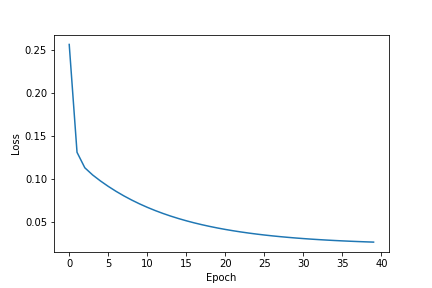
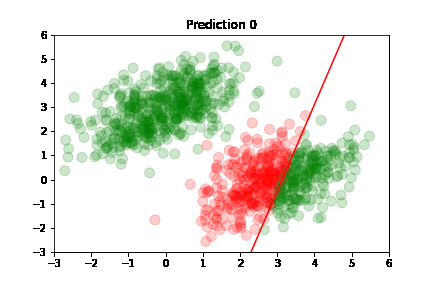

<title>Deep Learning with Python: Chapter 3 - Introduction to Keras and TensorFlow</title>


# Deep Learning with Python  <!-- omit in toc -->

This article is part 3/13 (?) of a series of articles named *Deep Learning with Python*.

In this series, I will read through the second edition of *Deep Learning with Python* by François Chollet.
Articles in this series will sequentially review key concepts, examples, and interesting facts from each chapter of the book.

<details>
    <summary>Table of Contents</summary>

- [Chapter 3: Introduction to Keras and TensorFlow](#chapter-3-introduction-to-keras-and-tensorflow)
    - [What's TensorFlow?](#whats-tensorflow)
        - [TensorFlow vs. NumPy](#tensorflow-vs-numpy)
        - [TensorFlow ecosystem](#tensorflow-ecosystem)
    - [What's Keras?](#whats-keras)
        - [Keras and TensorFlow: A brief history](#keras-and-tensorflow-a-brief-history)
    - [Setting up a deep learning workspace](#setting-up-a-deep-learning-workspace)
        - [Physical machine with NVIDIA GPU](#physical-machine-with-nvidia-gpu)
        - [Cloud GPU instances](#cloud-gpu-instances)
        - [Google Colab](#google-colab)
    - [First steps with TensorFlow](#first-steps-with-tensorflow)
        - [Constant tensors and variables](#constant-tensors-and-variables)
        - [A second look at the Gradient Tape API](#a-second-look-at-the-gradient-tape-api)
        - [Computing second-order gradients](#computing-second-order-gradients)
    - [Linear classifier example in pure TensorFlow](#linear-classifier-example-in-pure-tensorflow)
        - [What is linear classification?](#what-is-linear-classification)
        - [Generating synthetic data](#generating-synthetic-data)
        - [Creating the linear classifier](#creating-the-linear-classifier)
        - [Training the linear classifier](#training-the-linear-classifier)
        - [Plotting the loss](#plotting-the-loss)
        - [Plotting the predictions](#plotting-the-predictions)
    - [Understanding core Keras APIs](#understanding-core-keras-apis)
        - [Layers: the building blocks of deep learning](#layers-the-building-blocks-of-deep-learning)
    - [From layers to models](#from-layers-to-models)
        - [Importance of model architecture](#importance-of-model-architecture)
    - [The "compile" step: Configuring the learning process](#the-compile-step-configuring-the-learning-process)
</details>

---
# Chapter 3: Introduction to Keras and TensorFlow

This chapter covers...

* A closer look at TensorFlow, Keras, and their relationship
* Setting up a deep learning workspace
* Review of how deep learning concepts learned in previous chapters translate to Keras and TensorFlow

This chapter gives us everything required to get started with deep learning.
By the end of this chapter, we'll be ready to move on to practical, real-world applications of deep learning.

---
## What's TensorFlow?

TensorFlow is a free and open-source machine learning framework for Python.
It was primarily developed by Google.
Similar to NumPy, it is a general-purpose and efficient numerical library used by engineers to manipulate mathematical expressions using numerical tensors.

### TensorFlow vs. NumPy

TensorFlow far surpasses NumPy in the following ways:

- Automatically computes the gradient of any differentiable expressions (as seen in Ch2 with `GradientTape`)
- Runs not only on CPUs, but also on GPUs and TPUs (highly-parallel hardware accelerators)
- Computations defined in TensorFlow can be easily distributed across multiple devices (CPUs, GPUs, and TPUs) and machines
- TensorFlow programs can be exported and easily deployed to other runtimes, such as C++, JavaScript (for browsers), or TensorFlow lite (for mobile devices or embedded systems)

### TensorFlow ecosystem

TensorFlow is much more than a single Python library.
Rather, it's a platform home to a vast ecosystem of components.

Components of the ecosystem include:

- TF-Agents for reinforcement learning
- TF-Hub (repository) for pre-trained deep neural networks
- TensorFlow Serving for production deployment
- TFX for distributed training and ML workflow managements

Together, these components cover a wide-range of use cases: from cutting-edge research to large-scale production, or just a simple image classification application to see if a dog or a cat is in a picture.

Scientists from Oak Ridge National Lab have used TensorFlow to train an extreme weather forecasting model on the 27,000 GPUs within the IBM Summit supercomputer.
Google, on the other hand, has used TensorFlow to develop deep learning applications such as the chess-playing and Go-playing agent AlphaZero.

---
## What's Keras?

Keras is a high-level deep learning API built on top of TensorFlow.
It provides a convenient and flexible API for building and training deep learning models.

<font style="color:red">TODO: Insert image of Keras, TF, hardware hierarchical diagram</font>

Keras is known for providing a clean, simple, and efficient API that prioritizes the developer experience.
It's an API for human beings, not machines, and follows best practices for reducing cognitive load.
The API provides consistent and simple workflows, minimizes the number of actions required for common use cases, and outputs clear and actionable feedback upon user error.

Much like Python, Keras' large and diverse user base enables a well-documented and wide range of workflows for utilizing the API.
Keras does not force one to follow a single "true" way of building and training models.
Rather, it allows the user to build and train models corresponding to their own preference, and to explore the possibilities of each approach.

### Keras and TensorFlow: A brief history

Keras was designed originally in March 2015 to be used with Theano, a tensor-manipulation library developed by Montreal Institute for Learning Algorithms (MILA).
Theano pioneered the idea of using static computation graphs for automatic differentiation and compiling code to both CPU and GPU support.

Following the release of TensorFlow 1.0 in November 2015, Keras was refactored to support multiple backend architectures: starting with Theano and Tensorflow in late 2015, and adding support for CNTK and MXNet in 2017.

Keras became well known as the user-friendly way to develop TensorFlow applications.
By late 2017, a majority of TensorFlow users were using Keras.
In 2018, the TensorFlow leadership picked Keras and TensorFlow's official high-level API.
As a result, as of September 2019, the Keras API is the official API for TensorFlow 2.0.

Enough of the history, let's learn how to set up a deep learning workspace.

---
## Setting up a deep learning workspace

There are a handful of ways to set up a deep learning workspace:

- Buy and install a physical machine with an NVIDIA GPU
- Use GPU instances on AWS, Google Cloud, or cheaper alternatives such as Jarvis Labs
- Use the free GPU runtime from Google Colab, a hosted Jupyter notebook service that executes code on GPUs and even TPUs

Each approach has its own advantages and disadvantages in terms of flexibility, cost, and ease of use.
I'll briefly discuss the advantages and disadvantages of each approach below, but I will not discuss setup at all.

### Physical machine with NVIDIA GPU

Buying a machine with a GPU is not the easiest way to get started with DL, as it requires manual setup and it's also the most expensive upfront.
The upfront cost is amplified by the current (as of May 2022) chip shortage and GPU scalpers.
This method involves installing proper drivers, sorting out version conflicts, and then configuring the libraries to use the GPU instead of the CPU.

Most users already have NVIDIA GPUs installed in their computers.
Given the large user base of TensorFlow, there are many tutorials for setting up NVIDIA GPUs for deep learning, so this is not a bad option for tech-savvy people.

The alternative to buying a GPU is the use of embedded devices built specifically for efficient and highly-parallelized math operations, such as [NVIDIA's Jetson](https://www.nvidia.com/en-us/autonomous-machines/embedded-systems/) or [Google's Coral](https://coral.ai/products/).

### Cloud GPU instances

Using GPU instances is cheaper in the short-term because you pay as you go (per hour basis), but it's not sustainable in the long run if you're a heavy user of deep learning.
The benefit of using GPU instances is that it requires minimal setup as most instances have Python, TensorFlow, and Keras pre-installed - it's mostly plug-and-play and easy to use.
Moreover, the GPU instance can easily be upgraded, torn down, cloned, and re-installed.
Lastly, students and enterprise employees often get discounts - or free usage - for AWS and Google Cloud.

I personally use Jarvis Labs and AWS for my deep learning needs because I have discounts for both services.
There aren't many differences between cloud instance providers other than the availability of high-powered GPUs.

### Google Colab

The last approach - using free GPUs from Google Colab - is the simplest way to get started with deep learning.
It's recommended for those who are not familiar with the hardware and software, and for those who are new to deep learning.
Francois himself recommends executing code examples found in the book using Google Colab as it requires the least amount of setup.
The drawback of Colab is that the free GPU is time-limited and shared by users - meaning that the execution may be slower.

---
## First steps with TensorFlow

Training a neural network revolves around low-level tensor manipulations and high-level deep learning concepts.
TensorFlow takes care of the tensor manipulation through the use of:

- *Tensors*, including special tensors that store the network's state (*variables*)
- *Tensor operations* such as addition, `relu`, `matmul`, etc.
    - The previous article details [tensor operations](https://fars.io/deep_learning_python/ch2/#tensor-operations)
- *Backpropagation*, a way to compute gradients of mathematical operations (using TensorFlow's `GradientTape`)
    - The previous article discusses [backpropagation](https://fars.io/deep_learning_python/ch2/#backpropagation) and [TensorFlow's GradientTape](https://fars.io/deep_learning_python/ch2/#tensorflows-gradient-tape)

Let's take a deeper dive into how all of the concepts above translate to TensorFlow.

### Constant tensors and variables

To do anything in TensorFlow, we need to create tensors.
Let's look at code examples for creating tensors with all ones, zeros, or random values:

```python
import tensorflow as tf

# Equivalent to np.ones((2, 2))
t_ones = tf.ones(shape=(2, 2))
# Equivalent to np.zeros((2, 1))
t_zeros = tf.zeros(shape=(2, 1))
# Equivalent to np.random.normal(size=(3, 1), loc=0., scale=1)
t_random_normal = tf.random.normal(shape=(3, 1), mean=0., stddev=1.)
# Equivalent to np.random.uniform(size=(1, 3), low=0., high=1.)
t_random_uniform = tf.random.uniform(shape=(1, 3), minval=0., maxvval=1.)
```

What do the outputs of each tensor look like?

```python
>>> print(t_ones)
tf.Tensor(
    [[1. 1.]
     [1. 1.]], shape=(2, 2), dtype=float32)

>>> print(zeros)
tf.Tensor(
    [[0.]
     [0.]], shape=(2, 1), dtype=float32)

>>> print(t_random_normal)
tf.Tensor(
    [[-0.8276905]
     [ 0.2264915]
     [ 0.1399505]], shape=(3, 1), dtype=float32)

>>> print(t_random_uniform)
tf.Tensor(
    [[0.141 0.824 0.912]], shape=(1, 3), dtype=float32)
```

A significant difference between NumPy arrays and TensorFlow tensors is that tensors are not assignable: they're *constant*.
For instance, in NumPy, we can assign a value to a tensor, as seen in the code block below.
Whereas, in TensorFlow, we are greeted with an error: `TypeError: 'Tensor' object does not support item assignment`.

```python
>>> import numpy as np
>>> t_ones = np.ones((2, 2))
>>> t_ones
array([[1., 1.],
       [1., 1.]])
>>> t_ones[0, 0] = 0
>>> t_ones
array([[0., 1.],
       [1., 1.]])

>>> import tensorflow as tf
>>> t_ones = tf.ones((2, 2))
>>> t_ones
tf.Tensor(
    [[1. 1.]
     [1. 1.]], shape=(2, 2), dtype=float32)
>>> t_ones[0, 0] = 0
Traceback (most recent call last):
  File "<stdin>", line 1, in <module>
TypeError: 'Tensor' object does not support item assignment
```

To train a model, however, it's important to be able to change the values of the tensors - update the weights of the model.
This is where the TensorFlow's *variable* (`tf.Variable`) comes in to play:

```python
>>> v = tf.Variable(initial_value=tf.random.normal(shape=(3, 1)))
>>> print(v)
array([[-0.644994 ],
       [ 1.47064  ],
       [-0.6413262]], dtype=float32)>
```

The state of a variable - the entirety of or a subset of coefficients - can be modified via its `assign` method:

```python
>>> v.assign(tf.ones((3, 1)))
array([[1.],
       [1.],
       [1.]], dtype=float32)>
>>> v[0,0].assign(9)
array([[9.],
       [1.],
       [1.]], dtype=float32)>
```

Similarly, the `assign_add()` and `assign_sub()` are tensor-efficient equivalents of `+=` and `-=`, respectively.

```python
>>> v.assign_add(tf.ones((3, 1)))
array([[10.],
       [ 2.],
       [ 2.]], dtype=float32)>
>>> v.assign_sub(tf.ones((3, 1)))
array([[9.],
       [1.],
       [1.]], dtype=float32)>
```

### A second look at the Gradient Tape API

TensorFlow's ability to retrieve gradients of any expression with respect to any of its inputs is what makes the TensorFlow library so powerful.
All we have to do is open a `GradientTape` context, manipulate the input tensors, and retrieve the gradients with respect to the inputs.

```python
import tensorflow as tf

input = tf.Variable(initial_value=3.)
with tf.GradientTape() as tape:
    output = input * input

# <tf.Tensor: shape=(), dtype=float32, numpy=6.0>
gradient = tape.gradient(output, input)
```

The gradient tape is most commonly used to retrieve the gradients of the model's loss with respect to its weights: `gradient = tape.gradient(loss, weights)`.
We discussed and demonstrated this functionality in the [previous article](https://fars.io/deep_learning_python/ch2/#tensorflows-gradient-tape).

So far, we've only looked at the simplest case of `GradientTapes` - where the input tensors in `tape.gradient()` were TensorFlow variables.
It's actually possible for the input tensors to be any arbitrary tensor, not just variables, by calling `tape.watch(arbitrary_tensor)` within the `GradientTape` context.

```python
arbitrary_tensor = tf.constant(value=2.)
with tf.GradientTape() as tape:
    tape.watch(arbitrary_tensor)
    output = arbitrary_tensor * arbitrary_tensor

# tf.Tensor(4.0, shape=(), dtype=float32)
gradient = tape.gradient(output, arbitrary_tensor)
```

By default, only *trainable variables* are tracked because computing the gradient of a loss with regard to a trainable variable is the most common use case.
Furthermore, it would be too expensive to preemptively store the information required to compute the gradient of anything with respect to anything.
In an effort avoid wasting resources, only the trainable variables are tracked unless otherwise explicitly specified.

### Computing second-order gradients

The gradient tape is a powerful utility capable of computing *second-order gradients* - or, the gradient of a gradient.

For instance, the gradient of the position of an object with respect to time is the speed of the object.
The second-order gradient of the object speed is its acceleration.


```python
time = tf.Variable(initial_value=0.)
with tf.GradientTape() as outer_tape:
    with tf.GradientTape() as inner_tape:
        position = 4.9 * time ** 2
    speed = inner_tape.gradient(position, time)

# <tf.Tensor: shape=(), dtype=float32, numpy=9.8>
acceleration = outer_tape.gradient(speed, time)
```

---
## Linear classifier example in pure TensorFlow

We now know about tensors, variables, tensor operations, and gradient computation.
That's enough to build any machine learning model based on gradient descent.
Let's put our knowledge to the test and build an end-to-end linear classification model purely in TensorFlow.

We're going to implement a linear classifier that predicts whether a given input belongs to class A or class B.
But first, we need to understand what linear classification is.

### What is linear classification?

In linear classification problems, the model is trying to find a linear combination of the input features that best predicts the target variable.
Simply put, the model is trying to classify input data into 2+ categories (classes) by drawing a line through the the data.
The line is best fit to separate the data into two classes.

<font style="color:red">TODO: Insert image of a linear classification plot with a line separating the classes</font>

This is the basic idea behind linear classification.
Now let's generate some data and train a linear classifier.
All of the code related to this linear classifier can be found on my [GitHub](https://github.com/nosas/blog/blob/main/deep_learning_python/ch3/code/linear_classifier.py) as an interactive python file.
I recommend using VSCode to utilize the interactive python code blocks - similar to Jupyter Notebooks.

### Generating synthetic data

We need some nicely linear data to train our linear classifier.
To keep it simple, we'll create two classes of points in a 2D plane and call them class A and class B.
To keep it more simple, we won't explain all the math behind the data generation - just understand that both classes should be clearly separated and roughly distributed like a cloud.
We'll just use the following formula to generate the data:

```python
num_samples_per_class = 500
class_a_samples = np.random.multivariate_normal(
    mean=[0, 3],
    cov=[[1, 0], [0, 1]],
    size=num_samples_per_class)
class_b_samples = np.random.multivariate_normal(
    mean=[3, 0],
    cov=[[1, 0], [0, 1]],
    size=num_samples_per_class)
```

The figure below shows the linearly-separable data from classes A and B.
See the following code block to see how we plot the data.

<figure class="center">
    
    <figcaption>Two classes of synthetic and random points in the 2D plane</figcaption>
</figure>

Both samples are arrays of shape `(500, 2)` - meaning there are 500 rows of 2-dimensional data (x and y coordinate points).
Let's stack both class samples into a single array with shape `(1000, 2)`.
Stacking the samples into single array will allow for easier processing later on, such as plotting the data.

```python
import matplotlib.pyplot as plt
import numpy as np

# The first 500 samples are from class A, the next 500 samples are from class B
inputs = np.vstack((class_a_samples, class_b_samples)).astype(np.float32)
# The first 500 labels are 0 (class A), and the next 500 are 1 (class B)
labels = np.vstack(
    (
        np.zeros((num_samples_per_class, 1), dtype=np.float32),
        np.ones((num_samples_per_class, 1), dtype=np.float32),
    )
)
class_a = inputs[:num_samples_per_class]
class_b = inputs[num_samples_per_class:]

# %% Plot the two classes
# Class A is represented by green dots, and class B is represented by blue dots,
# plt.scatter(inputs[:, 0], inputs[:, 1], c=labels[:, 0], s=100)
plt.scatter(
    class_a[:, 0],
    class_a[:, 1],
    c="green",
    alpha=0.50,
    s=100,
    label="Class A",
    edgecolors="none",
)
plt.scatter(
    class_b[:, 0],
    class_b[:, 1],
    c="blue",
    alpha=0.50,
    s=100,
    label="Class B",
    edgecolors="none",
)
plt.legend()
plt.savefig("../img/linear_classifier_data.png", transparent=False)
plt.show()
```

### Creating the linear classifier

A linear classifier is an *affine transformation* of the input data (`prediction = dot(W, x) + b`), trained to minimize the square of the difference (mean squared error, or MSE) between the prediction and the target label.
I have not explained affine transformations - or any geometric interpretations of tensor operations - in my articles, but Francois Chollet greatly details geometric transformations in Chapter 2 of his book.
In short, an affine transformation is the combination of a linear transform (dot product) and a translation (vector addition).

Now that we understand the basic math behind linear classification, let's create the model's variables.

```python
input_dim = 2   # input is a 2D vector
output_dim = 1  # output is a scalar, class B < 0.5 < class A
W = tf.Variable(initial_value=tf.random.uniform(shape=(input_dim, output_dim)))
b = tf.Variable(initial_value=tf.zeros(shape=(output_dim,)))
```

Our forward pass function is the affine transformation discussed above.
Our loss function is the mean squared error (MSE) between the prediction and the target label.

```python
def model(inputs) -> tf.Tensor:
    return tf.matmul(inputs, W) + b

def square_loss(predictions, targets) -> tf.Tensor:
    # Calculate the loss per sample, results in tensor of shape (len(targets), 1)
    per_sample_loss = tf.square(targets - predictions)
    # Average the per-sample loss and return a single scalar loss value
    return tf.reduce_mean(per_sample_loss)
```
Next, we have to train the model.

### Training the linear classifier

Let's create the training step, where the model's weights and biases are updated based on the loss.

```python
def training_step(inputs, targets, learning_rate: float = 0.001) -> tf.Tensor:
    with tf.GradientTape() as tape:
        predictions = model(inputs)
        loss = square_loss(predictions, targets)
    # Calculate the gradients of the loss with respect to the variables
    grad_loss_wrt_W, grad_loss_wrt_b = tape.gradient(loss, [W, b])
    # Update the variables using the gradients and the learning rate
    W.assign_sub(learning_rate * grad_loss_wrt_W)
    b.assign_sub(learning_rate * grad_loss_wrt_b)
    return loss
```

Finally, let's create the training loop.
For simplicity, we'll do *batch training* instead of *mini-batch training*.
Batch training means the model trains on all the data at once instead of iteratively over small batches of the data.

Batch training has its pros and cons: each training step will take much longer to run, since we'll compute the forward pass and gradient calculation for the entire dataset (1000 samples in our example).
On the other hand, because the model is training on the entire dataset, each gradient update will be much more effective at reducing the loss since it learns information from all training samples.

```python
num_epochs = 50
# Save the loss scores so we can plot them later
loss_all = []
# Save all predictions so we can calculate and plot the accuracy later
predictions_all = []

for step in range(num_epochs):
    step_loss = training_step(inputs=inputs, targets=labels)
    print(f"Step {step} loss: {step_loss}")
    loss_all.append(step_loss)
    predictions_all.append(model(inputs))
```

<details>
    <summary>Full output of loss scores</summary>

    Step 0: Loss = 2.9617
    Step 1: Loss = 0.4816
    Step 2: Loss = 0.1756
    Step 3: Loss = 0.1239
    Step 4: Loss = 0.1098
    Step 5: Loss = 0.1017
    Step 6: Loss = 0.0950
    Step 7: Loss = 0.0890
    Step 8: Loss = 0.0836
    Step 9: Loss = 0.0785
    Step 10: Loss = 0.0740
    Step 11: Loss = 0.0698
    Step 12: Loss = 0.0660
    Step 13: Loss = 0.0625
    Step 14: Loss = 0.0593
    Step 15: Loss = 0.0563
    Step 16: Loss = 0.0536
    Step 17: Loss = 0.0512
    Step 18: Loss = 0.0490
    Step 19: Loss = 0.0469
    Step 20: Loss = 0.0450
    Step 21: Loss = 0.0433
    Step 22: Loss = 0.0418
    Step 23: Loss = 0.0403
    Step 24: Loss = 0.0390
    Step 25: Loss = 0.0378
    Step 26: Loss = 0.0367
    Step 27: Loss = 0.0357
    Step 28: Loss = 0.0348
    Step 29: Loss = 0.0340
    Step 30: Loss = 0.0332
    Step 31: Loss = 0.0325
    Step 32: Loss = 0.0319
    Step 33: Loss = 0.0313
    Step 34: Loss = 0.0307
    Step 35: Loss = 0.0302
    Step 36: Loss = 0.0298
    Step 37: Loss = 0.0294
    Step 38: Loss = 0.0290
    Step 39: Loss = 0.0287
    Step 40: Loss = 0.0284
    Step 41: Loss = 0.0281
    Step 42: Loss = 0.0278
    Step 43: Loss = 0.0272
    Step 44: Loss = 0.0268
    Step 45: Loss = 0.0261
    Step 46: Loss = 0.0259
    Step 47: Loss = 0.0255
    Step 48: Loss = 0.0254
    Step 49: Loss = 0.0254
</details>

After 50 epochs, or 50 training steps, the loss score stabilizes to around 0.025.
Let's plot the loss scores to see how the loss score changes after each training step.

### Plotting the loss

It's difficult to see the rate of decrease in the loss score following the rapid convergence after step 0 and long tail.
The initial loss score was initially at 2.9617 on step 0 and dropped to 0.4816 on step 1.
We can improve the plot by excluding the initial loss score and "trimming" the long tail at the point where see the score stabilizes (~40 epochs).
Let's clean up the data and plot the loss scores so we can better visualize the rate of decrease.

```python
plt.plot(loss_all[1:41])
plot.xlabel("Epoch")
plot.ylabel("Loss")
```

<table style="width:100%;">
    <tr>
        <td style="width:50%;">
            
        </td>
        <td style="width:50%;">
            
        </td>
    </tr>
    <tr >
        <td>
            <span style="text-align:center; display: block; margin-bottom: 2ch;margin-top: 0.5ch;">
                <small>
                    <i>Loss scores of all training steps, converges to ~0.025 after roughly 40 epochs<i>
                </small>
            </span>
        </td>
        <td>
            <span style="text-align:center; display: block; margin-bottom: 2ch;margin-top: 0.5ch;">
                <small>
                    <i>All loss scores, excluding the initial loss score and trimming the plot's long tail<i>
                </small>
            </span>
        </td>
    </tr>
</table>

*Can we train the model for more epochs and make it more accurate?*

No.
Take a look at the plots above: the loss score stabilizes after roughly 40 epochs.

The stabilization shows that the model learned its optimal weights given the current model architecture and training data.
If we were to train it for more epochs, the model would *overfit* to the data.
Sure, the loss score may decrease by 0.001 - a small amount - but that's because it's memorizing the dataset.

*Overfitting* is a huge concept in machine learning, which we'll cover later on.
For now, understand that more training does not guarantee better results!

### Plotting the predictions

After each training step, the model updates its weights and biases (parameters) and makes predictions on the inputs.
We append those predictions to a list called `predictions_all`.
Using the predictions, we can plot how accurate the model is after each training step: green dot if correctly predicted, otherwise red.

Predictions are classified as *correct* or *incorrect* based on the following criteria:

- If the prediction is greater than 0.5, the predicted label is Class A
- If the prediction is less than 0.5, the predicted label is Class B

An easier way to understand this is: if the dot is *above* the red line, it belongs to Class A, otherwise it's below the line and belongs to Class B.

We need two helper functions to create the accuracy plots and GIFs below: `plot_prediction_acc(prediction, input)` and `make_gif(predictions, inputs)`.
The `plot_prediction_acc()` function will plot the accuracy of the model and save it to an IO buffer.
The `make_gif()` function will create a GIF from the IO buffer and save it to a file.
Easy peasy.

```python
import matplotlib.pyplot as plt
import numpy as np

# %% Scatter plot for the model's predictions where the dots are green if the prediction is accurate, red if the prediction is incorrect
def plot_prediction_acc(
    prediction: np.ndarray,
    inputs: np.ndarray,
    buffer=None,
    parameters: tuple[np.ndarray, float] = None,
    savename: str = "",
    title: str = "",
):
    plt.scatter(
        inputs[:, 0],
        inputs[:, 1],
        c=[
            "green" if labels[idx] == pred else "red"
            for idx, pred in enumerate(prediction > 0.5)
        ],
        alpha=0.20,
        s=100,
    )
    # Draw the red line separating the two classes
    if parameters:
        W, b = parameters
        x = np.linspace(-1, 5, 100)
        y = -W[0] / W[1] * x + (0.5 - b) / W[1]
        plt.plot(x, y, c="red")
        plt.xlim(-3, 6)
        plt.ylim(-3, 6)
    # Add a title to the plot
    if title:
        plt.title(title)
    # Save the plot to a file
    if savename:
        plt.savefig(f"../img/{savename}.png", transparent=False)
    # Save the plot to a buffer
    if buffer:
        plt.savefig(buffer, format="png", transparent=False)
    else:
        plt.show()
    plt.close()


# %% Make gif
make_gif(predictions_all, inputs, "prediction_accuracy")
```

<details>
    <summary>How to make a GIF of matplotlib plots</summary>

There are many ways to make a GIF of matplotlib plots.
Matplotlib even has an `animation` module ([here](https://matplotlib.org/stable/api/animation_api.html)) that can be used to make GIFs.
However, it's not intuitive enough for me to use at the moment, so I hacked together something I knew would work using `imageio` and `io.BytesIO`.

Please refer to the code block below to view my implementations of `make_gif`.
There are two different implementations:

- `make_gif` appends each image to the writer object (`imageio.get_writer()`)
- `make_gif_with_duration` appends each image to a list and passes the list to `imageio.mimsave()`

A third implementation to better generalize and enhance this function: save all the prediction images outside of the function and pass the list of images to `make_gif` instead of the list of predictions.
Therefore, we'd only have to make each image one time and save computational resources.

```python
from io import BytesIO
import imageio


def make_gif(predictions: np.ndarray, inputs: np.ndarray, savename: str):
    fig, ax = plt.subplots()

    with imageio.get_writer(f"../img/{savename}.gif", mode="I") as writer:
        # for prediction_idx in [0, 1, 2, -1]:
        for prediction_idx, prediction in enumerate(predictions):
            params = parameters_all[prediction_idx]
            buffer = BytesIO()
            plot_prediction_acc(
                prediction=prediction,
                inputs=inputs,
                buffer=buffer,
                parameters=params,
                title=f"Prediction {prediction_idx}",
            )
            buffer.seek(0)
            img = plt.imread(buffer, format="png")
            writer.append_data(img)

    plt.show()

# Slow down the GIF by increasing the `duration` argument to 0.5 or 1 (seconds)
def make_gif_with_duration(
    predictions: np.ndarray, inputs: np.ndarray, savename: str, duration: float
):
    images = []
    for prediction_idx, prediction in enumerate(predictions):
        params = parameters_all[prediction_idx]
        buffer = BytesIO()
        plot_prediction_acc(
            prediction=prediction,
            inputs=inputs,
            buffer=buffer,
            parameters=params,
            title=f"Prediction {prediction_idx}",
        )
        buffer.seek(0)
        images.append(plt.imread(buffer, format="png"))
    imageio.mimsave(f"../img/{savename}.gif", images, duration=duration)
```

</details>

In the following plots, we see green dots representing correct predictions and red dots representing incorrect predictions.
After each training step, the model adjusts its parameters causing the red class-separation line to gradually adjust in the direction of the correct prediction.
As training continues, the number of incorrect predictions decreases and the line properly separates the two classes.
Pretty cool, right?

<table style="width:100%;">
    <tr>
        <td style="width:50%;">
            
        </td>
        <td style="width:50%;">
            
        </td>
    </tr>
    <tr >
        <td>
            <span style="text-align:center; display: block; margin-bottom: 2ch;margin-top: 0.5ch;">
                <small>
                    <i>Accuracy of the first 20 prediction, slowed down<i>
                </small>
            </span>
        </td>
        <td>
            <span style="text-align:center; display: block; margin-bottom: 2ch;margin-top: 0.5ch;">
                <small>
                    <i>Accuracy of all prediction<i>
                </small>
            </span>
        </td>
    </tr>
</table>

This is what linear classification is all about: finding the parameters of a line that neatly separates two classes of data.
In higher-dimensional spaces, we're finding the parameters of a hyperplane that neatly separates the two classes.

## Understanding core Keras APIs

We've learned how to create a linear classifier using pure TensorFlow.
Now, let's look closer at Keras- specifically, the anatomy of a neural network through Keras layers and models.

### Layers: the building blocks of deep learning

A layer is the fundamental data structure in neural networks.
As discussed in chapter 2, a layer is a data processing module that takes as input one or more tensors and outputs one or more tensors.
We previously referred to layers as a "data filter" where data goes in and comes out more useful.
Everything in Keras is either a layer or something that closely interacts with a layer.

Some layers can be stateless, but layers are more commonly stateful.
The layer's state may contain *weights* which represent the network's *knowledge*.

Furthermore, different types of layers are appropriate for different tensor formats and data processing tasks:

- `Dense`, or fully-connected, layers often process vector data stored in 2D tensors of shape `(samples, features)`
- Recurrent layers, such as `LSTM` (long short-term memory) or `Conv1D` (1D convolution layer), often process time-series data stored in 3D tensors of shape `(samples, timesteps, features)`
- `Conv2D` (2D convolution layer) and `Conv3D` (3D convolution layer) often process images stored in 4D tensors of shape `(samples, height, width, channels)`

Tensor formats were discussed in more detail in the previous [article](https://fars.io/deep_learning_python/ch2/#real-world-examples-of-data-tensors).

In Keras, a `Layer` is an object that encapsulates some state (weights) and some computation (a forward pass).
The weights are typically defined in a `build()` method - although they could be created in the constructor.
The computation, or forward pass, is defined in the `call()` method.

```python
from tensorflow import keras

class SimpleDense(keras.layers.Layer):
    def __init__(self, units, activation=None, **kwargs):
        super().__init__(**kwargs)
        self.units = units
        self.activation = keras.activations.get(activation)

    def build(self, input_shape):
        input_dim = input_shape[-1]
        # self.kernel = tf.Variable(tf.random.normal(shape=(input_dim, self.units)))
        self.kernel = self.add_weight(
            shape=(input_dim, self.units),
            initializer="random_normal",
            name="weights"
        )
        self.bias = self.add_weight(
            shape=(self.units,),
            initializer="zeros",
            name="bias"
        )

    def call(self, inputs):
        # return self.activation(keras.backend.dot(inputs, self.kernel) + self.bias)
        y = tf.matmul(inputs, self.kernel) + self.bias
        if self.activation is not None:
            y = self.activation(y)
        return y

my_dense = SimpleDense(units=32, activation="relu")
input_tensor = tf.ones(shape=(2, 32))
output_tensor = my_dense(input_tensor)
output_tensor.shape
```

Once instantiated, a layer can be called on a tensor to produce a new tensor.

```python
>>> my_dense = SimpleDense(units=32, activation="relu")
>>> input_tensor = tf.ones(shape=(2, 784))
>>> output_tensor = my_dense(input_tensor)
>>> output_tensor.shape
TensorShape([2, 32])
>>> output_tensor.numpy()
array([[0.        , 0.16681111, 0.37626198, 0.32816353, 0.        ,
        ...
        0.        , 0.16670324],
       [0.        , 0.16681111, 0.37626198, 0.32816353, 0.        ,
        ...
        0.        , 0.16670324]], dtype=float32)
```

*When do we call the `build()` method? How are the weights created?*

We don't have to explicitly call the `build()` method because it's handled by the superclass.
The weights are built - and `build()` called automatically - the first time the layer is called.
The superclass's `__call__()` method calls the `build()` method if the layer has not been built yet.

```python
def __call__(self, inputs):
    if not self.built:
        self.build(inputs.shape)
        self.built = True
    return self.call(inputs)
```

That's the gist of Keras layers.
Let's talk about model architectures.

## From layers to models

Simply put, a deep learning model, such as the `Model` class in Keras, is a graph of layers.
Until now, we've only discussed `Sequential` models - a linear stack of layers that map a single input to a single output.
As we move forward, we'll be exposed to a variety of neural network architectures:

- Two-branch networks
- Multihead networks
- Residual networks

The difference between each of these topologies is the type of layers and how they are connected.
Similar to layers, each network topology has its pros, cons, and common use cases.
Picking the right network topology is more an art than a science, where only practice can help you become a proper neural-network architect.

### Importance of model architecture

*Why is it important to pick a proper network architecture for my use case?*

To learn from data, we have to make assumptions about it - also referred to as a *hypothesis space* or *space of possibilities* in chapter 1.
These assumptions (hypothesis space) define what can be learned.
By choosing a network topology, we constrain our hypothesis space to a specific series of tensor operations.
As such, the structure of the model's hypothesis space - the architecture of the model - is extremely important.

The hypothesis space encodes the assumptions we make about our problems, aka the prior knowledge that the model starts with.
For instance, if we're working on a two-class classification problem with a model made of a single `Dense` layer with no activation function, then we are assuming that our two classes are linearly separable.
Finding the right balance between the number of layers, types of layers, and the number of parameters in the model is a key part of choosing a network architecture.

In short, the network's architecture constrains the data that can be learned.
We must find the right architecture for our problem and data.
With time, this process will become second nature.

Enough of model architecture, let's talk about model compilation and how we configure the learning process.

## The "compile" step: Configuring the learning process

Once the model architecture is defined, there are three more key parts to be defined:

1. *Loss function* - The quantity that will be minimized during training. It represents a measure of the model's success for the task at hand.
2. *Optimizer* - Determines how the network will be updated based on the loss function.
3. *Metrics* - The various measures of success we can monitor during training and validation, such as classification accuracy.
