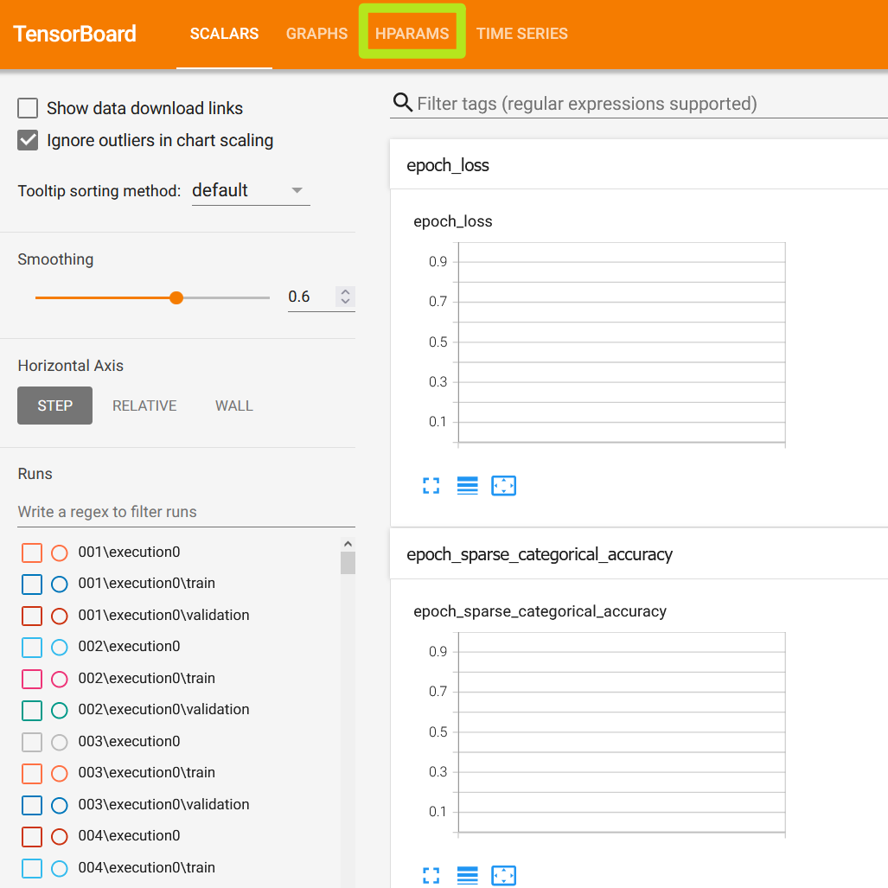
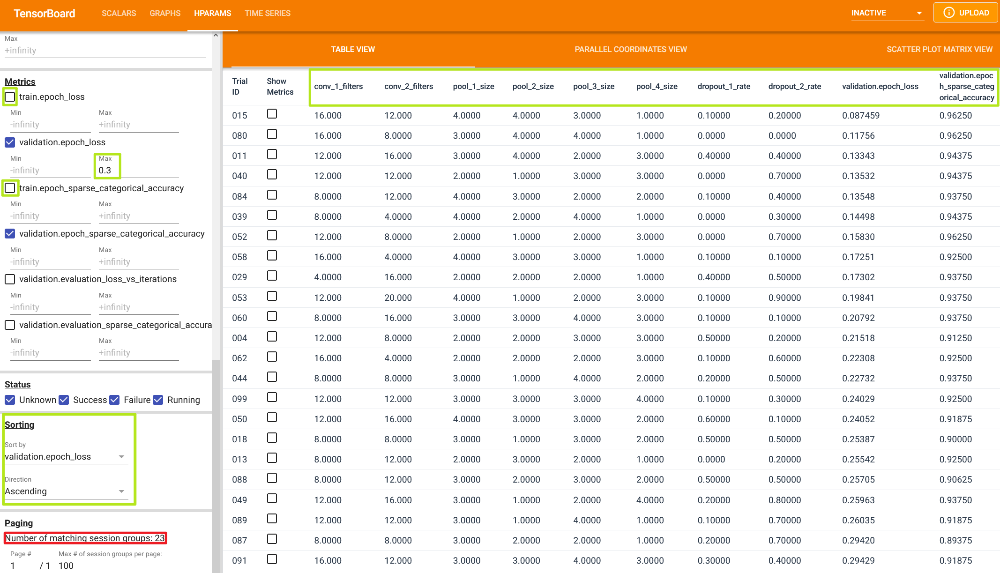
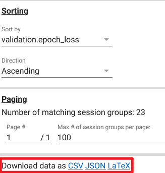

<title>Hyperparameter optimization: KerasTuner & TensorBoard</title>

# Hyperparameter optimization

Finding the optimal model architecture and training configuration is a tedious and time-consuming task.
The manual process of repeatedly tuning a model's hyperparameters and training configuration often leads to sub-optimal model performance.

*Hyperparameters* are values that are used to control the model's learning process during training.
Their values determine the model's performance - specifically, the model's ability to correctly map the input data to the desired labels or targets.
The more optimal the hyperparameters, the better the model's performance.

In deep learning models, the most common hyperparameters are the number of hidden layers, the number of neurons in each layer, and the activation function used in each layer.

<details>
<summary>Common hyperparameters</summary>

- Train-validation-test split ratio
- Optimizer algorithm (e.g., gradient descent, stochastic gradient descent, or Adam optimizer)
- Optimizer's learning-rate
- Convolutional layer's kernel or filter size
- Activation function in a neural network layer (e.g. Sigmoid, ReLU, Tanh)
- Number of hidden layers
- Number of activation units in each layer
- Dropout rate
- Pooling size
- Batch size
- Number of iterations (epochs) during training
- Number of clusters in a clustering task

</details>

We can use [KerasTuner](https://keras.io/keras_tuner/) to automate the process of hyperparameter optimization.
[TensorBoard](https://www.tensorflow.org/tensorboard/) visualizer can be used alongside KerasTuner to visualize the optimization progress.

This article will cover the basics of hyperparameter optimization in deep learning projects using KerasTuner and TensorBoard.
The examples will be based on my own [ToonVision](../toonvision/classification) computer vision project.

<details>
    <summary>Table of Contents</summary>

- [Hyperparameter optimization](#hyperparameter-optimization)
    - [Project description](#project-description)
        - [Model architecture](#model-architecture)
        - [Hyperparameters](#hyperparameters)
    - [KerasTuner](#kerastuner)
        - [Define the hyperparameter search space](#define-the-hyperparameter-search-space)
            - [Search space considerations](#search-space-considerations)
        - [Create a tuner object](#create-a-tuner-object)
        - [Launch the tuning process](#launch-the-tuning-process)
            - [Tuning process search times](#tuning-process-search-times)
        - [Tuning process results](#tuning-process-results)
            - [Retrieve the best hyperparameter values](#retrieve-the-best-hyperparameter-values)
            - [Create a model](#create-a-model)
    - [TensorBoard](#tensorboard)
        - [Hyperparameter values and loss/accuracy metrics](#hyperparameter-values-and-lossaccuracy-metrics)

</details>

---
## Project description

The ToonVision project is a multiclass classification model for classifying [Cogs](https://toontownrewritten.fandom.com/wiki/Cogs) in ToonTown Online.
There are four unique Cog types - also called [corporate ladders](https://toontownrewritten.fandom.com/wiki/Corporate_ladder) or suits.
Our goal is to train a model that can classify Cogs into the four unique suits, as seen in the image below.

<figure class="center">
    
    <figcaption>Unique Cog types: Bossbot, Lawbot, Cashbot, Sellbot</figcaption>
</figure>

### Model architecture

We'll create a model from scratch and use my [ToonVision dataset](../toonvision/classification/#the-toonvision-dataset) to train and evaluate the model.

The model will be a convolutional neural network (CNN).
It will have two "blocks", each of which contains a single convolutional layer, two max pooling layers, and a dropout layer.
The final layer will be a fully-connected layer (Dense) with four output nodes, one for each of the four Cog types.

```python
def make_multiclass_model(name: str = "", dropout: float = 0.0) -> keras.Model:
    inputs = keras.Input(shape=(600, 200, 3))
    x = layers.Rescaling(1.0 / 255)(inputs)
    x = keras.layers.RandomFlip("horizontal")(x)

    # Block 1: Conv2d -> MaxPool2D -> MaxPool2D -> Dropout
    x = layers.Conv2D(filters=4, kernel_size=3, activation="relu", padding="same")(x)
    x = layers.MaxPooling2D(pool_size=2)(x)
    x = layers.MaxPooling2D(pool_size=2)(x)
    x = layers.Dropout(dropout)(x)
    # Block 2: Conv2D -> MaxPool2D -> MaxPool2D -> Dropout
    x = layers.Conv2D(filters=8, kernel_size=3, activation="relu", padding="same")(x)
    x = layers.MaxPooling2D(pool_size=2)(x)
    x = layers.MaxPooling2D(pool_size=2)(x)
    x = layers.Dropout(dropout)(x)

    x = layers.Flatten()(x)
    outputs = layers.Dense(units=4, activation="softmax")(x)
    model = keras.Model(name=name, inputs=inputs, outputs=outputs)

    model.compile(
        optimizer=tf.keras.optimizers.Adam(learning_rate=1e-3),
        loss=tf.keras.losses.SparseCategoricalCrossentropy(),
        metrics=[tf.keras.metrics.SparseCategoricalAccuracy()],
    )
    return model
```

### Hyperparameters

The model's hyperparameters were chosen by intuition and experimentation.
However, I believe that we can find better hyperparameters by tuning the model's hyperparameters using KerasTuner.

We'll focus on tuning the following five hyperparameters with KerasTuner:

- `filters`: The number of convolutional filters in each convolutional layer.
- `kernel_size`: The size of the convolutional kernel.
- `pool_size`: The size of the max pooling layers.
- `dropout_rate`: The probability of dropping a neuron.
- `learning_rate`: The learning rate of the Adam optimizer.

```python
x = layers.Conv2D(filters, kernel_size, activation="relu", padding="same")(x)
x = layers.MaxPooling2D(pool_size)(x)
x = layers.MaxPooling2D(pool_size)(x)
x = layers.Dropout(rate)(x)
```

Additional hyperparameter tunings could include the number of layers (convolutional/pooling/dropout), optimizer algorithm, and/or activation functions, but I will not cover these in this article.

Before we start tuning the hyperparameters, let's discuss what KerasTuner does and how it helps ML engineers.

---
## KerasTuner

KerasTuner is a general-purpose hyperparameter tuning library.
The library is well integrated with Keras, allowing for hyperparameter tuning with minimal code changes.
It truly is a powerful, yet simple, library.

We can begin tuning with three easy steps:

1. Define the hyperparameter search space
2. Create a KerasTuner tuner object of type `Hyperband`, `BayesianOptimization`, or `RandomSearch`
3. Launch the tuning process

Pretty simple, right?
Let's take a look at how we can implement the above steps.

### Define the hyperparameter search space

Defining a search space is as simple as replacing the layers' hyperparameter values with KerasTuner's search space methods: `hp.Int`, `hp.Float`, `hp.Choice`, etc.
More details about the KerasTuner search space methods can be found [here](https://keras.io/api/keras_tuner/hyperparameters/).

For instance, the follow code block defines a search space for the number of convolutional filters in some convolutional layer.
When launched, the tuner searches for the most optimal filter count by varying the number of filters in the layer from 4 to 16 and training the model.

```python
model = keras.Sequential(
    [
        keras.layers.Conv2D(
            filters=hp.Int("conv_1_filters", min_value=4, max_value=16, step=4),
            kernel_size=5,
            activation="relu",
            padding="same",
        ),
    ])
```

What was once a tedious, manual task is now simple and powerful process for ML engineers.

The following code block is our model-building function with defined search spaces.
Recall that we're searching for the most optimal filter count, kernel size, pooling sizes, and dropout rate.

Note the use of `hp.Int`, `hp.Float`, and `hp.Choice` methods in each layer.
Each of these methods defines a search space for the corresponding hyperparameter.
Integers and floats are used for discrete search spaces (minimum and maximum values with steps), while choices are used for categorical search spaces.

```python
def model_builder(hp):
    model = keras.Sequential(
        [
            # Input and augmentation layers
            keras.layers.Rescaling(1.0 / 255),
            keras.layers.RandomFlip("horizontal"),

            # Block 1: Conv2D -> MaxPool2D -> MaxPool2D -> Dropout
            keras.layers.Conv2D(
                filters=hp.Int("conv_1_filters", min_value=4, max_value=16, step=4),
                kernel_size=hp.Choice("conv_1_kernel_size", values=[3, 5]),
                activation="relu",
                padding="same",
            ),
            keras.layers.MaxPooling2D(
                pool_size=hp.Int("pool_1_size", min_value=2, max_value=4, step=1),
            ),
            # Min value == 1 will void the second pooling layer
            keras.layers.MaxPooling2D(
                pool_size=hp.Int("pool_2_size", min_value=1, max_value=4, step=1),
            ),
            keras.layers.Dropout(
                rate=hp.Float("dropout_1_rate", min_value=0.0, max_value=0.9, step=0.1),
            ),
            ...  # Repeat for Block 2 (omitted for brevity)

            # Output layer
            keras.layers.Flatten(),
            keras.layers.Dense(units=4, activation="softmax"),
        ]
    )
    model.compile(
        optimizer=tf.keras.optimizers.Adam(
            learning_rate=hp.Choice("learning_rate", values=[1e-2, 1e-3, 1e-4])
        ),
        loss=tf.keras.losses.SparseCategoricalCrossentropy(),
        metrics=[tf.keras.metrics.SparseCategoricalAccuracy()],
    )
    return model
```

#### Search space considerations

Selecting the correct methods and values for the search space is critical to the success of the tuning process.
We do not want such a large search space that the tuner takes too much time and resources.
However, we also do not want such a small search space that the tuner does not find any optimal hyperparameters.

Rather, we must consider meaningful values for each hyperparameter.
This is where intuition, experimentation, and domain expertise comes in to help us define the search space.

For my model, I knew that the number of convolutional filters should remain low (4 to 16).
This choice was made in part because I wanted to avoid overfitting to the validation data during training.
However, I also knew from experience that the more filters I have, the lower my model's generalization performance.

Furthermore, I selected two MaxPooling2D layers for each block because I knew the main differentiation between classes is the Cog's suit color.
My intuition says that more pooling is better, but I'm putting it to the test by defining a search space that also evaluates only a single MaxPooling2D layer.
This is how domain expertise - knowing your data's characteristics - helps us define meaningful search spaces.

### Create a tuner object

KerasTuner contains multiple tuners: `RandomSearch`, `BayesianOptimization`, and `Hyperband`.
Each has their own unique tuning algorithm, but all of them share the same search space defined above.
Here are the three tuners along with their respective algorithms:

- `kerastuner.tuners.randomsearch.RandomSearch`: An inefficient, random search algorithm.
- `kerastuner.tuners.bayesian.BayesianOptimization`: A Bayesian optimization algorithm that follows a probabilistic search approach by taking previous results into account.
- `kerastuner.tuners.hyperband.Hyperband`: An optimized variant of the `RandomSearch` algorithm in terms of time and resource usage.

More details above each tuner can be found in [this article](https://neptune.ai/blog/hyperband-and-bohb-understanding-state-of-the-art-hyperparameter-optimization-algorithms).
Additionally, refer to the [KerasTuner documentation](https://keras.io/api/keras_tuner/tuners/) for API details.

My preferred tuning method is to first perform a `RandomSearch` with a large number of trials (100+).
Each trial samples a random set of hyperparameter values from the search space.
The goal is to find the best hyperparameter values that minimizes (or maximizes) the objective - in our case, the goal is minimizing the validation loss.

```python
tuner = RandomSearch(
    hypermodel=model_builder,
    objective="val_loss",
    max_trials=100,
    executions_per_trial=1,  # Increase to reduce variance of the results
    directory="models",
    project_name="tuned_multiclass_randomsearch",
    seed=42,
)
```

`RandomSearch` is the least efficient algorithm, but it provides useful insight into the general whereabouts of optimal hyperparameter values.
These insights can be used to further reduce the search space for more effective tuning.

Following the random search, I'll review the highest performing parameters in TensorBoard, tighten my search space, and then launch a more efficient `Hyperband` or `BayesianOptimization` search.
Let's launch a `RandomSearch` and review the results.

### Launch the tuning process

The tuning process uses identical arguments as the `keras.Model.fit` method.
Refer to the code block below to see how the `RandomSearch` is launched.

We will utilize the `tf.keras.callbacks.TensorBoard` callback to monitor the tuning process' progress.
This callback will save the logs of all trials to the `./tb_logs/randomsearch/` directory.
We can then use TensorBoard to visualize the results of all trials during/after the tuning process.

```python
tuner.search(
    train_images,
    train_labels,
    epochs=75,
    batch_size=64,
    validation_data=(val_images, val_labels),
    verbose=1,
    callbacks=[
        tf.keras.callbacks.EarlyStopping(
            monitor="val_loss", patience=3, restore_best_weights=True
        ),
        tf.keras.callbacks.TensorBoard("./tb_logs/randomsearch/"),
    ],
)
```

Details about the TensorBoard callback API can be found [here](https://www.tensorflow.org/api_docs/python/tf/keras/callbacks/TensorBoard).
A Keras guide for visualizing the tuning process can be found [here](https://keras.io/guides/keras_tuner/visualize_tuning/).

#### Tuning process search times

On a GPU, 100 trials of `RandomSearch` with the search space above takes roughly 45 minutes.
The search would take even longer if done on a CPU.

We can reduce the search time by constraining the search space, reducing the number of trials, decreasing the number of epochs, and/or reducing the executions per trial.
Alternatively, we could pick a more efficient algorithm, such as `Hyperband` or `BayesianOptimization`.

Search times are also dependent on the size of the model - filters in the Conv2D layers or pooling sizes in MaxPooling2D layers.
That's why it's important to define the search space with meaningful values; if the values are needlessly large, the search will be inefficient with regards to time and computation.

### Tuning process results

We can review the results of the tuning process using the `tuner.results_summary(N)` method.
The output is a list of trial summaries including each trial's hyperparameter values, objective value, and other metrics.

The summaries do not include trial IDs, so we cannot use this method to retrieve a specific trial.
Fortunately, TensorBoard provides a way to retrieve the results of specific trials.

```
>>> tuner.results_summary(100)
Results summary
Results in models\tuned_multiclass_randomsearch
Showing 100 best trials
<keras_tuner.engine.objective.Objective object at 0x000001F812400F10>

Trial summary
Hyperparameters:
conv_1_filters: 16
pool_1_size: 4
pool_2_size: 4
dropout_1_rate: 0.1
conv_2_filters: 12
pool_3_size: 3
pool_4_size: 1
dropout_2_rate: 0.2
learning_rate: 0.01
Score: 0.08702577650547028

Trial summary
Hyperparameters:
conv_1_filters: 12
pool_1_size: 3
pool_2_size: 4
dropout_1_rate: 0.4
conv_2_filters: 16
pool_3_size: 2
pool_4_size: 3
dropout_2_rate: 0.4
learning_rate: 0.01
Score: 0.11486983299255371

...
... omitted 96 entries for brevity
...

Trial summary
Hyperparameters:
conv_1_filters: 8
pool_1_size: 4
pool_2_size: 1
dropout_1_rate: 0.8
conv_2_filters: 20
pool_3_size: 4
pool_4_size: 3
dropout_2_rate: 0.7000000000000001
learning_rate: 0.0001
Score: 1.4036705493927002

Trial summary
Hyperparameters:
conv_1_filters: 4
pool_1_size: 2
pool_2_size: 4
dropout_1_rate: 0.8
conv_2_filters: 16
pool_3_size: 3
pool_4_size: 1
dropout_2_rate: 0.4
learning_rate: 0.0001
Score: 1.4044125080108643
```

The snippet above shows the top and bottom two trials, with 96 trials omitted in between.
There's a significant difference in the validation loss (Scores) of the top and bottom two trials.
If I had to speculate, I would say that the performance gap is due to the large `dropout_1_rate` of 0.8.

We'll see if this is the case in the next section.
For now, let's learn how to create a model with the best hyperparameter values.

#### Retrieve the best hyperparameter values

The `tuner.best_hyperparameters(N)` method returns the *N* best hyperparameter values as a list of `HyperParameters` objects.
The following code block shows how to retrieve the top hyperparameter values.

```python
params = tuner.get_best_hyperparameters(num_trials=1)[0]
```

We can view the hyperparameters as a python dictionary using the `params.values` attribute.

```python
>>> params.values
{'conv_1_filters': 16,
 'pool_1_size': 4,
 'pool_2_size': 4,
 'dropout_1_rate': 0.1,
 'conv_2_filters': 12,
 'pool_3_size': 3,
 'pool_4_size': 1,
 'dropout_2_rate': 0.2,
 'learning_rate': 0.01}
```

Now that we have the best hyperparameter values, let's figure out how to create a model with these values.

#### Create a model

Fortunately, KerasTuner makes it easy to create a model with the best hyperparameter values.
All we have to do is call the `tuner.hypermodel.build()` method.
This is the same as calling `model_builder(params)`.

```python
model = tuner.hypermodel.build(params)
```

Just like that, we have a fresh, untrained model with the best hyperparameter values.
We can now train this model from scratch and evaluate it.
We will train the tuned model and compare it to the baseline later in this article.

*What if I want the best model from the trials?*

Using the models from the tuning process is not recommended.
But, as seen in the code block below, it is possible.

```python
model = tuner.get_best_models(num_models=1)[0]
model.build(input_shape=(None, 600, 200, 3))
```

It's usually a good idea to train a new model from scratch rather than use the pre-trained model from the trials.
When training from scratch, we concatenate the training and validation data together to create a single training dataset.
This allows the model to learn from a larger, more representative dataset using the most optimal hyperparameters.

Ultimately, the model trained from scratch will be smarter than the model from the trials.

Enough about the tuning process.
Let's take a look at the tuning results in TensorBoard.

---
## TensorBoard

TensorBoard is a web application for monitoring and visualizing the progress of machine learning experiments.
It can track metrics, visualize model layers and graphs, view histograms of weights/biases/other tensors, and much more.
Get started with TensorBoard using their [guide](https://www.tensorflow.org/tensorboard/get_started).

We'll launch TensorBoard using the `tensorboard` command.
The `--logdir` flag specifies the directory where the logs are stored.

```bash
$ tensorboard --logdir toonvision/multiclassification/code/tb_logs/randomsearch/

Serving TensorBoard on localhost; to expose to the network, use a proxy or pass --bind_all
TensorBoard 2.9.1 at http://localhost:6006/ (Press CTRL+C to quit)
```

Once launched, we can open TensorBoard in a web browser by navigating to `http://localhost:6006/`.

We will use TensorBoard to view the hyperparameter values and their corresponding loss and accuracy metrics.
As such, we must navigate to away from the `SCALARS` tab and towards the `HPARAMS` tab.

<figure class="center">
    
    <figcaption>TensorBoard's initial screen</figcaption>
</figure>

### Hyperparameter values and loss/accuracy metrics

The raw hyperparameter values from all trials are displayed in the `TABLE VIEW` tab.
By default, the table columns are unordered, and some are even hidden, so take a minute to explore the data and reorder the columns.

The green boxes in the image below outline the changes I made to the sorting, ordering, and filtering of the table.
In summary, the changes are:

- Hide training loss and accuracy metrics
- Sort the table by the validation loss metric (the metric we are trying to optimize)
- Reorder table columns to group similar hyperparameters together
- Filter validation loss metrics above a certain threshold (>0.3)

<figure class="center" style="width:98%;">
    
    <figcaption>Filtered and sorted </figcaption>
</figure>

The resulting table includes only 23 trials (see red square in image's bottom left corner), which is a decent starting point for further constraining the search space.

We can see a few trends in the table data:

- The first dropout layer often has a low dropout rate (<0.2)
- The Conv2D layers successively reduce the number of filters (e.g. 16 -> 12, 16 -> 8) instead of increasing
- When the number of filters is reduced, the fourth MaxPooling2D layer is often discarded (set to 1x1 pool size)

> **NOTE: Download table data into CSV/JSON/LaTeX format**
>
> If you'd rather perform your own data analysis, you can download the table data into CSV/JSON/LaTeX format.
> The download link is in the bottom-left corner of the HPARAMS tab.
> <details>
    <summary>Download link location</summary>
 <figure class="center">
    
    <figcaption></figcaption>
</figure>
</details>
>
> Alternatively, consider uploading log data to [tensorboard.dev](https://tensorboard.dev/) and using `pandas` to [access the data as dataframes](https://www.tensorflow.org/tensorboard/dataframe_api).

*Table View* does not provide concrete, visual information about trends found during the tuning process.
Let's take a look at the other views available in TensorBoard, starting with *Parallel Coordinates View*.
