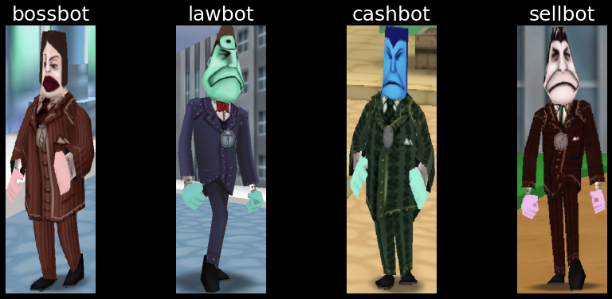

<title>Hyperparameter optimization: KerasTuner & TensorBoard</title>

# Hyperparameter optimization

Finding the optimal model architecture and training configuration is a tedious and time-consuming task.
The manual process of repeatedly tuning a model's hyperparameters and training configuration often leads to sub-optimal model performance.

Hyperparameters are values that are used to control the model's learning process during training.
Their values determine the model's performance - specifically, the model's ability ability to correctly map the input data to the desired labels or targets.
The more optimal the hyperparameters, the better the model's performance.

In deep learning models, the most common hyperparameters are the number of hidden layers, the number of neurons in each layer, and the activation function used in each layer.

<details>
<summary>Common hyperparameters</summary>

- Train-validation-test split ratio
- Optimizer algorithm (e.g., gradient descent, stochastic gradient descent, or Adam optimizer)
- Optimizer's learning-rate
- Convolutional layer's kernel or filter size
- Activation function in a neural network layer (e.g. Sigmoid, ReLU, Tanh)
- Number of hidden layers
- Number of activation units in each layer
- Dropout rate
- Pooling size
- Batch size
- Number of iterations (epochs) during training
- Number of clusters in a clustering task

</details>

We can use [KerasTuner](https://keras.io/keras_tuner/) to automate the process of hyperparameter optimization.
[TensorBoard](https://www.tensorflow.org/tensorboard/) visualizer can be used alongside KerasTuner to visualize the optimization progress.

This article will cover the basics of hyperparameter optimization in deep learning projects using KerasTuner and TensorBoard.
The examples will be based on my own [ToonVision](../toonvision/classification) computer vision project.


<details>
    <summary>Table of Contents</summary>

- [Hyperparameter optimization](#hyperparameter-optimization)
    - [Project description](#project-description)
        - [Model architecture](#model-architecture)
        - [Hyperparameters](#hyperparameters)

</details>

## Project description

The ToonVision project is a multiclass classification model for classifying [Cogs](https://toontownrewritten.fandom.com/wiki/Cogs) in ToonTown Online.
There are four unique Cog types - also called [corporate ladders](https://toontownrewritten.fandom.com/wiki/Corporate_ladder) or suits.
Our goal is to train a model that can classify Cogs into the four unique suits, as seen in the image below.

<figure class="center">
    
    <figcaption>Unique Cog types: Bossbot, Lawbot, Cashbot, Sellbot</figcaption>
</figure>

### Model architecture

We'll create a model from scratch and use my [ToonVision dataset](../toonvision/classification/#the-toonvision-dataset) to train and evaluate the model.

The model will be a convolutional neural network (CNN).
It will have two "blocks", each of which will have a single convolutional layer and two max pooling layers.
The final layer will be a fully-connected layer (Dense) with four output nodes, one for each of the four Cog types.

```python
def make_multiclass_model_padding(
    name: str = "",
    augmentation: keras.Sequential = None,
    dropout: float = 0.0,
) -> keras.Model:
    inputs = keras.Input(shape=(600, 200, 3))
    if augmentation:
        x = augmentation(inputs)
    x = layers.Rescaling(1.0 / 255)(inputs)

    # Block 1: Conv2d -> MaxPool2D -> MaxPool2D -> Dropout
    x = layers.Conv2D(filters=4, kernel_size=3, activation="relu", padding="same")(x)
    x = layers.MaxPooling2D(pool_size=2)(x)
    x = layers.MaxPooling2D(pool_size=2)(x)
    x = layers.Dropout(dropout)(x)
    # Block 2: Conv2D -> MaxPool2D -> MaxPool2D -> Dropout
    x = layers.Conv2D(filters=4, kernel_size=3, activation="relu", padding="same")(x)
    x = layers.MaxPooling2D(pool_size=2)(x)
    x = layers.MaxPooling2D(pool_size=2)(x)
    x = layers.Dropout(dropout)(x)

    x = layers.Flatten()(x)
    outputs = layers.Dense(units=4, activation="softmax")(x)
    model = keras.Model(name=name, inputs=inputs, outputs=outputs)

    model.compile(
        optimizer=tf.keras.optimizers.Adam(learning_rate=1e-3),
        loss=tf.keras.losses.SparseCategoricalCrossentropy(),
        metrics=[tf.keras.metrics.SparseCategoricalAccuracy()],
    )
    return model
```

### Hyperparameters

The model's hyperparameters were chosen by intuition and experimentation.
However, I believe that we can find better hyperparameters by tuning the model's hyperparameters using KerasTuner.

We'll focus on tuning the following hyperparameters with KerasTuner:

- `filters`: The number of convolutional filters in each convolutional layer.
- `kernel_size`: The size of the convolutional kernel.
- `pool_size`: The size of the max pooling layers.
- `dropout_rate`: The probability of dropping a neuron.

```python
x = layers.Conv2D(filters, kernel_size, activation="relu", padding="same")(x)
x = layers.MaxPooling2D(pool_size)(x)
x = layers.MaxPooling2D(pool_size)(x)
x = layers.Dropout(rate)(x)
```

Additional hyperparameters tuning could include the number of layers (convolutional/pooling/dropout), optimizer algorithm, and learning rate, but I will not cover these here.

