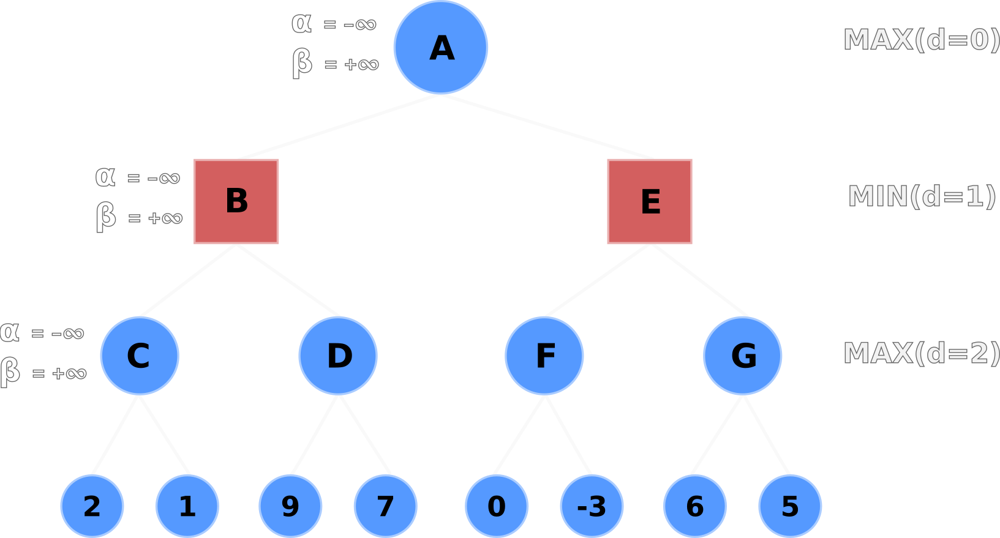
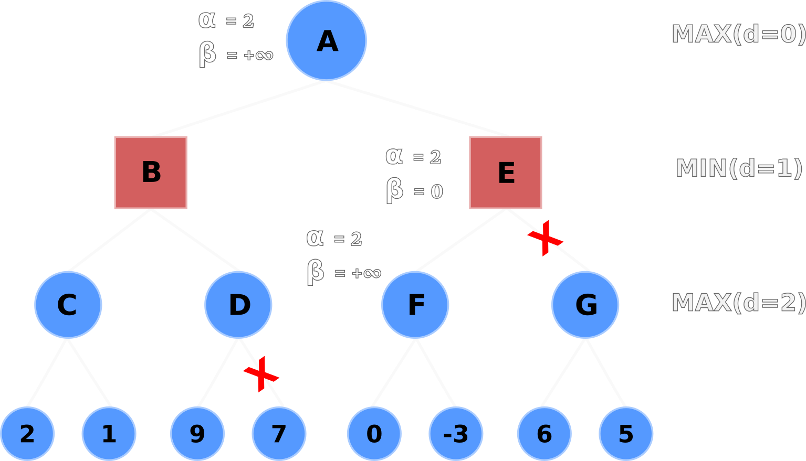
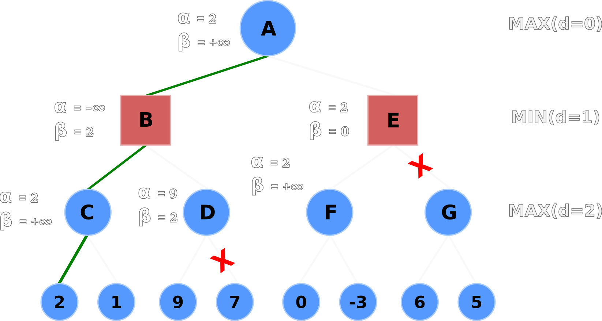

# Minimax search

Minimax search is a fundamental depth-first search algorithm used in Artificial Intelligence, decision theory, game theory, and statistics.
The purpose of minimax search is to  **minimize the maximum loss** in a worst-case scenario - or, simply put, figure out the best action to pursue in a worst-case scenario.

This algorithm can be implemented in *n*-player **perfect information** games but is most commonly implemented in 2-player zero-sum games such as checkers, chess, connect 4, mancala, tic-tac-toe, etc.
Zero-sum games are simplified as games where whatever (value/utility) one player wins and, the other player loses.

Perfect information games are games where every player knows the results of all previous moves.
In games of perfect information, there is at least one "best" way to play for each player.
The "best" way to play can be obtained by searching into future moves using and evaluating the game states with search algorithms such as minimax.
Moreover, the best strategy does not necessarily allow one to win but will minimize the losses[^1].

In this article, we'll discuss what minimax search is, the related vocabulary, search tree structure, search process, alpha-beta pruning, and, finally, implement minimax with and without alpha-beta pruning in mancala.

---
## Minimax vocabulary

Let's familiarize ourselves with minimax-related variables and keywords before we implement minimax searches.

| **Keyword**       | **Variable**   | **Definition** |
| --------------    | :------------: | :------------: |
| Player/Maximizer  | pmax[^2]| Maximizes their action's value - or minimizes the maximum loss - in a worst-case scenario |
 Opponent/Minimizer | pmin| Minimizes the value of the player's (pmax's) maximum gain |
| Heuristic value   | `v`[^3]        | Value of the player's action - or current game state - obtained by an evaluation function. Larger numbers are more beneficial for pmax, whereas smaller numbers are more beneficial for pmin. |
| Branching factor  | `b`            | How many actions the player has available |
| Depth             | `d`            | How deep into the tree - or how many moves ahead - the algorithm will search |

---
## Minimax tree structure

Suppose we're playing a 2-player turn-based game where each player has a choice between two actions per turn.
The branching factor, `b`, will be equal to 2.
We'll configure the algorithm to search to a depth of 3 - that is, we'll consider the player's possible moves, the opponent's responses, and the player's responses to the opponent's responses - which will set the variable `d` equal to 3.

Given the variables `b`=2 and `d`=3, the algorithm will generate the following tree structure:

<figure class="right">
    
    <figcaption>Tree generated by minimax with the branching factor of 2 and depth of 3.
    Each node in the tree is the value of a game state as a result of the player choosing an action.
 </figcaption>
</figure>

<!--  -->

The number of heuristic evaluations - also called *terminal nodes* or *leaf nodes*, seen in the figure as v1-v8 - completed in a minimax search tree is denoted by: **bd**.
It's important to notice that the size of the search tree increases exponentially based on **how deep the algorithm searches** and **how large the branching factor is**.

We have a mere 23 (8) heuristics evaluations in the tree above when looking 3 moves ahead.
However, the tree represents an arbitrary game for which there are only two possible actions per turn.

Consider chess, where the branching factor (possible moves) is exactly 20 for opening moves and about 35 for the remainder of the game[^4].
If we re-configured our minimax algorithm's branching factor (`b`) to reflect the number of possible moves in chess, we would have to perform roughly 353 (42,875) heuristic evaluations.
And that's only looking 3 moves ahead!

The last thing to consider about these trees is that **the branching factor is not always uniform**.
Just because there are two possible moves this turn, it doesn't mean there will be two possible moves next turn.
Perhaps there is only one possible move next turn or you may have reached a terminal state where there are no possible moves; you've won or lost.

Looking at chess again: there are 20 possible opening moves, that is known.
After the first move, and depending on which piece is moved, there can be anywhere from 20-29 moves.
The opening move below allows for 29 possible moves on white's next turn - or 28 possible moves if black moves their pawn to d5.

<!--  -->
<figure class="center">
    
    <figcaption>White's first move, pawn d2->d4, opens up an additional 9 moves for white's next turn</figcaption>
</figure>

---
## Minimax search process

Recall that minimax search is a **depth-first search** algorithm; it starts at the root node and travels as deep as possible through each branch before backtracking to the top of the tree.
The depth-first search is complete once all nodes have been visited.

    

    Depth-first search animation
    

    <figure class="center">
        
        <figcaption>Depth-first search on a tree with 10 nodes[^5]</figcaption>
    </figure>

Minimax evaluates all terminal nodes at the maximum search depth `d` and then begins the search process.
The non-terminal nodes' values are determined by the minimizer/maximizer's choices of the descendent leaf nodes.

Referring back to the minimax tree, the search process begins as follows for a tree with depth 3:
<figure class="right">
    
    <figcaption>Minimax search animation</figcaption>
</figure>

1. Minimax reaches the terminal nodes on the left-hand side of the tree and calculates the heuristic values, v1 and v2
1. Minimax backtracks one level; `max2` picks the maximum value between v1 and v2
1. Minimax then goes down the right-hand side of `min1` and calculates the terminal node values of v3 and v4
1. Backtrack up one level; `max3` picks the maximum value between v3 and v4
1. Backtrack up one level; `min1`  picks the minimum value between `max2` and `max3`
1. Repeat with `max4(v5, v6)`, `max5(v7, v8)`, and `min2(max4, max5)`
1. Finally `max1` (root node) picks the maximum value between `min1` and `min2`

The gist of minimax is that the minimizer and maximizer alternate picking their most optimal value for every level of the tree.
Who picks first depends on how deep the tree is, but it's guaranteed that the maximizer picks last because they are the root node and the main player.

When the search completes, the root node will contain the player's maximum gain in a worst-case scenario, **assuming the opponent is always playing their best move.**
Minimax with deep searches (large `d` value) are not optimal against opponents with random actions because the algorithm assumes the opponent is competent and playing optimal moves.

One last thing to consider is that the algorithm's search time drastically increases for complex games with a large branching factor `b` - also called *action spaces* - such as chess.
The algorithm visits *every* node - every possible action - before choosing an optimal action.
So the larger and deeper the tree, the longer the search algorithm takes to find the most optimal value.

The search time of large trees can be dramatically reduced by applying an optimization called **alpha-beta pruning**.

---
# Alpha-beta pruning

Alpha-beta pruning is an optimization technique for the minimax search algorithm.
The optimization greatly reduces search times by preventing minimax from visiting and evaluating unnecessary nodes.

Recall that the number of nodes visited by minimax is exponential (bd).
In best-case scenarios, alpha-beta pruning reduces the exponent in half, thus considerably improving search times.
But how does alpha-beta pruning optimize search times?

The pruning process cuts off leaves - or entire sub-trees - in the game tree which need not be searched because a better move already exists.
It's easy to think that the algorithm may prune the most optimal action; however, alpha-beta pruning will return the same action as minimax, only much faster.

---
## Alpha-beta vocabulary
The optimization technique adds two new terms to our minimax vocabulary: alpha (`α`) and beta (`β`)

| **Keyword**       | **Variable**   | **Definition** |
| --------------    | :--------------: | -------------- |
| Alpha             | `α`            | The best action (highest value) pmax can guarantee at the current tree depth or above. Initial value is -∞.
| Beta              | `β`            | The best action (lowest value) the pmin can guarantee at the current tree depth or above. Initial value is +∞.

---
## Alpha-beta pruning process
Before diving into the pruning process, we need to understand the principles of alpha-beta:

1. Only the maximizer may update `α`
1. Only the minimizer may update `β`
1. `α` and `β` values are passed down only to the child nodes; not to the parent nodes
1. Pruning occurs when `α`>=`β`

Let's now walk through the alpha-beta pruning process.
In the following figures, Nodes A, C, D, F, G are the maximizers, and Nodes B, E are the minimizers.

The default `α` and `β` values are propagated from A to its children B and C.

<figure class="center" style="width:60%;">
    
    <figcaption>A propogates its alpha-beta values to children nodes B and C</figcaption>
</figure>

Node C evaluates its left-hand terminal node (2) and compares it to the current `α` value.
If the terminal node's value is greater than the current `α` value -  e.g. max(2, -∞) - then Node C updates `α` with the terminal node's value.
Node C's node and `α` values are now equal to 2 because 2 is greater than -∞.

<figure class="center" style="width:60%;">
    
    <figcaption>C updates its node and <code>α</code> values</figcaption>
</figure>

Node C then evaluates its right-hand terminal node.
The right-hand node's value (1) is less than `α` (2) and less than Node C's current value (2), so nothing is updated.

Node C's value is backtracked upwards; Node B's value is set to 2.
Node B then compares its `β` value (+∞) to its current node value (2) and updates `β` if the current node value is less than `β` - e.g. min(2, +∞).
Node B's `β` value is now set to 2 and propagated downwards to Node D's `β` value.

<figure class="center" style="width:60%;">
    
    <figcaption>B updates it node and <code>β</code>, values following C's backtrack, then propogates its <code>β</code> to D</figcaption>
</figure>

Node D evaluates the left-hand node and updates its node and `α` values to 9.
**Here's the important part**: Node D's `α` value is now greater than its `β` value, so it no longer has to evaluate the remaining nodes.
The right-hand node is pruned, thus saving the algorithm from evaluating the heuristic value of one node so far.

<figure class="center" style="width:60%;">
    
    <figcaption>D prunes the right-hand terminal node after updating its <code>α</code> value because it's a pointless computation</figcaption>
</figure>

Node D backtracks its node value to Node B.
Node B selects the minimum value from C and D with min(2, 9), and selects 2.
Node B then backtracks its node value to Node A, and Node A updates its node and `α` values to 2 after evaluating max(2, -∞).

<figure class="center" style="width:60%;">
    
    <figcaption>A updates its node and <code>α</code> values following B's backtrack</figcaption>
</figure>

Node A propagates its alpha-beta values (`α`=2, `β`=+∞) down to Nodes E and F.
Node F evaluates its left-hand terminal node (0) and selects 0 for its own node value, but does not update the `α` value because max(0, 2) is still 2.
Node F then evaluates the right-hand node but doesn't update its node or `α` value because -3 is less than 0 and 2.

<figure class="center" style="width:60%;">
    
    <figcaption>A propogates its <code>α</code> value to children Nodes E and F</figcaption>
</figure>

Node F backtracks its node value up to Node E, where E will update its `β` value with 0 after evaluating min(0, +∞).
Now E's alpha-beta values are (`α`=2, `β`=0).
**Here's another important part**: Node E's `α` value is greater than its `β` value, so it prunes the entire sub-tree of Node G.
Thus saving the algorithm from two more node evaluations, for a total of three fewer heuristic evaluations overall.

<figure class="center" style="width:60%;">
    
    <figcaption>E prunes sub-tree G following F's backtrack because E's <code>α</code> value is greater than its <code>β</code> value</figcaption>
</figure>

Node E backtracks its node value of 0 up to Node A where Node A will take the max(B, E) or max(2, 0).

Of course Node A will select 2. And that's how we can find the player's most optimal action in a worst-case scenario using minimax with alpha-beta pruning!

<figure class="center" style="width:60%;">
    
    <figcaption>Minimax game tree including the optimal action path, alpha-beta values, and prunes</figcaption>
</figure>

---
## Alpha-beta pruning considerations

The order in which nodes are examined directly affects alpha-beta pruning's effectiveness. There are two types of node orderings to be conscious of prior to creating a minimax game tree:

1. *Worst* ordering: In the worst-case scenario, the alpha-beta optimization does not prune any nodes; thus acting like the standard minimax algorithm without no optimizations. The worst ordering occurs when the most optimal value resides on the right-most terminal node.
1. *Ideal* ordering: Conversely, the ideal ordering occurs when the most optimal value resides on/near the left-most terminal node. In the ideal ordering, the algorithm prunes many nodes and adds considerable optimizations to the overall search time.

How can we prevent the worst ordering?

Order moves from best to worst using domain knowledge so the best move resides on/near the left-most terminal node.

In Chess, for instance, certain actions are more valuable than others: winning captures, promotions, equal captures, non-captures[^6].
If we wanted to maximize the alpha-beta pruning process on a Chess game tree, we'd order the nodes from most valuable to least valuable - aka an *ideal* ordering.

---
# Mancala

Mancala is a 2-player turn-based board game.
Each player has 6 pits with 4 seeds/stones along with 1 mancala (store) at the end of the board.

Players take turns picking up all the seeds from one of their 6 pits and placing them one-by-one until they're holding no seeds.
Stones are placed counterclock-wise into pits and in the player's own mancala at the end of the board.
Players must not place seeds in their opponent's mancala.

There are two exceptions for when a player can go again, or **re-turn**:

1. The last stone in the player's hand lands in their own mancala
1. The last stone in the player's hand lands in the same pit it started from

Lastly, there is a **capture rule**:
If the last stone in the player's hand lands in an empty pit on their own side of the board, and the adjacent pit on the opponent's side contains 1+ seeds, the player may capture all seeds from both pits and place them in their own mancala.

The player's goal is to have more seeds in their mancala than their opponent.

The game ends on either of two conditions:

1. A player's mancala contains 25+ seeds
1. All pits on a player's side are empty. In this case, the player with seeds still in play may gather and deposit the remaining seeds into their own mancala.

Please watch [this 3-minute video](https://www.youtube.com/watch?v=OX7rj93m6o8) if the explanation above wasn't clear.

---
## Mancala simluation

I wrote a simple, CLI Mancala game simulator in Python.
The code and gameplay can be found on [my GitHub repo](https://github.com/nosas/blog/tree/mancala/minimax_mancala/code).

In addition to the game simulator, I wrote an Agent class so I could play against bots using various Mancala strategies.
So far, the bots only strategies are: prioritize re-turns, random, minimax, minimax with alpha-beta pruning.

<!-- In the future, I plan on using OpenAI Gym to simulate a bot tournament and find the strongest Mancala strategy. -->

---
# References/Notes

[^1]: [Stanford CS, Game Theory: Zero-Sum Games](https://cs.stanford.edu/people/eroberts/courses/soco/projects/1998-99/game-theory/zero.html)
[^2]: Other papers or articles may refer to the player as pi or ai, and opponent(s) as p-i or a-i
[^3]: The heuristic value is often referred to as utility. The variable `u` represents utility, where ui represents the player's utility.
[^4]: [How the Computer Beat the Go Master](https://www.scientificamerican.com/article/how-the-computer-beat-the-go-master/)
[^5]: [Depth-first search animation](https://en.wikipedia.org/wiki/Depth-first_search#/media/File:Depth-First-Search.gif)
[^6]: [Chess Move Ordering: Typical move ordering](https://www.chessprogramming.org/Move_Ordering#Typical_move_ordering)
