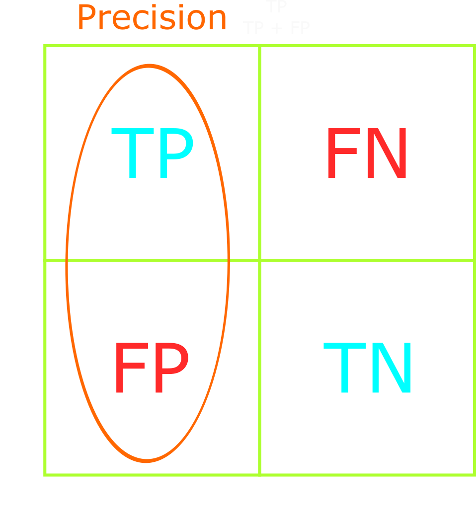

<title>Performance Measures for Classification Problems</title>

# Classification Performance Measures

This article will explain the most common performance measures for classification problems.
These measures apply to both binary and multiclass classification problems.

We will explain model performance metrics such as confusion matrix, accuracy, precision, recall, and F1-score.
The code in this article utilizes python3.7, TensorFlow, keras, and scikit-learn.

<details>
    <summary>Table of Contents</summary>

- [Classification Performance Measures](#classification-performance-measures)
    - [Why are performance measures important?](#why-are-performance-measures-important)
    - [Confusion Matrix](#confusion-matrix)
        - [Generate confusion matrix](#generate-confusion-matrix)
    - [Accuracy](#accuracy)
        - [Accuracy in classification problems](#accuracy-in-classification-problems)
    - [Precision](#precision)
        - [What are positive labels?](#what-are-positive-labels)
        - [Conceptualizing precision](#conceptualizing-precision)
    - [Accuracy vs. Precision](#accuracy-vs-precision)
    - [Recall](#recall)
    - [When to use Precision vs. Recall](#when-to-use-precision-vs-recall)
    - [F1-score](#f1-score)
    - [Performance measures in code](#performance-measures-in-code)
        - [Training accuracy](#training-accuracy)
        - [Keras built-in accuracy function](#keras-built-in-accuracy-function)
        - [Training precision, recall, and F1-score](#training-precision-recall-and-f1-score)
    - [Conclusion](#conclusion)
    - [Further reading](#further-reading)
    - [References](#references)
</details>

---
## Why are performance measures important?

During training, we monitor how well the model performs on the training data using model loss and accuracy metrics.
While these metrics are useful for monitoring the model's training progress, they are not very useful for evaluating the *performance*, or *quality*, of the model.

For example, imagine we've trained 100 models for the same classification problem, each with a different set of hyperparameters.
How do we know which model is the best?
Do we pick the model with the lowest loss, highest accuracy, or maybe a combination of the two metrics?

We could pick the model with the lowest loss, or highest accuracy, but that does not guarantee that the model is the best.
Alternatively, we could pick the model with the least amount of wrong predictions on the test data.
But does that guarantee we've picked the best model?

The loss and accuracy metrics give us a rough idea of the model's performance on the training data, but no indication of the model's general performance.
To gain a better understanding of the model's performance, we must use more specific metrics.
We'll discuss and compare the following metrics:

* *Accuracy*: The percentage of correct predictions
* *Precision*: The proportion of correct positive predictions
* *Recall*: The proportion of positive labels that were correctly identified
* *F1-score*: The harmonic mean of precision and recall

We'll examine these metrics in examples such as dog vs cat classification, cancer detection, and shooting arrows at a target.
Afterward, with the help of Keras and scikit-learn, we'll write code to calculate the metrics.
But first, we must familiarize ourselves with the confusion matrix.

---
## Confusion Matrix

<figure class="right" style="width:30%">
    
    <figcaption>Confusion matrix for a binary classification problem</figcaption>
</figure>

A confusion matrix is a core computer vision technique for visualizing and evaluating a classification model's performance.
As the name suggests, a confusion matrix is a 2-dimensional table.

From the confusion matrix, we can determine the number of true positives, true negatives, false positives, and false negatives.
We'll shorten the names to TP, TN, FP, and FN, respectively.
Using TP, TN, FP, and FN, we can calculate the model's accuracy, precision, recall, and F1-score.

The table on the right shows a confusion matrix for a binary classification problem.
The rows represent the true labels and the columns represent the predicted labels.
The diagonal represents correct predictions, and all other cells represent incorrect predictions.
Ideally, our confusion matrix should only contain diagonal values - no incorrect predictions.

We can expand the confusion matrix to include multiclass classification problems.
For instance, the table below shows the confusion matrix for a multiclass classification problem with four classes.

The more classes in a multiclass classification problem, the more convoluted the confusion matrix will be.
This should not stop us from using the confusion matrix to evaluate model performance, however.
We can turn the multiclass matrix into a binary matrix using one-vs-all, but I will not demonstrate that here.
Instead, I'll point you to this [video](https://www.youtube.com/watch?v=6kzvrq-MIO0) and this [video by Andrew Ng](https://www.youtube.com/watch?v=ZvaELFv5IpM).

<figure class="center">
    
    <figcaption>Confusion matrix for a multiclass classification problem</figcaption>
</figure>

Later in this article, we'll use a confusion matrix to derive the accuracy, precision, recall, and F1-score of our classification models.

### Generate confusion matrix

Given a list of predictions and a list of targets (true labels), we can generate a confusion matrix.
We'll utilize two libraries to display the matrix: `matplotlib` and `sklearn`.

The code block below was used to generate the multiclass confusion matrix in the earlier section.

```python
import matplotlib.pyplot as plt
from sklearn.metrics import ConfusionMatrixDisplay, confusion_matrix


def plot_confusion_matrix(
    predictions: list[str],
    targets: list[str],
    display_labels: list[str],
    title: str = "",
) -> None:
    """Plot the confusion matrix for a list of predictions and targets"""

    # Generate the confusion matrix
    matrix = confusion_matrix(
        y_pred=predictions, y_true=targets, labels=display_labels
        )
    # Generate the figure
    display = ConfusionMatrixDisplay(
        confusion_matrix=matrix, display_labels=display_labels
    )
    # Plot the figure, add title, and resize
    display.plot(include_values=True)
    display.ax_.set_title(title)
    fig = display.ax_.get_figure()
    fig.set_figwidth(8)
    fig.set_figheight(8)
    # Show the confusion matrix
    plt.show()
```

The `confusion_matrix()` method from `sklearn.metrics` takes in a list of predictions and a list of targets (true labels).
It outputs a 2-dimensional numpy array that represents the confusion matrix.

```python
>>> confusion_matrix(
        y_pred=preds_str,
        y_true=integer_to_suit(test_labels),
        labels=['bb', 'lb', 'cb', 'sb']
    )
array([[36,  0,  1,  4],
       [ 0, 60,  0,  0],
       [ 4,  2, 35,  0],
       [10,  0,  0, 45]], dtype=int64)
```

It may be important to note that the ordering of the `labels` parameter determines the order of the rows and columns in the confusion matrix.

---
## Accuracy

<figure class="right" style="width:40%;">
    
    <figcaption>Ratio of correct predictions</figcaption>
</figure>

Accuracy is a metric that measures the percentage of correct predictions across all classes.
In other words, accuracy is **how close the model comes to the correct result**.

Using the confusion matrix on the right, we can visualize accuracy as the confusion matrix's diagonal.

Accuracy is calculated by dividing the number of correct predictions by the total number of predictions: `(TP + TN) / (TP + TN + FP + FN)`.
`(TP + TN)` is the number of correct predictions - the diagonal of the confusion matrix.
`(TP + TN + FP + FN)` is the total number of predictions - the sum of all cells in the confusion matrix.

<br>

```python
predictions = model.predict(test_images)
# Get the wrong predictions as a True/False array, where True == wrong prediction
wrong_preds = preds != test_labels
# Count the number of wrong predictions (number of True values in the array)
num_wrong_preds = len(np.argwhere(wrong_preds))
# Calculate the accuracy
accuracy = (len(preds) - num_wrong_preds) / len(preds)
```

### Accuracy in classification problems

Balanced datasets are the key to successful classification models.
Real-world problems, however, do not always have balanced datasets.
We must understand how accuracy may be misleading in imbalanced classification datasets and tasks.

Imagine we had a binary classifier that predicts whether an image was a cat or dog.
Our dataset consists of 1000 pictures: 950 cat pictures and 50 dog pictures.

After training, the model correctly predicts 925/950 cats and 5/50 dogs, for a total of 930/1000 correct predictions.
We would say the model has an accuracy of 93%.

We might think that the model has high accuracy regardless of the class.
For instance, given a dataset with 950 dogs and 50 cats, we might assume the model retains its 93% accuracy.
This is not the case.
The model will incorrectly predict dog samples as cats as a result of its imbalanced training, resulting in significantly lower accuracy.
We can agree that the model has high accuracy on imbalanced tasks - specifically those that favor cat samples - but it will perform poorly on balanced tasks where there's an equal number of dog and cat samples.

Accuracy does not provide insight into the model's general performance, but rather the model's performance on a specific dataset.
Furthermore, accuracy does not consider the subtleties of class imbalances or differing costs of false negatives and false positives.
Measuring model performance should be straightforward, not misleading.
We can use precision and recall to measure model performance properly when facing class imbalances of differing costs of incorrect predictions.

---
## Precision

We know now that accuracy is simply the ratio of correct predictions to total predictions.
Let's expand this to include precision.

Precision answers the question of "what proportion of positive labels are actually positive?"
It's calculated as follows: `TP / (TP + FP)`.

<figure class="center" style="width:40%;">
    
    <figcaption>Ratio of correctly predicted positive labels</figcaption>
</figure>

It is the ratio of correctly predicted *positive* labels to the total number of *positive* labels predicted.
In other words, precision is **how reliably the model reaches the correct result**.

We should optimize our model's precision when we want to decrease the number of false positives or when having false negatives is not costly.

### What are positive labels?

Positive labels are labels that the model is expected to predict correctly.
They are chosen by the model author and represent the class that the model is expected to predict.

Suppose that we selected "cat" as the positive label in the cat vs. dog classification problem above.
We could then calculate the model's precision by asking, **"what proportion of cat predictions were actually cats?"**
For instance, if the model correctly predicted 3 cat samples as cats (TP = 3), but incorrectly predicted 2 dog samples as cats (FP = 2), then precision = 3/5 = 60%.

Positive labels are used to frame the model's performance given a specific task - such as precisely predicting cats.

### Conceptualizing precision

Imagine the goal is to shoot an arrow at the apple's center.
We would have high precision if there were a cluster of arrows directly at the apple's center.

If we shot a cluster of arrows directly above the apple - the arrows reliably landed above the apple, but had no guarantee of hitting the apple's center - we would still have high precision due to the arrows' consistent clustering.
This is a case of high precision (consistent arrow location) with low accuracy (missing the apple's center).

High precision allows us to trust the arrow to reliably hit near the previous arrows' locations.
The key takeaway is that high precision means high reliability, but that doesn't guarantee it's reliably correct!

---
## Accuracy vs. Precision

Accuracy and precision are closely related and often used interchangeably in day-to-day work.
However, the distinction between accuracy and precision is crucial for engineers and scientists.

Earlier we explained accuracy as how *close* the model is to the correct result and precision as how *reliably* the model reaches the correct result.
We can visualize accuracy as how close the arrows land near the apple's center, and precision as how reliably the arrows land near one another.

<figure class="center" style="width:100%;">
    
    <figcaption>Accuracy and precision</figcaption>
</figure>

One can have high accuracy and low precision - such as when the arrows land everywhere around the apple's center.
High precision and low accuracy are also possible - such as when the arrows reliably cluster, but miss the apple's center.

---
## Recall

Now we understand how many times the model correctly predicted labels (accuracy) and how many times it correctly predicted a specific label (precision).
Let's move on to the next metric: recall.

Recall answers the question "what proportion of actual positives are correctly classified?"
We calculate recall as follows: `TP / (TP + FN)`.

<figure class="center" style="width:40%;">
    
    <figcaption>Proportion of correct positives</figcaption>
</figure>

We should optimize our model's recall when we want to decrease the number of false negatives - identify rare but important classes.

---
## When to use Precision vs. Recall

Remember that precision minimizes false positives and recall minimizes false negatives.
When precision is high, we trust the model when it says positive.
When recall is high, we can trust the model to not mislabel positive classes as negative.

If our goal is identifying an object in a scene, and the false negatives are not a concern, then we should optimize for precision.
For example, counting the number of cars on a busy street or trees in forest photos, or fish in aquarium photos.
Missing an object or two is not detrimental to our goal of identifying the objects.

Now, imagine our model's task is to identify cancer in x-rays.
We're provided a realistic dataset with 1000 x-rays where the vast majority of the x-rays do *not* contain cancer.
Therefore, we can consider cancer in x-rays to be a rare class.
Our goal is to guarantee the correct identification of all cancer samples in the dataset.
Mistakenly classifying a cancerous x-ray as cancer-free is a serious mistake that would ruin our credibility.

Optimizing for recall will decrease the number of false negatives and ensure no x-rays containing cancer fly under our radar.
This optimization will both strengthen the model's ability to recognize rare classes and reach our goal of correctly identifying all cancer samples.
Alternatively, if we optimize our model's precision, then we decrease the number of false positives - misclassifying cancer-free x-rays as cancerous.
This neither improves our model's ability to classify cancer nor reaches our goal of identifying all cancer samples.

Precision and recall are in a trade-off relationship, where optimizing for one comes at a cost of the other.
There are cases where we should optimize for either precision or recall but, realistically, we should optimize both.
We can do this by utilizing the F1-score.

---
## F1-score

The F1-score combines precision and recall to effectively measure the model's accuracy on imbalanced classification datasets.
It's designed to be used when other metrics may be deceptive or misleading.

Formally, the F1-score is: `(2 * precision * recall) / (precision + recall)`.
We calculate the F1-score by taking the harmonic mean of precision and recall.
We take the harmonic mean because it penalizes extreme value discrepancies more than the arithmetic mean.
Penalization ensures we find a balance of precision and recall in our model's performance.
The following figure demonstrates how the F1-score compares against the arithmetic mean with varying precision and recall values.

<figure class="center" style="width:98%;">
    
    <figcaption></figcaption>
</figure>

Figure 1 derives the F1-score when precision and recall are slightly different.
Note how close the F1-score is to the arithmetic mean.
The larger the difference between precision and recall, the larger the difference between the harmonic and arithmetic means.
Figures 2 and 3 show how the F1-score moves when the precision and recall values are vastly different and the same, respectively.

If our goal is to have strong precision and recall, we should optimize our model's F1-score.
This is especially true when working with imbalanced datasets or tasks - such as the cancer classification problem.

The following section shows how to implement the accuracy, precision, recall, and F1-score metrics using python.
It's not a detailed how-to, but a resource for future projects.

---
## Performance measures in code

The following section is for future reference.
We'll implement and visualize the performance measures with the help of Keras, Tensorflow, and scikit-learn.

### Training accuracy

During training, we can use Keras' built-in accuracy `Metric` classes: [binary_accuracy][binary_accuracy], [categorical_accuracy][categorical_accuracy], and [sparse_categorical_accuracy][sparse_categorical_accuracy].
For binary classification models, we use the `binary_accuracy` metric.
For multiclass classification models, we use the `[sparse_]categorical_accuracy` metric.

The `Metric` classes allow us to use TensorBoard and visualize training metrics.

```python
model = make_multiclass_model(
    name="convnet_example", augmentation=get_image_augmentations(), dropout=0.5
)
model.compile(
    loss=(
        tf.keras.losses.SparseCategoricalCrossentropy()
        if not ONEHOT
        else tf.keras.losses.CategoricalCrossentropy()
    ),
    optimizer=opt,
    metrics= [
        tf.keras.metrics.SparseCategoricalAccuracy()
        if not ONEHOT
        else tf.keras.metrics.CategoricalAccuracy(),
    ]
)
```

### Keras built-in accuracy function

Alternatively, given a pre-trained model, we can use Keras' built-in accuracy function to calculate the model's prediction accuracy: [binary][binary], [categorical][categorical], [sparse_categorical][sparse_categorical].

Where the `Metric` classes allow us to utilize TensorBoard, the accuracy function allows us to directly calculate the model's prediction accuracy.

```python
>>> predictions = model.predict(test_images)
>>> ca = tf.keras.metrics.categorical_accuracy(y_true=test_labels, y_pred=predictions)
>>> ca
<tf.Tensor: shape=(197,), dtype=float32, numpy=
array([0., 1., 1., 1., 1., 1., 1., 1., 1., 1., 1., 1., 1., 1., 1., 0., 1.,
       1., 1., 1., 1., 1., 1., 1., 1., 1., 1., 1., 1., 1., 1., 1., 1., 1.,
       1., 1., 1., 1., 1., 1., 1., 1., 1., 1., 0., 1., 1., 1., 1., 1., 1.,
       1., 1., 1., 0., 1., 1., 1., 1., 1., 1., 1., 1., 1., 1., 1., 1., 1.,
       1., 1., 1., 1., 1., 1., 1., 1., 1., 1., 1., 1., 1., 1., 1., 1., 1.,
       1., 1., 1., 1., 1., 1., 1., 1., 1., 1., 1., 1., 1., 1., 1., 1., 1.,
       0., 1., 1., 1., 1., 1., 1., 1., 1., 1., 1., 1., 1., 1., 1., 1., 1.,
       0., 1., 1., 1., 1., 1., 1., 1., 1., 1., 1., 1., 0., 1., 1., 1., 1.,
       1., 1., 1., 1., 1., 1., 1., 1., 1., 1., 1., 1., 1., 1., 1., 1., 1.,
       1., 1., 1., 1., 1., 1., 1., 0., 1., 1., 1., 1., 1., 1., 1., 0., 1.,
       1., 1., 1., 1., 1., 1., 1., 1., 1., 1., 1., 1., 1., 1., 1., 1., 1.,
       1., 1., 0., 1., 1., 1., 1., 1., 1., 1.], dtype=float32)>
```

The function outputs a binary array where `0` represents wrong predictions and `1` represents correct predictions.
This is the equivalent of the code example seen earlier in the [accuracy section](#accuracy):

```python
# Get the wrong predictions as a True/False array, where True == wrong prediction
>>> wrong_preds = preds != test_labels
>>> ca = tf.keras.metrics.categorical_accuracy(y_true=test_labels, y_pred=predictions)
>>> ca = np.argwhere(ca == 0)  # Create the True/False array
>>> ca == wrong_preds
True
```

### Training precision, recall, and F1-score

During training, we can use Keras' built-in [precision](https://www.tensorflow.org/api_docs/python/tf/keras/metrics/Precision) and [recall](https://www.tensorflow.org/api_docs/python/tf/keras/metrics/Recall) metrics.

```python
model = make_multiclass_model(
    name="convnet_example", augmentation=get_image_augmentations(), dropout=0.5
)
model.compile(
    loss=(
        tf.keras.losses.SparseCategoricalCrossentropy()
        if not ONEHOT
        else tf.keras.losses.CategoricalCrossentropy()
    ),
    optimizer=opt,
    metrics= [tf.keras.metrics.Precision(), tf.keras.metrics.Recall()]
)
```

We can use these measures to manually derive the F1-score.
Alternatively, we can use TensorFlow Addons' [F1Score metric](https://www.tensorflow.org/addons/api_docs/python/tfa/metrics/F1Score).

The simplest way to derive precision, recall, and F1-score, however, is to use scikit-learn's `classification_report` and `f1_score` methods.

```python
>>> from sklearn.metrics import (
>>>     classification_report,
>>>     f1_score,
>>>     precision_score,
>>>     recall_score,
>>>     confusion_matrix)

>>> confusion_matrix(test_labels, predictions)
[[38  1  1  1]
 [ 0 41  0  0]
 [ 0  4 56  0]
 [ 1  1  1 52]]

>>> precision_score(test_labels, predictions , average="macro")
0.9483371791854744

>>> recall_score(test_labels, predictions , average="macro")
0.9514042867701404

>>> f1_score(test_labels, predictions , average="macro")
0.9484834217885065

>>> classification_report(test_labels, predictions)
              precision    recall  f1-score   support

          bb       0.97      0.93      0.95        41
          cb       0.87      1.00      0.93        41
          lb       0.97      0.93      0.95        60
          sb       0.98      0.95      0.96        55

    accuracy                           0.95       197
   macro avg       0.95      0.95      0.95       197
weighted avg       0.95      0.95      0.95       19
```

---
## Conclusion

After reading this article, we should have a more profound understanding of the three most common classification performance measures: precision, recall, and F1-score.
We learned how accuracy is a misleading metric for evaluating model performance - especially in imbalanced classification tasks.
Using precision, recall, and F1-score, we can properly evaluate and fine-tune our model for high performance on imbalanced datasets.

Here's the final summary of the performance measures:

* **Accuracy**: The percentage of correct predictions. A misleading metric that provides minimal insight into the model's true performance.
* **Precision**: The proportion of positive labels that are actually positive: model's reliability score. Useful for minimizing false positives.
* **Recall**: The proportion of actual positive labels that were correctly identified. Useful for minimizing false negatives.
* **F1-score**: The harmonic mean of precision and recall. Useful for finding a balance of high precision and recall - minimizing false positives and false negatives - in imbalanced datasets.

---
## Further reading

My explanations merely scratch the surface of classification performance measures.
This article was not intended to deep dive into the measures.
Rather, it was to demonstrate my current working knowledge on the subject of performance measures.

The following articles go in-depth into additional measures such as ROC-AUC curves, Cohen Kappa score, Matthew’s correlation coefficient, and log loss.
I highly recommend giving them a read/skim to gain a deeper understanding, or varying perspective, of the measures mentioned above.

* [F-Score](https://deepai.org/machine-learning-glossary-and-terms/f-score)
* [Guide to accuracy, precision, and recall](https://www.mage.ai/blog/definitive-guide-to-accuracy-precision-recall-for-product-developers)
* [Comprehensive Guide to Multiclass Classification Metrics](https://towardsdatascience.com/comprehensive-guide-on-multiclass-classification-metrics-af94cfb83fbd)
* [Comprehensive Guide to Multiclass Classification With Sklearn](https://towardsdatascience.com/comprehensive-guide-to-multiclass-classification-with-sklearn-127cc500f362)
* (VIDEO) [Introduction to Precision, Recall, and F1](https://www.youtube.com/watch?v=jJ7ff7Gcq34)

---
## References

* Scikit-learn's *Model Evaluation Metrics and Scoring* [API](https://scikit-learn.org/stable/modules/model_evaluation.html#metrics-and-scoring-quantifying-the-quality-of-predictions)

[binary_accuracy]: https://www.tensorflow.org/api_docs/python/tf/keras/metrics/BinaryAccuracy
[categorical_accuracy]: https://www.tensorflow.org/api_docs/python/tf/keras/metrics/CategoricalAccuracy
[sparse_categorical_accuracy]: https://www.tensorflow.org/api_docs/python/tf/keras/metrics/SparseCategoricalAccuracy
[binary]: https://www.tensorflow.org/api_docs/python/tf/keras/metrics/binary_accuracy
[categorical]: https://www.tensorflow.org/api_docs/python/tf/keras/metrics/categorical_accuracy
[sparse_categorical]: https://www.tensorflow.org/api_docs/python/tf/keras/metrics/sparse_categorical_accuracy
