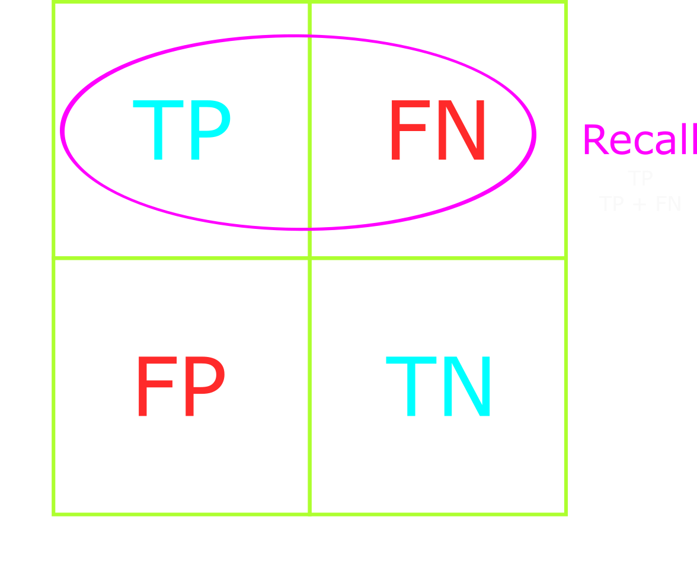

<title>Performance Measures for Classification Problems</title>

# Classification Performance Measures

This article will explain the most common performance measures for classifications problems.
These measures apply to both binary and multi-class classification problems.

We will explain model performance metrics such as confusion matrix, accuracy, precision, recall, F1-score, and ROC curve.
The code in this article utilizes python3.7, tensorflow, and keras.

<details>
    <summary>Table of Contents</summary>

- [Classification Performance Measures](#classification-performance-measures)
    - [Why are performance measures important?](#why-are-performance-measures-important)
    - [Confusion Matrix](#confusion-matrix)
        - [Generate confusion matrix](#generate-confusion-matrix)
    - [Accuracy](#accuracy)
        - [Accuracy in classification problems](#accuracy-in-classification-problems)
    - [Precision](#precision)
        - [What are positive labels?](#what-are-positive-labels)
        - [Conceptualizing precision](#conceptualizing-precision)
    - [Accuracy vs Precision](#accuracy-vs-precision)
    - [Recall](#recall)
    - [When to use Precision vs Recall](#when-to-use-precision-vs-recall)
    - [F1-score](#f1-score)
    - [Keras](#keras)
        - [Training accuracy in Keras](#training-accuracy-in-keras)
        - [Accuracy in Keras](#accuracy-in-keras)
        - [Training precision in Keras](#training-precision-in-keras)
    - [Conclusion](#conclusion)
    - [References](#references)
</details>

---
## Why are performance measures important?

During training, we monitor how well the model performs on the training data using model loss and accuracy metrics.
While these metrics are useful for monitoring the model's training progress, they are not very useful for evaluating the *performance*, or *quality*, of the model.

For example, imagine we've trained 100 models for the same classification problem, each with a different set of hyperparameters.
How do we know which model is the best?
Do we pick the model with the lowest loss, highest accuracy, or maybe a combination of the two metrics?

We could pick the model with the lowest loss, or highest accuracy, but that does not guarantee that the model is the best.
Alternatively, we could pick the model with the least amount of wrong predictions on the test data.
But does that guarantee we've picked the best model?

The loss and accuracy metrics give us a rough idea of the model's performance on the training data, but no indication of the model's general performance.
In order to gain a better understanding of the model's performance, we must use more specific metrics.
We'll discuss and compare the following metrics:

* *Accuracy*: The percentage of correct predictions
* *Precision*: The percentage of correct positive predictions
* *Recall*: The percentage of positive predictions that are correct
* *F1-score*: The harmonic mean of precision and recall
* *ROC Curve*: A plot of the true positive rate against the false positive rate

We'll examine these metrics in examples such as dog vs cat classification, cancer detection, and shooting arrows at a target.
Afterwards, with the help of Keras and scikit-learn, we'll write code to calculate the metrics.
But first we must familiarize ourselves with the confusion matrix.

---
## Confusion Matrix

<figure class="right" style="width:30%">
    
    <figcaption>Confusion matrix for a binary classification problem</figcaption>
</figure>

A confusion matrix is a core computer vision technique for visualizing and evaluating a classification model's performance.
As the name suggests, a confusion matrix is a 2-dimensional table.

From the confusion matrix we can determine the number of true positives, true negatives, false positives, and false negatives.
We'll shorten the names to TP, TN, FP, and FN, respectively.
Using TP, TN, FP, and FN, we can calculate the model's accuracy, precision, recall, and F1-score.

The table below shows the confusion matrix for a binary classification problem.
The rows represent the true labels and the columns represent the predicted labels.
The diagonal represents correct predictions and all other cells represent incorrect predictions.
Ideally, our confusion matrix should diagonal contain values - no incorrect predictions.

We can expand the confusion matrix to include multi-class classification problems.
For instance, the table below shows the confusion matrix for a multi-class classification problem with four classes.

The more classes in a multi-class classification problem, the more convoluted the confusion matrix will be.
This should not stop us from using the confusion matrix to evaluate model performance, however.

<figure class="center">
    
    <figcaption>Confusion matrix for a multiclass classification problem</figcaption>
</figure>

Later in this article, we'll use a confusion matrix to derive the accuracy, precision, recall, and F1-score of our classification models.

### Generate confusion matrix

Given a list of predictions and a list of targets (true labels), we can generate a confusion matrix.
We'll utilize two libraries to display the matrix: `matplotlib` and `sklearn`.

The code block below was used to generate the multiclass confusion matrix in the earlier section.

```python
import matplotlib.pyplot as plt
from sklearn.metrics import ConfusionMatrixDisplay, confusion_matrix


def plot_confusion_matrix(
    predictions: list[str],
    targets: list[str],
    display_labels: list[str],
    title: str = "",
) -> None:
    """Plot the confusion matrix for a list of predictions and targets"""

    # Generate the confusion matrix
    matrix = confusion_matrix(
        y_pred=predictions, y_true=targets, labels=display_labels
        )
    # Generate the figure
    display = ConfusionMatrixDisplay(
        confusion_matrix=matrix, display_labels=display_labels
    )
    # Plot the figure, add title, and resize
    display.plot(include_values=True)
    display.ax_.set_title(title)
    fig = display.ax_.get_figure()
    fig.set_figwidth(8)
    fig.set_figheight(8)
    # Show the confusion matrix
    plt.show()
```

The `confusion_matrix()` method from `sklearn.metrics` takes in a list of predictions and a list of targets (true labels).
It outputs a 2-dimensional numpy array that represents the confusion matrix.

```python
>>> confusion_matrix(
        y_pred=preds_str,
        y_true=integer_to_suit(test_labels),
        labels=['bb', 'lb', 'cb', 'sb']
    )
array([[36,  0,  1,  4],
       [ 0, 60,  0,  0],
       [ 4,  2, 35,  0],
       [10,  0,  0, 45]], dtype=int64)
```

It may be important to note that the ordering of the `labels` parameter determines the order of the rows and columns in the confusion matrix.

---
## Accuracy

<figure class="right" style="width:40%;">
    
    <figcaption>Ratio of correct predictions</figcaption>
</figure>

Accuracy is a metric that measures the percentage of correct predictions across all classes.
In other words, accuracy is **how close the model comes to the correct result**.

Using the confusion matrix on the right, we can visualize accuracy as the confusion matrix's diagonal.

Accuracy is calculated by dividing the number of correct predictions by the total number of predictions: `(TP + TN) / (TP + TN + FP + FN)`.
`(TP + TN)` is the number of correct predictions - the diagonal of the confusion matrix.
`(TP + TN + FP + FN)` is the total number of predictions - the sum of all cells in the confusion matrix.

<br>

```python
predictions = model.predict(test_images)
# Get the wrong predictions as a True/False array, where True == wrong prediction
wrong_preds = preds != test_labels
# Count the number of wrong predictions (number of True values in the array)
num_wrong_preds = len(np.argwhere(wrong_preds))
# Calculate the accuracy
accuracy = (len(preds) - num_wrong_preds) / len(preds)
```

### Accuracy in classification problems

Balanced datasets are the key to successful classification models.
Real-world problems, however, do not always have balanced datasets.
We must understand how accuracy may be deceptive in unbalanced classification datasets and tasks.

Imagine we had a binary classifier that predicts whether an image was a cat or dog.
Our dataset consists of 1000 pictures: 950 cats pictures and 50 dog pictures.

After training, the model correctly predicts 925/950 cats and 5/50 dogs for a total of 930/1000 correct predictions.
We would say the model has an accuracy of 93%.

We might think that the model has high accuracy regardless of the class.
For instance, given a dataset with 950 dogs and 50 cats we might assume the model retains its 93% accuracy.
This is not the case.
The model will incorrectly predict dog samples as cats, likely resulting in significantly lower accuracy.

We can agree that the model has high accuracy on unbalanced tasks - specifically those that favor cat samples - but it will perform poorly on balanced tasks where there's an equal number of dog and cat samples.
Additionally, accuracy does not provide insight to the model's general performance, but rather the model's performance on a specific dataset.

Measuring model performance should be straightforward, not deceptive.
This is where precision and recall come in.

---
## Precision

We know now that accuracy is simply the ratio of correct predictions to total predictions.
Let's expand this to include precision.

Precision answers the question of "what proportion of positive labels are actually positive?"
It's calculated as follows: `TP / (TP + FP)`.

<figure class="center" style="width:40%;">
    
    <figcaption>Ratio of correctly predicted positive labels</figcaption>
</figure>

It is the ratio of correctly predicted *positive* labels to the total number of *positive* labels predicted.
In other words, precision is **how reliably the model reaches the correct result**.

<font style="color:red">TODO: Insert code snippet to calculate precision</font>

We should optimize our model's precision when we want to decrease the number of false positives or when having false negatives is not a concern.

### What are positive labels?

Positive labels are labels that the model is expected to predict correctly.
They are chosen by the model author and represent the class that the model is expected to predict.

Suppose that we chose "cat" as the positive label in the cat vs dog classification problem above.
We could then calculate the model's precision by asking **"what proportion of cat predictions were actually cats?"**
For instance, if the model correctly predicted 3 cat samples as cats (TP = 3), but incorrectly predicted 2 dog samples as cats (FP = 2), then precision = 3/5 = 60%.

Positive labels are used to frame the model's performance given a specific task - such as precisely predicting cats.

### Conceptualizing precision

Imagine the goal is to shoot an arrow at the apple's center.
Obviously, we would have high precision if there were a cluster of arrows directly at the apple's center.

If we shot a cluster of arrows directly above the apple - the arrows reliably landed above the apple, but had no guarantee of hitting the apple's center - we would still have high precision due to the arrows' consistent clustering.
This is a case of high precision (consistent arrow location) with low accuracy (missing the apple's center).

High precision allows us to trust the arrow to reliably hit near the previous arrows' locations.
The key takeaway is that high precision means high reliability, but that doesn't guarantee it's reliably correct!

---
## Accuracy vs Precision

Accuracy and precision are closely related and often used interchangeably in day-to-day work.
However, the distinction between accuracy and precision is crucial for engineers and scientists.

Earlier we explained accuracy as how *close* the model is to the correct result and precision as how *reliably* the model reaches the correct result.
We can visualize accuracy as how close the arrows land near the apple's center, and precision as how reliably the arrows land near one another.

<figure class="center" style="width:100%;">
    
    <figcaption>Accuracy and precision</figcaption>
</figure>

One can have high accuracy and low precision - such as when the arrows land everywhere around the apple's center.
High precision and low accuracy is also possible - such as when the arrows reliably cluster, but miss the apple's center.

---
## Recall

Now we understand how many times the model correctly predicted labels (accuracy) and how many times it correctly predicted a specific label (precision).
Let's move on to the next metric: recall.

Recall answers the question of "what proportion of positives are correctly classified?"
We calculate recall as follows: `TP / (TP + FN)`.

<figure class="center" style="width:40%;">
    
    <figcaption>Proportion of correct positives</figcaption>
</figure>

We should optimize our model's recall when we want to decrease the number of false negatives - identify rare but important classes.

---
## When to use Precision vs Recall

Remember that precision minimizes false positives and recall minimizes false negatives.
When precision is high, we trust the model when it says positive.
When recall is high, we can trust the model to not mislabel positive classes as negative.

If our goal is identifying an object in a scene, and the false negatives are not a concern, then we should optimize for precision.
For example, counting the number of cars on a busy street or trees in forest photos or fish in aquarium photos.
Missing an object or two is not detrimental to our goal of identifying the objects.

Now, imagine our model's task is to identify cancer in x-rays.
We're provided a realistic dataset with 1000 x-rays where the vast majority of the x-rays do *not* contain cancer.
Therefore, we can consider cancer in x-rays to be a rare class.
Our goal is to guarantee correct identification of all cancer samples in the dataset.
Mistakenly classifying a cancerous x-ray as cancer-free is a serious mistake that would ruin our credibility.

Optimizing for recall will decrease the number of false negatives and ensure no x-rays containing cancer fly under our radar.
This optimization will both strengthen the model's ability to recognize rare classes and reach our goal to correctly identify all cancer samples.
Alternatively, if we optimize our model's precision, then we decrease the number of false positives - misclassifying cancer-free x-rays as cancerous.
This neither improves our model's ability to classify cancer nor reaches our goal of identifying all cancer samples.

Precision and recall are in trade-off relationship where optimizing for one comes at a cost for the other.
There are cases where we should optimize for either precision or recall but, realistically, we should optimize both.
We can do this by utilizing the F1-score.

---
## F1-score

The F1-score combines precision and recall to make for a good metric for imbalanced datasets.
It's designed to be a good metric for classification when other metrics may be deceptive or misleading.

Formally, the F1-score is: `(2 * precision * recall) / (precision + recall)`.
We calculate the F1-score by taking the harmonic mean of precision and recall.
We take the harmonic mean because it penalizes extreme value discrepancies more than the arithmetic mean.
Take the following three figures, for example.

<figure class="center">
    <font style="color:red">TODO: Add three figures: similar pr, different pr, same pr</font>
    
    <figcaption></figcaption>
</figure>

Figure 1 derives the F1-score when precision and recall are slightly different.
Note how similar the F1-score is to the arithmetic mean.
The larger the difference between precision and recall, the larger the difference between the harmonic and arithmetic means.
Figures 2 and 3 show how the F1-score moves when the precision and recall values are vastly different and exactly the same, respectively.

---
## Keras

### Training accuracy in Keras

During training, we can use Keras' built-in accuracy `Metric` classes: [binary_accuracy][binary_accuracy], [categorical_accuracy][categorical_accuracy], and [sparse_categorical_accuracy][sparse_categorical_accuracy].
For binary classification models, we use the `binary_accuracy` metric.
For multi-class classification models, we use the `[sparse_]categorical_accuracy` metric.

Utilizing the `Metric` classes allows us to use TensorBoard and visualize metrics during training.

<font style="color:red">TODO: Insert code snippet using Keras' built-in accuracy metrics</font>

<font style="color:red">TODO: Image of TensorBoard metrics</font>

### Accuracy in Keras

Alternatively, given a pre-trained model, we can use Keras' built-in accuracy methods to calculate the model's prediction accuracy: [binary][binary], [categorical][categorical], [sparse_categorical][sparse_categorical].

Where the `Metric` classes allow us to utilize TensorBoard, the accuracy methods allows us to directly calculate the model's prediction accuracy.

<font style="color:red">TODO: Insert code snippet using Keras' built-in accuracy methods</font>

### Training precision in Keras

During training, we can use Keras' [built-in precision metric](https://www.tensorflow.org/api_docs/python/tf/keras/metrics/Precision).

<font style="color:red">TODO: Insert code snippet using Keras' built-in precision metric</font>

---
## Conclusion

---
## References

1. Skicit Learn's *Model Evaluation Metrics and Scoring* [API](https://scikit-learn.org/stable/modules/model_evaluation.html#metrics-and-scoring-quantifying-the-quality-of-predictions)

<!-- Keras built-in training metrics -->
[binary_accuracy]: https://www.tensorflow.org/api_docs/python/tf/keras/metrics/BinaryAccuracy

[categorical_accuracy]: https://www.tensorflow.org/api_docs/python/tf/keras/metrics/CategoricalAccuracy

[sparse_categorical_accuracy]: https://www.tensorflow.org/api_docs/python/tf/keras/metrics/SparseCategoricalAccuracy

<!-- Keras built-in accuracy methods-->
[binary]: https://www.tensorflow.org/api_docs/python/tf/keras/metrics/binary_accuracy

[categorical]: https://www.tensorflow.org/api_docs/python/tf/keras/metrics/categorical_accuracy

[sparse_categorical]: https://www.tensorflow.org/api_docs/python/tf/keras/metrics/sparse_categorical_accuracy