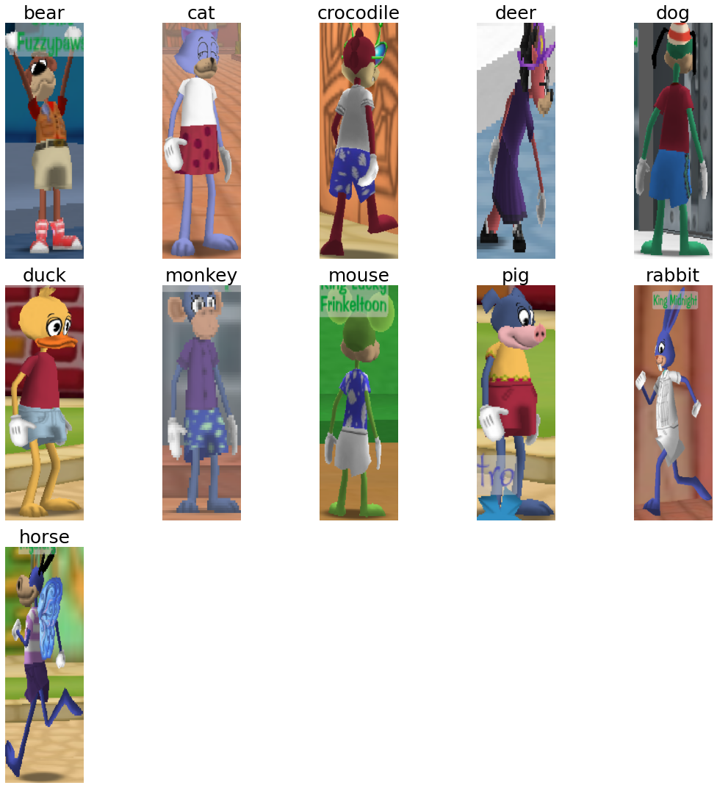
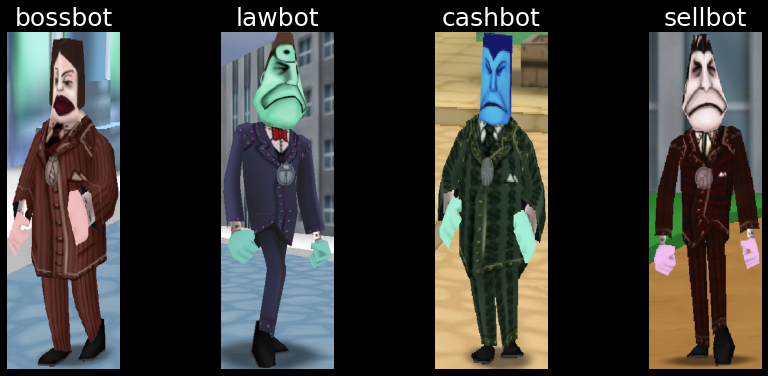
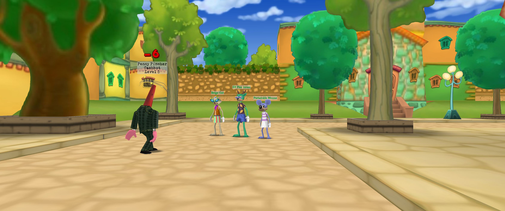
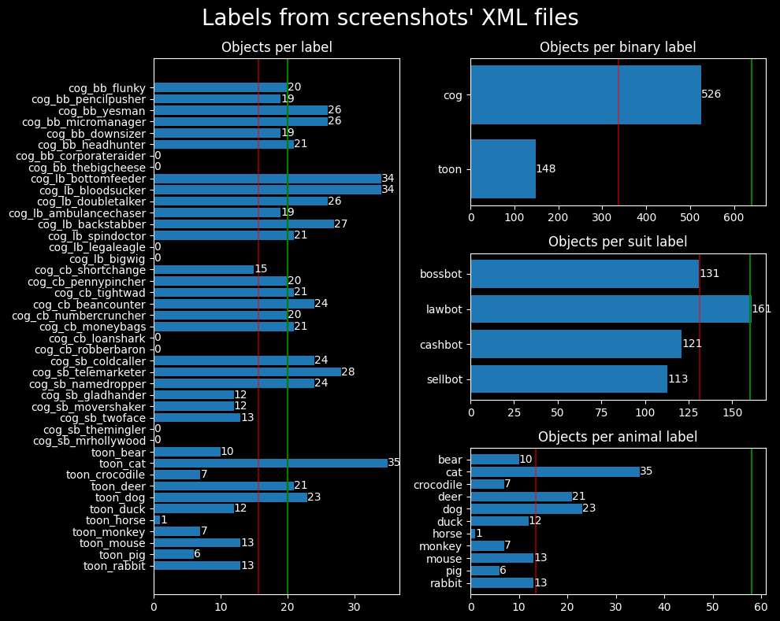
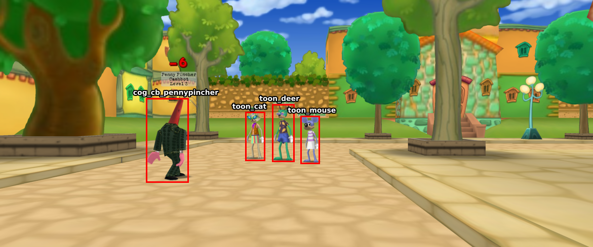
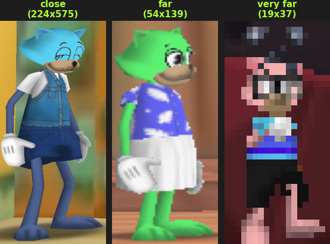
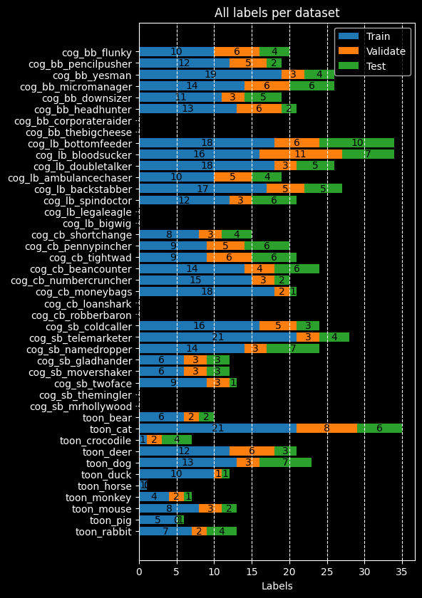
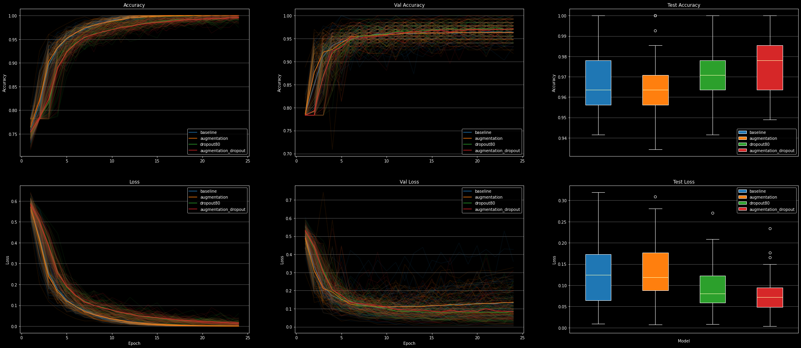
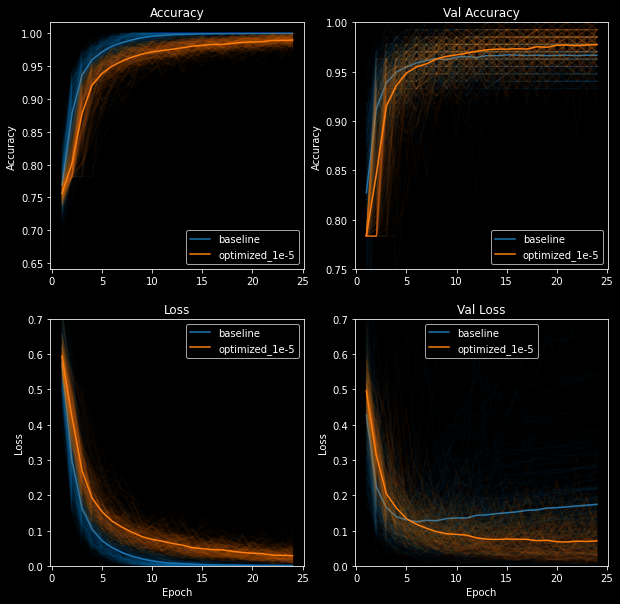
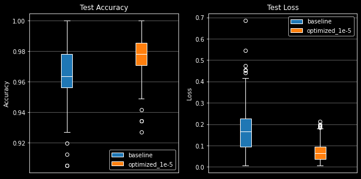

<title>ToonVision: Binary and Multiclass Classification</title>

# ToonVision - Classification


This article is first in a series on **ToonVision**.

ToonVision is my personal computer vision project for teaching a machine how to see in [ToonTown Online](https://en.wikipedia.org/wiki/Toontown_Online) - an MMORPG created by Disney in 2003.
The ultimate goal is to teach a machine (nicknamed **OmniToon**) how to play ToonTown and create a self-sustaining ecosystem within the game where the bots progress through the game together.

In later articles, we'll dive into image segmentation and object detection.
For now, let's focus on real-time classification.

This article covers ...

- Binary classification: Toon vs Cog
- Multiclass classification: Cog suits (4 unique suits) and Cog names (32 unique names)

After reading this article, we'll have a better understanding of...

- How to acquire, label, and process samples from image data
- How to deal with a model overfitting to a small, imbalanced dataset
- How to utilize image augmentation and dropout to improve the model's generalization capability
- How to compare different models, optimizers, and hyperparameters

<details>
    <summary>Table of Contents</summary>

- [ToonVision - Classification](#toonvision---classification)
    - [Classification](#classification)
        - [Binary classification](#binary-classification)
        - [Multiclass classification](#multiclass-classification)
            - [Multiclass multilabel classification](#multiclass-multilabel-classification)
    - [ToonTown Online](#toontown-online)
        - [Toons](#toons)
            - [ToonTasks](#toontasks)
        - [Cogs](#cogs)
        - [Why is it important for Toons to classify Cogs?](#why-is-it-important-for-toons-to-classify-cogs)
    - [The ToonVision dataset](#the-toonvision-dataset)
        - [Dataset considerations](#dataset-considerations)
        - [Filename and data folder structure](#filename-and-data-folder-structure)
        - [Data acquisition](#data-acquisition)
            - [Can we use GANs to synthesize additional data?](#can-we-use-gans-to-synthesize-additional-data)
        - [Data labeling](#data-labeling)
        - [Data extraction](#data-extraction)
        - [Data processing](#data-processing)
        - [Creating the datasets](#creating-the-datasets)
            - [Spitting the images into train, validate, and test](#spitting-the-images-into-train-validate-and-test)
    - [Compiling the model](#compiling-the-model)
        - [Loss function](#loss-function)
        - [Optimizer](#optimizer)
            - [Adam optimizer](#adam-optimizer)
        - [Metrics](#metrics)
        - [Defining the model](#defining-the-model)
    - [Training the baseline model](#training-the-baseline-model)
        - [Baseline loss and accuracy plots](#baseline-loss-and-accuracy-plots)
        - [Baseline evaluation](#baseline-evaluation)
        - [Baseline confusion matrix](#baseline-confusion-matrix)
    - [Training the optimized model](#training-the-optimized-model)
        - [Preventing overfitting](#preventing-overfitting)
            - [Data augmentation](#data-augmentation)
            - [Learning rate decay](#learning-rate-decay)
        - [Callbacks](#callbacks)
        - [Confusion matrix](#confusion-matrix)
        - [Comparing the baseline model to the optimized model](#comparing-the-baseline-model-to-the-optimized-model)

</details>

---
## Classification

Classification is the process of assigning categorical label(s) (a class) to input examples such as images, timeseries, or text.
For instance, given a dog-vs-cat classification model and an image of a Pomeranian, the model will predict that the image is a dog.
Given an email, the model will predict that the email is spam.
Given user activity data on a website, the model will predict whether the user is a human or a bot.

There are many classification problems: binary classification, multiclass classification, and multilabel classification.

### Binary classification

Binary classification - also called two-class classification - is the most common type of classification problem.
It is a problem where the model is trying to predict whether an input example belongs to class A or class B.

In this article, we're building a model to predict whether an image is a Toon or a Cog.

### Multiclass classification

On the other hand, multiclass classification is the type of classification problem where the model is trying to predict which *single class* an input example belongs to.
Where binary classification is a two-class problem, multiclass classification is a multi-class problem - meaning three or more classes.
For instance, the model could predict that an animal belongs to the class of dogs, cats, rabbits, horses, or any other animal.

In this article, we're building a model to predict which of the four Cog suits an image belongs to.

#### Multiclass multilabel classification

Lastly, multiclass multilabel classification is the type of classification problem where the model is trying to predict which *classes* an input example belongs to.
For instance, a multiclass multilabel animal classifier can predict not only that an image belongs to the class of dogs, cats, rabbits, etc. but also the specific breed of dog, cat, rabbit, etc.
Alternatively, a vehicle classifier can predict not only that an image belongs to the class of cars, trucks, motorcycle, etc. but also the specific make and model of car, truck, motorcycle, etc.

Other practical applications of multiclass multilabel classification include labeling which classes are present in an image.
An image of a park, for example, could be labeled as containing a tree, a bench, a flower, a pond, etc.

We could beef up the Cog suit classifier to a multilabel multiclass classification: Cog state/level/hp/name/suit.
But this adds unneeded complexity to the model and should be an article of its own.
In the future, I will surely add the classification of the Cog's state: battle, patrolling, spawning, de-spawning, etc.
Let's keep it simple for now.

---
## ToonTown Online

ToonTown Online is a multiplayer online role-playing game (MMORPG) created by Disney in 2003.
The game is based on a cartoon animal world where each player controls a Toon (a cartoon animal).

Like most MMORPGs, there's no single focus in ToonTown's gameplay.
Players can perform whatever activities they want: socialize, explore the world, fight Cogs, complete tasks for rewards, fish, race karts, and even play minigames.

We won't discuss too much about the game itself in this article because we're focusing on building an image classifier, not a full end-to-end ToonTown AI.

### Toons

Toons are the main protagonists of ToonTown online.
They are cartoon animals that enjoy having fun and are constantly using their arsenal of gags (jokes/weapons) to stop Cogs from invading their neighborhoods and converting ToonTown into a corporate dystopia.

Players can customize their Toon's name, species, color, clothes, and other attributes.
There are 11 unique animals:

- bear
- cat
- crocodile
- deer
- dog
- duck
- horse
- monkey
- mouse
- pig
- rabbit

Each animal can have a unique head shape, body length, and height.
Furthermore, each animal can have mismatching colors for its head, arms, and legs.

<details>
    <summary>All animal species</summary>
    This dataset lacks mismatched-colored Toons.
    As you can see below, all Toons have matching colors for their head, arms, and legs.
    <figure class="center" style="width:100%;">
        
        <figcaption>11 unique animal species in ToonTown</figcaption>
    </figure>
</details>

Toons progress through the game by completing ToonTasks and acquiring rewards.
Ultimately, the goal is to eliminate the Cogs from the streets and acquire the most powerful gags.

#### ToonTasks

A ToonTask is a quest given by ToonTown NPCs in which Toons must complete in order to earn rewards.
Tasks include:

- Talking to other NPCs
- Defeating specific Cogs or specific number of Cogs
- Retrieving items from defeated Cogs
- Defeating Cog buildings

Rewards include jellybeans (currency), laff points (health points), gag advancements (weapons), access to other areas of the game and [more](https://toontown.fandom.com/wiki/ToonTask).

### Cogs

<figure class="right">
    
    <figcaption>4 unique Cog suits and their respective colors</figcaption>
</figure>

Cogs are the main antagonists of ToonTown online.
They are corporate robots that are trying to take over ToonTown and convert it into a corporate dystopia.

There are 4 Cog suits, each with a unique color: Bossbot (brown), Lawbot (blue), Cashbot (green), and Sellbot (maroon).
Each suit in the corporate ladder contains 8 Cogs for a total of 32 unique Cogs.
While most Cogs can be found in the streets, the two highest-tiered Cogs can be found only in Cog buildings.

We'll only acquire data about Cogs in the streets for this model.
We can leverage Cog invasions in order to find building-specific Cogs in the streets.


### Why is it important for Toons to classify Cogs?

More often than not, ToonTasks involve defeating Cogs.
A ToonTown AI must be able to identify which Cogs are in a given image in order to engage in battle with the correct Cog.

However, there are delivery tasks that require Toons to deliver items to NPCs in the streets of ToonTown.
Therefore, it's important for Toons to identify and *avoid* Cogs in its path in order to deliver the items on time.

---
## The ToonVision dataset

There doesn't exist a dataset for ToonVision, so I'll be creating one from scratch.
The following sections will explain my dataset's design considerations, acquisition process, and extraction results.

### Dataset considerations

- Images are split into training, validation, and test sets: 40% training, 20% validation, and 40% test.
- Images of Toons and Cogs must be...
    - Taken at various distances from each street, not playground
    - Taken of the entity's front, back, and side
- In the Cog dataset, there must be an equal part of each Cog suit
    - There must must be an equal part of each unique Cog (32 unique Cogs)
        - There is a minimum requirement of 20 images per unique Cog (32*20 = 640 images total)
    - Must not include the Cog's nametag in the image
- There must be an equal part of Toons and Cogs in each set
    - There must be an equal part Cog suit in each set
- In the Toon dataset, balance of animal types is welcome but not necessary

### Filename and data folder structure

Cog filename structure: `cog_<suit>_<name>_<index>.png`.

Toon filename structure: `toon_<animal>_<index>.png`.

Data folder structure:
```
img
├───data
│   ├───test
│   │   ├───cog
│   │   └───toon
│   ├───train
│   │   ├───cog
│   │   └───toon
│   └───validate
│       ├───cog
│       └───toon
├───raw
│   ├───processed
│   └───screenshots
│       ├   sample_img0.png
│       ├   sample_img0.xml
│       ├   sample_img1.png
│       └   sample_img1.xml
└───unsorted
    ├───cog
    └───toon
```

There's no need for a unique folder for each Cog suit because we can filter on the filename.

### Data acquisition

Acquiring data is simple: Walk around TT streets, take screenshots, and save them to the raw folder.
It's important to take screenshots from various distance and of different angles of each entity: front, back, and side.
Taking screenshots from up close is preferred.
When taken from far away, the entity's nametag covers the entity's head, thus causing us to crop the entity's head or include the nametag - neither are good options.

<figure class="center" style="width:auto;">
    
    <figcaption>Sample screenshot containing one Cog and three Toons in battle</figcaption>
</figure>

There were a few difficulties with acquiring data:

1. Entities are typically moving unless in battle
1. Entities often obstruct other entities, which makes for less than ideal training data
1. Finding the desired entity is purely a matter of walking around the street and looking for the entity, there's no precision radar

Furthermore, there were class-specific data acquisition problems:

1. Cogs are more commonly found in the streets than Toons
2. Multi-colored Toons are uncommon, therefore the dataset is skewed towards single-colored Toons
3. The two highest-tiered Cogs are only found in Cog buildings, not in the streets (unless there's an invasion)
    - Highest-tiered Cogs include Corporate Raiders and The Big Cheese for Bossbots, Legal Eagle and Big Wig for Lawbots, etc.

As a result, we have an imbalanced dataset.
I hope to balance the dataset over time, but we'll work with the current imbalanced dataset to gain a better understanding of how to deal with a model overfitting to a small dataset.

<figure class="center" style="width:100%">
    
    <figcaption></figcaption>
</figure>

The green lines indicate the <font style="color:#0F0;">desired number of samples</font> for each class, whereas the red lines indicate the <font style="color:red;">average number of samples</font> per class.

The dataset shows a few overrepresented classes:

- More Cogs than Toons (526 vs 148 Toon samples)
- Too many cats on the streets (or I have a bias towards taking photos of cats)
- Not enough horses on the streets (or I have a bias towards not taking photos of horses)

#### Can we use GANs to synthesize additional data?

Yes, iff there was a GAN that could generate Toons and Cogs.
As far as I know, no GAN exists for generating ToonTown entities; perhaps I can take a swing at it later.

Don't be discouraged about an imbalanced dataset.
We can use many techniques to adjust for the imbalance and still create an accurate model.

### Data labeling

I'm using [labelimg](https://github.com/tzutalin/labelImg) to draw labeled bounding boxes around Toons and Cogs.
Labels - also referred to as `obj_name` - follow the format:

- `cog_<bb|lb|cb|sb>_<name>_<index>`
- `toon_<animal>_<index>`

The cog labels contain shorthand notation (`<bb|lb|cb|sb>`) for each suit: Bossbot, Lawbot, Cashbot, and Sellbot, respectively.
This shorthand notation allows us to filter cog data by filename and create a classifier that can distinguish between the 4 suits.

Bounding boxes are saved in XML format - specifically [Pascal VOC XML](https://mlhive.com/2022/02/read-and-write-pascal-voc-xml-annotations-in-python) - alongside the image in the `raw/screenshots` directory, as seen in the [data folder file structure](#filename-and-data-folder-structure) section above.

<figure class="center" style="width:auto;">
    
    <figcaption>Sample screenshot with labeled bounding boxes</figcaption>
</figure>

How the objects are labeled - how the bounding boxes are drawn - determines how the object will be extracted from the image.
It's important to draw bounding boxes such that the entity is snugly contained within the bounding box.
Furthermore, we must exclude entity nametags in the bounding box because the classifier will learn to "cheat" by identifying objects from their nametag rather than features of the entity itself.

### Data extraction

The raw data (screenshot) is passed into the `data_processing.py` script.
The script utilizes functions in `img_utils.py` to extract objects from the images using the labeled bounding boxes found in the image's corresponding XML files.
Specifically, the data extraction workflow is as follows:

- Acquire bounding box dimensions and labels from the XML files
- Extract object (Toon or Cog) from the image using the dimensions and labels found in the XML files
- Save the cropped image of the object to the `img/unsorted` folder
- Move the raw image and its corresponding XML file to the `raw/processed` folder

*Why move the cropped image to unsorted and then processed?*

The unsorted images directory is used to maintain a counter (referred to as an index) for each label.
It gives me a glimpse of how many images are in each category by looking at the filenames in the `unsorted` directory.
If I want to add more images to the dataset, I would have place images from all datasets back into the `unsorted` directory in order to maintain the counter and avoid overwriting existing images.

Given that my dataset is so small, I can unsort and re-sort the images with ease.
But this is not at all scalable in the future and I will surely redesign this portion of the data pipeline.

```python
# %% Convert raw images to data images
def process_images(
    raw_images_dir: str = SCREENSHOTS_DIR,
    image_type: str = "png",
    move_images: bool = False,
) -> None:
    """Extract objects from raw images and save them to the unsorted img directory"""
    screenshots = glob(f"{raw_images_dir}/*.{image_type}", recursive=True)
    print(f"Found {len(screenshots)} screenshots")
    for img_path in screenshots:
        print(f"Processing {img_path}")
        xml_path = img_path.replace(f".{image_type}", ".xml")
        if path.exists(xml_path):
            # Extract objects' labels and bounding box dimensions from XML
            objs_from_xml = extract_objects_from_xml(xml_path)
            # Extract objects from images using XML data
            objs_from_img = extract_objects_from_img(img_path, objs_from_xml)
            # Save extracted objects to images, modify image name to include object index
            save_objects_to_img(objs_from_img, UNSORTED_DIR)
            # Move raw image to processed directory
            if move_images:
                for f in [img_path, xml_path]:
                    new_path = f.replace(raw_images_dir, PROCESSED_DIR)
                    print(f"    Moving {f} to {new_path}")
                    rename(f, new_path)
        else:
            print(f"    No XML file found for {img_path}")
```

### Data processing

<figure class="right">
    
    <figcaption></figcaption>
</figure>

The extracted objects are of various sizes because the screenshots were taken from various angles and distances.
Large objects are a result of the screenshot taken from up close, while small objects are a result of the screenshot taken from far away.

We can see from the image on the right how the object's distance affects the extracted object's quality.
The further the object is from the camera, the smaller and more blurry the object is.
We lose quite a bit of information about the object when the object is far away.

Overall, it would be ideal for the dataset to consist mostly of large, close-up objects because they contain more information about the object.
Small, far-away objects lose information about the object and are not as useful for training.
Further more, we could simulate this loss of information through image augmentation - rescaling or blurring/pixelating the image.

It would make a fun project to create a model that upscales the images to a higher resolution.
Then we could use those high-resolution images in this dataset.

### Creating the datasets

After the objects are extracted and placed in the `unsorted` folder, we can create the datasets.
First, we need to create a balanced datasets within the `data/[train|validate|test]` folders.
Remember that we're aiming for a 60/20/20 split of the dataset for training, validation, and testing, respectively.

#### Spitting the images into train, validate, and test

Before creating the datasets, we need to move images from `unsorted/[cog|toon]` to `data/[train|validate|test]/[cog|toon]`.

```python
def split_data(split_ratio: list[float, float, float], dry_run: bool = False):
    """Split the data into train(60%)/validate(20%)/test(20%) data sets"""
    for unsorted_dir in [UNSORTED_COG_DIR, UNSORTED_TOON_DIR]:
        cog_or_toon = unsorted_dir.split("/")[-1]
        # Get all images from unsorted_dir
        unsorted_images = glob(f"{unsorted_dir}/*.png")
        num_images = len(unsorted_images)

        # Split images into train/validate/test sets
        num_train = int(num_images * split_ratio[0])
        num_validate = int(num_images * split_ratio[1])
        num_test = num_images - num_train - num_validate
        print(num_train, num_validate, num_test)

        # # Shuffle filenames to randomize the order of the images
        shuffle(unsorted_images)
        train = unsorted_images[:num_train]
        validate = unsorted_images[num_train:-num_test]
        test = unsorted_images[-num_test:]

        # Move images to train/validate/test directories
        for images, dir_name in zip(
            [train, validate, test], [TRAIN_DIR, VALIDATE_DIR, TEST_DIR]
        ):
            for img_path in images:
                new_path = img_path.replace(unsorted_dir, f"{dir_name}/{cog_or_toon}")
                if dry_run:
                    print(f"Moving {img_path} to {new_path}")
                else:
                    rename(img_path, new_path)
```

We can visualize the dataset's balance by using the `plot_datasets_all()` function in the `data_visualization` module.

<figure class="center">
    
    <figcaption>Train, validate, and test datasets</figcaption>
</figure>

The creation of datasets is straight-forward using keras:

```python
# %% Create datasets
from tensorflow.keras.image_dataset_from_directory

train_dataset = image_dataset_from_directory(
    TRAIN_DIR,
    image_size=(600, 200),
    # batch_size=16
)
validation_dataset = image_dataset_from_directory(
    VALIDATE_DIR,
    image_size=(600, 200),
    # batch_size=16
)
test_dataset = image_dataset_from_directory(
    TEST_DIR,
    image_size=(600, 200),
    # batch_size=16
)
```

## Compiling the model

Now that we've created the datasets, we can compile the model.
Compiling the model requires choosing a loss function, optimizer, and metrics to monitor the model's performance during training.

### Loss function

Our first model is classifying between two classes, therefore we'll use the `binary_crossentropy` loss function.
The later models will be more complex - classifying 4 or 32 classes - so we'll use the `categorical_crossentropy` loss function.

### Optimizer

There are a few guidelines to choosing an optimizer for classification problems.
I visualized the process by plotting optimizers' performances using the same model, dataset, hyperparameters, and number of epochs.

<font style="color:red">TODO: Insert plot</font>

A handful of the optimizers' losses flattened over the course of training as a result of a low learning rate or *vanishing gradients*.
SGD commonly encounters this problem, and it's often due to a low learning rate.

I increased the learning rate for all flattened optimizers and plotted the loss scores and accuracies again.

<font style="color:red">TODO: Insert plot with non-equal learning rates</font>

I could use additional callbacks, such as the learning rate scheduler, to gradually decrease the learning rate and improve the model's performance
Even more, adding *momentum* to the SGD optimizer could help the model reach global loss minimums and learn more effectively.
Alternatively, I could read an article which discusses the points above and use their suggestions to save time, but where's the fun in that?

Given the loss scores and accuracies plotted above, I've chosen to go with the `Adam` optimizer.

#### Adam optimizer

The Adam optimizer is a variant of the stochastic gradient descent (SGD) algorithm.
Adam combines the advantages of two other SGD variants - "AdaGrad" and "RMSProp" - to create a more effective optimization algorithm for computer vision tasks.
Jason Brownlee wrote an [excellent introduction](https://machinelearningmastery.com/adam-optimization-algorithm-for-deep-learning/) to the Adam algorithm, and I encourage you to read it if you're interested in the technical details.

### Metrics

It's a classification model with only two classes, so we'll use the `binary_accuracy` metric.
We'll use the `categorical_accuracy` metric later for our model with 4 and 32 classes.
That's about it.

### Defining the model

## Training the baseline model

Before training the actual model, we need to define a simple baseline to compare against.
The baseline model will use the same model architecture, datasets, and hyperparameters as the optimized model we're training.
The only difference is that we will not perform any optimizations - no data augmentation, dropout, batch normalization or learning rate decay.

We'll train the baseline for 25 epochs with a learning rate of 0.001 (1e-3).
The baseline model will be trained 50 times, each time with a rebalanced dataset.
The average of all 50 runs will be plotted below.


```python
model_baseline = create_model()
# ! TODO`
```

### Baseline loss and accuracy plots

### Baseline evaluation

### Baseline confusion matrix

## Training the optimized model

### Preventing overfitting

Given that we have a small dataset, we can utilize a few of the following techniques during training to prevent overfitting:

* **Data augmentation** - we can augment the images by randomly rotating, flipping, and cropping them.
* **Data balancing** - we can balance the datasets by balancing the number of objects in each dataset.
* **Dropout** - we can dropout some of the nodes in the model to prevent overfitting.
* **Regularization** - we can regularize the model by adding a penalty to the loss function.
* **Small learning rate** - we can use a small learning rate to prevent overfitting.
* **Reducing number of parameters** - too many parameters can cause overfitting.
* **Early stopping** - we can stop training the model if the model doesn't improve after a certain number of epochs.

For the ToonVision model, we'll utilize data augmentation, dropout, regularization, small learning rate, and learning rate decay.

#### Data augmentation

During training, we'll perform the following data augmentation techniques:

* Horizontal flip (50% chance)
* Rotate +- 20%
* Zoom +-30%

```python
from keras import layers

data_augmentation = keras.Sequential(
    [
        # Apply horizontal flipping to 50% of the images
        layers.RandomFlip("horizontal"),
        # Rotate the input image by some factor in range [-20%, 20%] or [-72, 72] in degrees
        layers.RandomRotation(0.2),
        # Zoom in or out by a random factor in range [-30%, 30%]
        layers.RandomZoom(0.3),
    ])
```

#### Learning rate decay

Learning rate decay is a technique that helps prevent overfitting.
It's a simple way to reduce the learning rate of the optimizer as training progresses.
We can implement learning rate decay in two ways:

- Use a learning rate scheduler (callback)
- Add a learning rate decay factor to the optimizer

I'll use the optimizer's `lr_decay` argument to implement the learning rate decay in training.

```python
from keras.callbacks import LearningRateScheduler

def lr_schedule(epoch):
    return 0.001 * (0.1 ** (epoch // 10))

# Create a learning rate scheduler
lr_callback = LearningRateScheduler(lr_schedule)
# Add the learning rate decay to the optimizer
optimizer = keras.optimizers.Adam(lr=0.001, lr_decay=1e-5)
```

### Callbacks

### Confusion matrix

### Comparing the baseline model to the optimized model

<!-- Split the training line chart and the evaluation bar chart -->
<figure class="center" style="width:100%;">
    
    <figcaption></figcaption>
</figure>

<!-- Split the training line chart and the evaluation bar chart -->
<figure class="center" style="width:100%;">
    
    <figcaption></figcaption>
</figure>

<!-- Split the training line chart and the evaluation bar chart -->
<figure class="center" style="width:100%;">
    
    <figcaption></figcaption>
</figure>