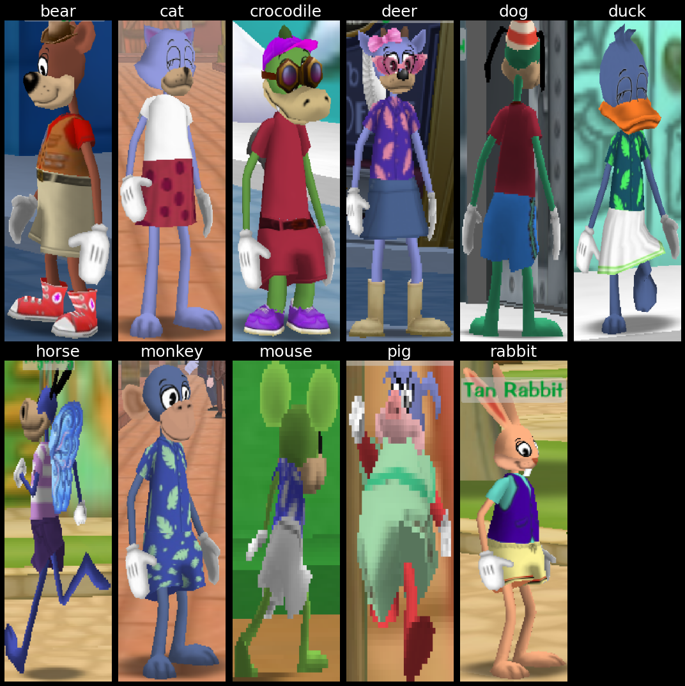

<title>ToonVision: Binary and Multiclass Classification</title>

# ToonVision - Classification


This article is first in a series on **ToonVision**.

ToonVision is my personal computer vision project for teaching a machine how to see in [ToonTown Online](https://en.wikipedia.org/wiki/Toontown_Online) - an MMORPG created by Disney in 2003.
The ultimate goal is to teach a machine (nicknamed **OmniToon**) how to play ToonTown and create a self-sustaining ecosystem within the game where the bots progress through the game together.

This article covers binary classification of Toons and Cogs.
The following article will cover multiclass classification of Cog suits (4 unique suits) and Cog names (32 unique names).

After reading this article, we'll have a better understanding of how to

- acquire, label, and process samples from image data
- deal with a model overfitting to a small, imbalanced dataset
- utilize image augmentation and dropout to improve the model's generalization capability
- compare different models, optimizers, and hyperparameters
- interpret and visualize what the model is learning

In later articles, we'll dive into image segmentation and object detection.
For now, let's focus on classification.

<details>
    <summary>Table of Contents</summary>

- [ToonVision - Classification](#toonvision---classification)
    - [Classification](#classification)
        - [Binary classification](#binary-classification)
        - [Multiclass classification](#multiclass-classification)
            - [Multiclass multilabel classification](#multiclass-multilabel-classification)
    - [ToonTown Online](#toontown-online)
        - [Toons](#toons)
            - [ToonTasks](#toontasks)
        - [Cogs](#cogs)
        - [Why is it important for Toons to classify Cogs?](#why-is-it-important-for-toons-to-classify-cogs)
    - [The ToonVision dataset](#the-toonvision-dataset)
        - [Dataset considerations](#dataset-considerations)
        - [Filename and data folder structure](#filename-and-data-folder-structure)
        - [Data acquisition](#data-acquisition)
        - [Data labeling](#data-labeling)
        - [Data extraction](#data-extraction)
        - [Data processing](#data-processing)
        - [Creating the datasets](#creating-the-datasets)
            - [Spitting the images into train, validate, and test](#spitting-the-images-into-train-validate-and-test)
    - [Compiling the model](#compiling-the-model)
        - [Loss function](#loss-function)
        - [Optimizer](#optimizer)
            - [Adam optimizer](#adam-optimizer)
        - [Metrics](#metrics)
        - [Callbacks](#callbacks)
        - [Defining the model](#defining-the-model)
    - [Training the baseline model](#training-the-baseline-model)
        - [Baseline loss and accuracy plots](#baseline-loss-and-accuracy-plots)
        - [Baseline wrong predictions](#baseline-wrong-predictions)
    - [Training the optimized model](#training-the-optimized-model)
        - [Preventing overfitting](#preventing-overfitting)
            - [Data augmentation](#data-augmentation)
            - [Dropout](#dropout)
            - [Learning rate decay](#learning-rate-decay)
        - [Wrong predictions](#wrong-predictions)
        - [Baseline comparison: Training](#baseline-comparison-training)
            - [What's with the jagged lines?](#whats-with-the-jagged-lines)
        - [Baseline comparison: Evaluation](#baseline-comparison-evaluation)
    - [Model interpretation](#model-interpretation)
        - [Visualizing intermediate convnet outputs (intermediate activations)](#visualizing-intermediate-convnet-outputs-intermediate-activations)
        - [Visualizing convnet filters](#visualizing-convnet-filters)
        - [Visualizing heatmaps of class activation in an image](#visualizing-heatmaps-of-class-activation-in-an-image)
    - [Future improvements](#future-improvements)
        - [Dataset balance](#dataset-balance)
        - [Model architecture](#model-architecture)
        - [Model interpretation](#model-interpretation-1)

</details>

---
## Classification

Classification is the process of assigning categorical label(s) (a class) to input examples such as images, timeseries, or text.
For instance, given a dog-vs-cat classification model and an image of a Pomeranian, the model will predict that the image is a dog.
Given an email, the model will predict that the email is spam.
Given user activity data on a website, the model will predict whether the user is a human or a bot.

There are many classification problems: binary classification, multiclass classification, and multilabel classification.

### Binary classification

Binary classification - also called two-class classification - is the most common type of classification problem.
It is a problem where the model predicts whether an input example belongs to class A or class B.

In this article, we're building a model to predict whether an image is a Toon or a Cog.

### Multiclass classification

On the other hand, multiclass classification is the type of classification problem where the model predicts which *single class* an input example belongs to.
Where binary classification is a two-class problem, multiclass classification is a multi-class problem - meaning three or more classes.
For instance, the model could predict that an animal belongs to the class of dogs, cats, rabbits, horses, or any other animal.

In the next article, we'll build a model to predict which of the four Cog suits an image belongs to.
We can push the model even further to predict which of the 32 Cog names an image belongs to.

#### Multiclass multilabel classification

Lastly, multiclass multilabel classification is a classification problem where the model predicts which *classes* an input example belongs to.
For instance, a multiclass multilabel animal classifier can predict not only that an image belongs to the class of dogs, cats, rabbits, etc. but also the specific breed of dog, cat, rabbit, etc.
Alternatively, a vehicle classifier can predict not only that an image belongs to the class of cars, trucks, motorcycle, etc. but also the specific make and model of car, truck, motorcycle, etc.

Other practical applications of multiclass multilabel classification include labeling which classes are present in an image.
For example, an image of a park could be labeled as containing a tree, a bench, a flower, a pond, etc.

We could upgrade the single-label multiclass Cog suit classifier to a multilabel multiclass classification model and have it predict Cog state/level/hp/name/suit.
But this adds unneeded complexity to the model and should be an article of its own.
In the future, I will surely add the classification of the Cog's state: battle, patrolling, spawning, de-spawning, etc.
Let's keep it simple for now.

---
## ToonTown Online

ToonTown Online is a multiplayer online role-playing game (MMORPG) created by Disney in 2003.
The game is based on a cartoon animal world where each player controls a Toon (a cartoon animal).

Like most MMORPGs, there's no single focus in ToonTown's gameplay.
Players can perform whatever activities they want: socialize, fight Cogs, explore the world, complete tasks for rewards, fish, race karts, and even play minigames.

We won't discuss too much about the game itself in this article because we're focusing on building an image classifier, not a full end-to-end ToonTown AI.

### Toons

Toons are the main protagonists of ToonTown online.
They are cartoon animals that enjoy having fun and are constantly using their arsenal of gags (jokes/weapons) to stop Cogs from invading their neighborhoods and converting ToonTown into a corporate dystopia.

Players can customize their Toon's name, species, color, clothes, and other attributes.
There are 11 unique animals:

- bear
- cat
- crocodile
- deer
- dog
- duck
- horse
- monkey
- mouse
- pig
- rabbit

Each animal can have a unique head shape, body length, and height.
Furthermore, each animal can have mismatching colors for its head, arms, and legs.

<details>
    <summary>All animal species</summary>
    This dataset lacks mismatched-colored Toons.
    As you can see below, all Toons have matching colors for their head, arms, and legs.
    <figure class="center" style="width:100%;">
        
        <figcaption>11 unique animal species in ToonTown</figcaption>
    </figure>
</details>

Toons progress through the game by completing ToonTasks and acquiring rewards.
Ultimately, the goal is to eliminate the Cogs from the streets and acquire the most powerful gags.

#### ToonTasks

A ToonTask is a quest given by ToonTown NPCs in which Toons must complete in order to earn rewards.
Tasks include:

- Defeating specific Cogs or specific number of Cogs
- Retrieving items from defeated Cogs
- Defeating Cog buildings
- Talking to other NPCs

Rewards include jellybeans (currency), laff points (health points), gag advancements (weapons), access to other areas of the game and [more](https://toontown.fandom.com/wiki/ToonTask).

### Cogs

<figure class="right">
    
    <figcaption>4 unique Cog suits and their respective colors</figcaption>
</figure>

Cogs are the main antagonists of ToonTown online.
They are corporate robots that are trying to take over ToonTown and convert it into a corporate dystopia.

There are 4 Cog suits, each with a unique color: Bossbot (brown), Lawbot (blue), Cashbot (green), and Sellbot (maroon).
Each suit in the corporate ladder contains 8 Cogs for a total of 32 unique Cogs.
While most Cogs can be found in the streets, the two highest-tiered Cogs of each suit can be found only in Cog buildings.

We'll only acquire data about Cogs in the streets for this model.
We can leverage Cog invasions in order to find building-specific Cogs in the streets.

### Why is it important for Toons to classify Cogs?

More often than not, ToonTasks involve defeating Cogs.
A ToonTown AI must be able to identify which Cogs are in a given image in order to engage in battle with the correct Cog.

However, there are delivery tasks that require Toons to deliver items to NPCs in the streets of ToonTown.
Therefore, it's important for Toons to identify and *avoid* Cogs in its path in order to deliver the items on time.

---
## The ToonVision dataset

There doesn't exist a dataset for ToonVision, so I'll be creating one from scratch.
The following sections will explain my dataset's design considerations, acquisition process, and extraction results.

### Dataset considerations

- Images are split into training, validation, and test sets: 40% training, 20% validation, and 40% test.
- Images of Toons and Cogs must be...
    - Taken at various distances from each street, not playground
    - Taken of the entity's front, back, and side
- In the Cog dataset, there must be an equal part of each Cog suit
    - There must must be an equal part of each unique Cog (32 unique Cogs)
        - There is a minimum requirement of 20 images per unique Cog (32*20 = 640 images total)
    - Must not include the Cog's nametag in the image
- There must be an equal part of Toons and Cogs in each set
    - There must be an equal part Cog suit in each set
- In the Toon dataset, balance of animal types is welcome but not necessary

### Filename and data folder structure

Cog filename structure: `cog_<suit>_<name>_<index>.png`.

Toon filename structure: `toon_<animal>_<index>.png`.

Data folder structure:
```
img
├───data
│   ├───test
│   │   ├───cog
│   │   └───toon
│   ├───train
│   │   ├───cog
│   │   └───toon
│   └───validate
│       ├───cog
│       └───toon
├───raw
│   ├───processed
│   └───screenshots
│       ├   sample_img0.png
│       ├   sample_img0.xml
│       ├   sample_img1.png
│       └   sample_img1.xml
└───unsorted
    ├───cog
    └───toon
```

There's no need for a unique folder for each Cog suit because we can filter on the filename.

### Data acquisition

Acquiring data is simple: Walk around TT streets, take screenshots, and save them to the raw folder.
It's important to take screenshots from various distance and angles of each entity: front, back, and side.

Taking screenshots from up close is preferred.
When taken from far away, the entity's nametag covers the entity's head, thus causing us to crop the entity's head or include the nametag - neither are good options.

<figure class="center" style="width:90%;">
    
    <figcaption>Sample screenshot containing one Cog and three Toons in battle</figcaption>
</figure>

There were a few difficulties with acquiring data:

1. Entities are typically moving unless in battle
1. Entities often obstruct other entities, which makes for less than ideal training data
1. Finding the desired entity is purely a matter of walking around the street and looking for the entity, there's no precision radar

Furthermore, there were class-specific data acquisition problems:

1. Cogs are more commonly found in the streets than Toons
2. Multi-colored Toons are uncommon, therefore the dataset is skewed towards single-colored Toons
3. The two highest-tiered Cogs are only found in Cog buildings, not in the streets (unless there's an invasion)
    - Highest-tiered Cogs include Corporate Raiders and The Big Cheese for Bossbots, Legal Eagle and Big Wig for Lawbots, etc.

As a result, we have an imbalanced dataset.
I hope to balance the dataset over time, but we'll work with the current dataset to better understand how to deal with a model overfitting to a small, imbalanced dataset.

<figure class="center" style="width:100%">
    
    <figcaption></figcaption>
</figure>

The green lines indicate the <font style="color:#0F0;">desired number of samples</font> for each class, whereas the red lines indicate the <font style="color:red;">average number of samples</font> per class.

The dataset shows a few overrepresented classes:

- More Cogs than Toons (526 vs 148 Toon samples)
- Less-than-average Sellbot samples (cog_sb_*), specifically Glad Handers, Mover & Shakers, and Two Faces
- Too many cats on the streets (or I have a bias towards taking photos of cats)
- Not enough horses on the streets (or I have a bias towards not taking photos of horses)

### Data labeling

I'm using [labelimg](https://github.com/tzutalin/labelImg) to draw labeled bounding boxes around Toons and Cogs.
Labels - also referred to as `obj_name` - follow the format:

- `cog_<bb|lb|cb|sb>_<name>_<index>`
- `toon_<animal>_<index>`

The cog labels contain shorthand notation (`<bb|lb|cb|sb>`) for each suit: Bossbot, Lawbot, Cashbot, and Sellbot, respectively.
This shorthand notation allows us to filter cog data by filename and create a classifier that can distinguish between the 4 suits.

Bounding boxes are saved in XML format - specifically [Pascal VOC XML](https://mlhive.com/2022/02/read-and-write-pascal-voc-xml-annotations-in-python) - alongside the image in the `raw/screenshots` directory, as seen in the [data folder file structure](#filename-and-data-folder-structure) section above.

<figure class="center" style="width:90%;">
    
    <figcaption>Sample screenshot with labeled bounding boxes</figcaption>
</figure>

How the objects are labeled - how the bounding boxes are drawn - determines how the object will be extracted from the image.
It's important to draw bounding boxes such that the entity is snugly contained within the bounding box.
Furthermore, we must exclude entity nametags in the bounding box because the classifier will learn to "cheat" by identifying objects from their nametag rather than features of the entity itself.

### Data extraction

The raw data (screenshot) is passed into the `data_processing.py` script.
The script utilizes functions in `img_utils.py` to extract objects from the images using the labeled bounding boxes found in the image's corresponding XML files.
Specifically, the data extraction workflow is as follows:

- Acquire bounding box dimensions and labels from the XML files
- Extract object (Toon or Cog) from the image using the dimensions and labels found in the XML files
- Save the cropped image of the object to the `img/unsorted` folder
- Move the raw image and its corresponding XML file to the `raw/processed` folder

*Why move the cropped image to unsorted and then processed?*

The unsorted images directory is used to maintain a counter (referred to as an index) for each label.
It gives me a glimpse of how many images are in each category by looking at the filenames in the `unsorted` directory.
If I want to add more images to the dataset, I would have place images from all datasets back into the `unsorted` directory in order to maintain the counter and avoid overwriting existing images.

Given that the dataset is so small, I can unsort and re-sort the images with ease.
But this is not at all scalable in the future and I will surely redesign this portion of the data pipeline.

```python
# %% Convert raw images to data images
def process_images(
    raw_images_dir: str = SCREENSHOTS_DIR,
    image_type: str = "png",
    move_images: bool = False,
    filename_filter: str = "",
) -> None:
    """Extract objects from raw images and save them to the unsorted img directory"""
    screenshots = glob(f"{raw_images_dir}/**/*.{image_type}", recursive=True)
    print(f"Found {len(screenshots)} screenshots in {raw_images_dir}")
    for img_path in screenshots:
        if filename_filter in img_path:
            print(f"Processing {img_path}")
            xml_path = img_path.replace(f".{image_type}", ".xml")
            if path.exists(xml_path):
                # Extract objects' labels and bounding box dimensions from XML
                objs_from_xml = extract_objects_from_xml(xml_path)
                # Extract objects from images using XML data
                objs_from_img = extract_objects_from_img(img_path, objs_from_xml)
                # Save extracted objects to images, modify image name to include object index
                save_objects_to_img(objs_from_img, UNSORTED_DIR)
                # Move raw image to processed directory
                if move_images:
                    for f in [img_path, xml_path]:
                        new_path = f.replace(raw_images_dir, PROCESSED_DIR)
                        print(f"    Moving {f} to {new_path}")
                        rename(f, new_path)
            else:
                print(f"    No XML file found for {img_path}")

```

### Data processing

<figure class="right">
    
    <figcaption></figcaption>
</figure>

The extracted objects are of various sizes because the screenshots were taken from various angles and distances.
Large objects are a result of the screenshot taken from up close, while small objects are a result of the screenshot taken from far away.

We can see from the image on the right how the object's distance affects the extracted object's quality.
The further the object is from the camera, the smaller and more blurry the object is.
We lose quite a bit of information about the object when the object is far away.

Overall, it would be ideal for the dataset to consist mostly of large, close-up objects because they contain more information about the object.
Small, far-away objects lose information about the object and are not as useful for training.
Further more, we could simulate this loss of information through image augmentation - rescaling or blurring/pixelating the image.

It would make a fun project to create a model that upscales the images to a higher resolution.
Then we could use those high-resolution images in this dataset.

### Creating the datasets

After the objects are extracted and placed in the `unsorted` folder, we can create the datasets.
First, we need to create balanced datasets within the `data/[train|validate|test]` folders.
Remember that we're aiming for a 60/20/20 split of the dataset for training, validation, and testing, respectively.

#### Spitting the images into train, validate, and test

Before creating the datasets, we need to move images from `unsorted/[cog|toon]` to `data/[train|validate|test]/[cog|toon]`.
We can utilize the `split_data()` function in the `data_processing` module to do this.

```python
def split_data(split_ratio: list[float, float, float], dry_run: bool = False):
    """Split the data into train(60%)/validate(20%)/test(20%) data sets"""
    for unsorted_dir in [UNSORTED_COG_DIR, UNSORTED_TOON_DIR]:
        cog_or_toon = unsorted_dir.split("/")[-1]
        # Get all images from unsorted_dir
        unsorted_images = glob(f"{unsorted_dir}/*.png")
        num_images = len(unsorted_images)

        # Split images into train/validate/test sets
        num_train = int(num_images * split_ratio[0])
        num_validate = int(num_images * split_ratio[1])
        num_test = num_images - num_train - num_validate
        print(num_train, num_validate, num_test)

        # # Shuffle filenames to randomize the order of the images
        shuffle(unsorted_images)
        train = unsorted_images[:num_train]
        validate = unsorted_images[num_train:-num_test]
        test = unsorted_images[-num_test:]

        # Move images to train/validate/test directories
        for images, dir_name in zip(
            [train, validate, test], [TRAIN_DIR, VALIDATE_DIR, TEST_DIR]
        ):
            for img_path in images:
                new_path = img_path.replace(unsorted_dir, f"{dir_name}/{cog_or_toon}")
                if dry_run:
                    print(f"Moving {img_path} to {new_path}")
                else:
                    rename(img_path, new_path)
```

Creating `tf.data.Dataset` objects is straight-forward when using Keras' `image_dataset_from_directory` function.
I wrote a wrapper function, `create_datasets`, to create the train, validate, and test datasets:

```python
from tensorflow.keras.utils import image_dataset_from_directory


def create_datasets(
    image_size: tuple = (600, 200),
    batch_size: int = 32,
    shuffle: bool = True,
    split_ratio: list[float, float, float] = None,
    dry_run: bool = False,
):
    if split_ratio:
        split_data(split_ratio=split_ratio, dry_run=dry_run)

    ds_train = image_dataset_from_directory(
        TRAIN_DIR,
        image_size=image_size,
        batch_size=batch_size,
        shuffle=shuffle,
    )
    ds_validate = image_dataset_from_directory(
        VALIDATE_DIR,
        image_size=image_size,
        batch_size=batch_size,
        shuffle=shuffle,
    )
    ds_test = image_dataset_from_directory(
        TEST_DIR,
        image_size=image_size,
        batch_size=batch_size,
        shuffle=shuffle,
    )
    return (ds_train, ds_validate, ds_test)
```

We can visualize the dataset's balance by using the `plot_datasets_all()` function in the `data_visualization` module.

<details>
    <summary>Dataset balance</summary>
<figure class="center" style="width:60%;">
    
    <figcaption>Train, validate, and test datasets</figcaption>
</figure>
</details>

---
## Compiling the model

Now that we've created the datasets, we can compile the model.
Compiling the model requires choosing a loss function, optimizer, and metrics to monitor the model's performance during training.

### Loss function

Our first model is classifying between two classes, therefore we'll use the `binary_crossentropy` loss function.
The later models will be more complex - classifying 4 or 32 classes - so we'll use the `[sparse_]categorical_crossentropy` loss function.

### Optimizer

I visualized the process of choosing an optimizer by plotting each optimizer's performance during training.
Models were trained with each optimizer for 20 epochs using the same model architecture, dataset, hyperparameters, and static learning rate of 0.001 (1e-3).

<figure class="center" style="width:90%;">
    
    <figcaption></figcaption>
</figure>

A handful of the optimizers' losses flattened over the course of training as a result of a low learning rate or *vanishing gradients*.
SGD commonly encounters this problem, and it's often due to a low learning rate.

I increased the learning rate for all flattened optimizers and plotted the loss scores and accuracies again, but didn't see much improvement.
Additional callbacks, such as the learning rate scheduler, could be used to gradually decrease the learning rate and improve the model's performance.
Adding *momentum* to the SGD optimizer could also help the model reach global loss minimums and learn more effectively.
If really wanted to get a feel for the proper optimizer, we should try different learning rates, utilize Keras' callbacks, and tweak the hyperparameters.
However, this is beyond the scope of the article.

Optimizers with low performance (`Adadelta`, `Adagrad`, `Ftrl`, and `SGD`) were eliminated from consideration.
The performance between the remaining four optimizers - `Adam`, `Adamax`, `Nadam`, and `RMSprop` - is close enough that either one is a good choice.
Looking at the plot below, we see that `Adam` and `Nadam` are the most effective optimizers.

<figure class="center" style="width:90%;">
    
    <figcaption></figcaption>
</figure>

The `Adam` optimizer has a smooth accuracy and loss curve, while `Nadam` overfits quickly and has a more jagged curve.
Given the loss scores and accuracies plotted above, I've decided to go with the `Adam` optimizer.

#### Adam optimizer

The `Adam` optimizer is an adaptive variant of the stochastic gradient descent (`SGD`) algorithm.
`Adam` combines the advantages of two other `SGD` variants - `AdaGrad` and `RMSProp` - to create a more effective optimization algorithm for computer vision tasks.
Jason Brownlee wrote an [excellent introduction](https://machinelearningmastery.com/adam-optimization-algorithm-for-deep-learning/) to the `Adam` algorithm, and I encourage you to read it if you're interested in the technical details.

### Metrics

We're building a two-class classification model, so we'll use the `binary_accuracy` metric.
When training the multi-class models - with 4 and 32 classes - we'll utilize the `categorical_accuracy` metric.

### Callbacks

Originally, I planned on only using a single callback, `ModelCheckpoint`, to save the model's weights.
The callback saves the model's weights to a file at some interval - usually after each epoch or at the lowest validation loss value during training.

Saving the model at the lowest validation loss value is flawed because the model may have overfit to the data.
In fact, during my experiments, I found that models that saved their weights at the lowest validation loss value were not performing well during evaluation.

As a result, I omitted the use of [ModelCheckpoint](https://keras.io/api/callbacks/model_checkpoint/).
Rather, I saved the model only if it exceeded the previous run's evaluation accuracy and loss.
This ensured I got a better model out of the 200 runs compared to the `ModelCheckpoint` callback.
I believe this method is still flawed, but it proved to be more effective than saving the model based on the validation loss.

```python
# Save the model based on the validation loss value
callbacks = [
    keras.callbacks.ModelCheckpoint(
        filepath=f"toonvision_{kwargs['name']}.keras",
        save_best_only=True,
        monitor="val_loss",
    )
    for kwargs in model_kwargs
]

# Save the model based on the evaluation accuracy and loss
for run in range(200):
    history, evaluation = train_model(...)
    loss, acc = evaluation

    if (loss < evaluations_best[kwargs["name"]][0]) and (
        acc > evaluations_best[kwargs["name"]][1]
    ):
        evaluations_best[kwargs["name"]] = (loss, acc)
        # Save the model
        model.save(f"./models/toonvision_{kwargs['name']}_run{run}.keras")
```

### Defining the model

The model is simple CNN (convolutional neural network) with three Conv2D layers and four MaxPooling2D layers.
It's defined in the `model_utils` module within the `make_model()` function.

<figure class="center" style="width:80%">
    
    <figcaption>Model architecture, visualized with python package "visualkeras"</figcaption>
</figure>

After experimenting with a handful of different architectures, I found the best architecture to contain few intermediate layers with small filters.
Remember that the more layers and filters in the model, the more room for the model to overfit to the data.
We must find the right balance in the architecture to ensure the model is small enough to prevent overfitting, but accurate enough to generalize on never-before-seen data.

```python
def make_model(
    name: str = "", augmentation: keras.Sequential = None, dropout: float = 0.0
) -> keras.Model:
    inputs = keras.Input(shape=(600, 200, 3))  # Height, width, channels
    if augmentation:
        x = augmentation(inputs)
    x = layers.Rescaling(1.0 / 255)(inputs)
    x = layers.MaxPooling2D(pool_size=2)(x)
    x = layers.Conv2D(filters=16, kernel_size=3, activation="relu")(x)
    x = layers.MaxPooling2D(pool_size=2)(x)
    x = layers.Conv2D(filters=32, kernel_size=3, activation="relu")(x)
    x = layers.MaxPooling2D(pool_size=2)(x)
    x = layers.Conv2D(filters=32, kernel_size=3, activation="relu")(x)
    x = layers.MaxPooling2D(pool_size=2)(x)
    x = layers.Flatten()(x)
    if dropout:
        x = layers.Dropout(dropout)(x)
    outputs = layers.Dense(units=1, activation="sigmoid")(x)
    model = keras.Model(name=name, inputs=inputs, outputs=outputs)
    return model
```

<details>
    <summary>Model summary</summary>
```
Model: "optimized_1e-5"
_________________________________________________________________
 Layer (type)                Output Shape              Param #
=================================================================
 input_53 (InputLayer)       [(None, 600, 200, 3)]     0
 rescaling_52 (Rescaling)    (None, 600, 200, 3)       0
 max_pooling2d_208           (None, 300, 100, 3)       0
 conv2d_156                  (None, 298, 98, 16)       448
 max_pooling2d_209           (None, 149, 49, 16)       0
 conv2d_157                  (None, 147, 47, 32)       4640
 max_pooling2d_210           (None, 73, 23, 32)        0
 conv2d_158                  (None, 71, 21, 32)        9248
 max_pooling2d_211           (None, 35, 10, 32)        0
 flatten_52 (Flatten)        (None, 11200)             0
 dropout_38 (Dropout)        (None, 11200)             0
 dense_52 (Dense)            (None, 1)                 11201

=================================================================
Total params: 25,537
Trainable params: 25,537
Non-trainable params: 0
_________________________________________________________________
```
</details>

I believe the architecture above has room for improvement.
More experimentation - remove some Conv2D and MaxPooling2D layers, reduce the filter sizes, or maybe add strides to the Conv2D layers - could fine-tune the architecture and improve the model's performance.
The chosen architecture may not be the best, but it will suffice.

---
## Training the baseline model

Before training the actual model, we need to define a simple baseline to compare against.
The baseline model will use the same model architecture, datasets, and hyperparameters as the optimized model we're training.
The only difference is that baseline model not perform any optimizations during training or within the model - no data augmentation, dropout, batch normalization or learning rate decay.

```python
model_kwargs = [
    {
        "name": "baseline",
        "optimizer": tf.keras.optimizers.Adam(learning_rate=LR)
    },
    {
        "name": "optimized_1e-5",
        "optimizer": tf.keras.optimizers.Adam(learning_rate=LR, decay=1e-5),
        "augmentation": data_augmentation,
        "dropout": 0.90,
    },
]

# %% Train each model for 25 epochs, and repeat it 200 times
histories_all, evaluations_all = make_baseline_comparisons(
    epochs=25,
    num_runs=5,
    model_kwargs=model_kwargs,
)
```

We'll train the baseline for 25 epochs with a learning rate of 0.001 (1e-3).
The baseline model will be trained 200 times, each time with a rebalanced dataset.
The average of all 200 runs is plotted below.

### Baseline loss and accuracy plots

The model's best run (#99) can be seen plotted below.
It overfits to the training data after 9 epochs - see the validation loss increase.
Futhermore, the model memorizes the dataset after 13 epochs - see the training accuracy plateau at 100% accuracy.

There are four tell-tale signs of overfitting in the plots below:

1. Train accuracy plateaus
2. Validation accuracy *decreases*
3. Train loss converges
4. Validation loss *increases*

<figure class="center" style="width:90%;">
    
    <figcaption>Baseline model's best loss and accuracy</figcaption>
</figure>

On average, the baseline model overfits after 6 epochs.
Refer to the plot below to see the average loss and accuracy of the baseline model.

<figure class="center" style="width:90%;">
    
    <figcaption>Baseline model's average loss and accuracy</figcaption>
</figure>

It's not surprising to see the model overfit so quickly.
We're not performing any training optimizations and the learning rate is a bit high for the size of the dataset.

Let's take a peek at the model's predictions on the entire dataset.

### Baseline wrong predictions

<figure class="right" style="width:60%;">
    
    <figcaption>Baseline model's wrong predictions, ranked from highest error</figcaption>
</figure>

Despite the overfitting, the baseline model is still able to predict the correct class with a 99% accuracy rate!
Looking at the model's predictions on the entire dataset, we see that it's predicting the wrong class for 6 images.
However, when it's predicting the wrong class, the model is heavily confused.

Take at the model's wrong predictions; the images are ranked from highest error to lowest error.
The `E` stands for error, or how far away the model's confidence in the prediction is from the actual class.
The `A` stands for the actual prediction, or confidence in the model's prediction.
Toons are predicted when `A` > 0.5, and Cogs are predicted when `A` < 0.5.

The first image is clearly a Toon, but the model confidently predicts Cog.
The second image is also predicted as a Cog, but that makes sense as there's a giant Cog arm occluding the Toon.

There's no obvious reason as to why the model confidently predicts Cog for the first image.
Perhaps the color of Toon's shirt is similar to the Lawbot's blue suit?
We'll interpret the layers' activations as heatmaps later to see if this is the case.

Let's optimize the model's training to prevent overfitting and acquire better results.

---
## Training the optimized model

Now that we have a baseline to compare against, we can train the optimized model.

### Preventing overfitting

Given that we have a small dataset, we can utilize a few of the following techniques during training to prevent overfitting:

* **Data augmentation** - randomly rotating, flipping, and cropping input images.
* **Data balancing** - balancing the number of objects in each dataset.
* **Dropout** - dropout some of the output nodes in the model to prevent overfitting.
* **Regularization** - regularize the model by adding a penalty to the loss function.
* **Small learning rate** - use a small learning rate to decrease the magnitude of the weight updates and learn slower.
* **Reducing number of parameters** - too many parameters can the model to memorize the dataset.
* **Early stopping** - stop training the model if the model doesn't improve after a certain number of epochs.
* **Learning rate decay** - decrease the optimizer's learning rate after each epoch.

For the ToonVision model, we'll utilize data augmentation, dropout, regularization, small learning rate, and learning rate decay.

#### Data augmentation

During training, we'll perform the following data augmentation techniques:

* Horizontal flip (50% chance)
* Rotate +- 7.5%
* Zoom +-20%

```python
from keras import layers

data_augmentation = keras.Sequential(
    [
        # Apply horizontal flipping to 50% of the images
        layers.RandomFlip("horizontal"),
        # Rotate the input image by some factor in range [-7.5%, 7.5%] or [-27, 27] in degrees
        layers.RandomRotation(0.075),
        # Zoom in or out by a random factor in range [-20%, 20%]
        layers.RandomZoom(0.2),
    ]
)
```

The purpose of the data augmentation is to increase the number of training examples so the model can learn from more data and never see the same sample twice.

It's important to augment the data just enough so the samples remain representative of the dataset.
If we rotate the image too much, or zoom in/out too much, we lose the context of the image and the model will not be able to learn from it.

<figure class="center" style="width:50%">
    
    <figcaption>Top four: Tame image augmentation resulting in realistic samples. Bottom four: Aggressive image augmentation resulting in unrealistic samples.</figcaption>
</figure>

Looking at the grid above, we see a single image that has been augmented with the data augmentation techniques.
The top four images result from a slight data augmentation, whereas the bottom four images are from an aggressive data augmentation.
The more aggressive augmentation are not representative of the dataset or real-world samples.

#### Dropout

Dropout is one of the most effective and commonly used regularization techniques for neural networks.
When applied to a layer, dropout randomly *drops out* (sets to zero) a number of output features of the layer.
The number of dropped features is determined by the *dropout rate* - the percentage of features that are dropped.

For example, given a layer with 6 features, if the dropout rate is 0.5, then 3 features will be dropped.
Let's say a given layer normal returns a vector `[0.1, 0.2, 0.3, 0.4, 0.5, 0.6]`.
After applying dropout with a rate of 0.5, the output vector will be `[0.1, 0.2, 0.0, 0.0, 0.5, 0.0]`.

François Chollet, author of the Keras library, recommends using a dropout rate of in the range [0.2, 0.5].
However, because our dataset is so small and skewed, I found the best dropout rate to be in the range [0.7, 0.9].
For the remainder of training, we'll use the dropout rate of 0.9.

```python
model_kwargs = [
    {"name": "baseline"},
    {
        "name": "optimized_1e-5",
        "augmentation": data_augmentation,
        "dropout": 0.90,
    },
]
```

#### Learning rate decay

Learning rate decay is a technique that reduces the optimizer's learning rate as training progresses.
Decreasing the learning rate will help the model to converge smoother and faster.
We can implement learning rate decay in two ways:

- Use a learning rate scheduler (callback)
- Add a learning rate decay factor to the optimizer

I'll use the optimizer's `decay` argument to implement the learning rate decay in training.

```python
from keras.callbacks import LearningRateScheduler

LR = 0.001  # Global learning rate value


def lr_schedule(epoch):
    return LR * (0.1 ** (epoch // 10))

# Create a learning rate scheduler
lr_callback = LearningRateScheduler(lr_schedule)
# Add the learning rate decay to the optimizer
optimizers = [
    tf.keras.optimizers.Adam(learning_rate=LR),  # baseline
    tf.keras.optimizers.Adam(learning_rate=LR, decay=1e-5),
]
```

### Wrong predictions

<figure class="right" style="width:50%;">
    
    <figcaption>Baseline model's wrong predictions, ranked from highest error</figcaption>
</figure>

As expected, the optimized model predicts classes more accurately than the baseline model.
The model only misclassifies 3 images out of the entire dataset of 674 images.
Not bad!

The worst prediction - an image of a Cog partially occluded by another Cog's nametag - has an error of 0.46/0.50.
It makes sense for this image to be incorrect because we purposefully excluded occluded Cogs from the dataset.
Ideally, the model would be able to generalize to the unseen data.

The other two images frequently appear in wrong predictions of all models.
I assume it's because the images contain brown in the middle of the image - a feature commonly seen in Bossbot and Sellbot Cogs.

We'll interpret the layers' activations as heatmaps later to see if this is the case.
For now, let's compare the optimized model's average training loss and accuracy to the baseline model's.

### Baseline comparison: Training

The following plots show clearly the superior performance of the optimized model following 200 training runs.
In all of the plots, the orange line represents the average loss and accuracy of the optimized model, while the blue line represents the baseline model.

We can see in the accuracy plot (top left) that the optimized model does not overfit to the training data, whereas the baseline model overfits at ~12 epochs.
This is expected because the optimized model performs  many techniques to prevent overfitting; the most important being *dropout* and *learning rate decay*.

The validation accuracy plot (top right) shows a similar trend.
On average, the optimized model does not overfit, whereas the baseline model overfits at ~12 epochs.

<!-- Split the training line chart and the evaluation bar chart -->
<figure class="center" style="width:90%;">
    
    <figcaption></figcaption>
</figure>

The loss plots speak for themselves.
The optimized model's loss plots are constantly decreasing and never converge to zero.
One could argue that the validation loss flatlines after ~20 epochs, but at least it's not increasing.

On the other hand, the baseline model displays telltale signs of overfitting: training loss converges to near-zero after ~15 epochs while the validation loss decreases to ~0.13 and steadily increases thereafter.

#### What's with the jagged lines?

The validation plots for both models are quite sporadic compared to the smooth, continuous training plots.
We can see that the optimized model often overfits to the validation data - enough to show jagged lines on both validation accuracy and loss plots.

I suspect the validation plots' sporadic movement is due to the small size of the validation dataset.
The fluctuations could also be due to the validation set being not representative enough of the training set.
The former is a difficulty I burdened myself with early on in order to learn how to deal with poorly-balanced datasets.
The latter is why I rebalance the datasets - unsort and re-split datasets - before each training run in order to get an accurate model performance over 200 runs.

An alternative to shuffling the datasets would be to  utilize [k-fold cross-validation](https://medium.com/the-owl/k-fold-cross-validation-in-keras-3ec4a3a00538), but that's beyond the scope of this article.
Remember, we're keeping it simple!

We can now clearly see the optimized model's superior performance during training.
Let's take a look at the model's performance on the test dataset.

### Baseline comparison: Evaluation

Recall that we split the dataset into three sets: training (60%), validation (20%), and test (20%).
The test set is used to evaluate the model's performance on never-before-seen data.

The box plots below show the distribution of 200 evaluations of the models' predictions on the test dataset.
Once again, the optimized model outshines the baseline model.

The optimized model has a smaller test accuracy spread (smaller box) and its median (0.978) is more than a basis point higher than the baseline (0.965).
Furthermore, excluding the outliers, the optimized model's minimum accuracy does not fall below 0.95, whereas the baseline model's minimum accuracy falls well below 0.93.

<!-- Split the training line chart and the evaluation bar chart -->
<figure class="center" style="width:90%;">
    
    <figcaption></figcaption>
</figure>

The loss plot is even more damning for the baseline model.
The optimized model's loss box is much smaller (Q1: 0.4, Median: 0.65, Q3: 0.9) and lower than the baseline model's.
We see the baseline model has a median loss of 1.6 while the optimized model's median loss is 0.5.
Lastly, the optimized model's outliers are more contained with a range of [0.18, 0.21] whereas the baseline model's outliers range from [0.42, 0.68].

Enough proving that the optimized model is superior to the baseline model.
Let's interpret what the model's layers are seeing as heatmaps.

---
## Model interpretation

Neural networks are often considered to be black boxes.
You throw a bunch of data at a network of math functions and it solves all of your problems; it's basically magic.
If you try to understand the network by looking at the layers and their activations, you'll find that it still doesn't make sense.

Convolutional neural networks - specifically for image classification problems - are quite the opposite.
We can visualize the layers' activations - outputs - as heatmaps and clearly understand what the model is looking for in an image.


### Visualizing intermediate convnet outputs (intermediate activations)

### Visualizing convnet filters

### Visualizing heatmaps of class activation in an image

---
## Future improvements

As much as I enjoyed writing this article, there are many areas in which I would like to improve: dataset balance, model architecture, and model interpretation.
The following article will ensure improvement in the areas listed above.

### Dataset balance

Balancing the dataset requires time and effort.
The imbalanced dataset in this article was because I wanted a quick dataset to train on, but I also wanted to learn how to work with a poorly-balanced dataset.
With time, I'm confident in my ability to balance the dataset.

Furthermore, the use of a validation set resulted in small training, validation, and testing dataset.
As a consequence, the validation scores changed a lot depending on which data points we chose for validation and which we chose for training.
This is commonly referred to as having a "high *variance*" with regard to the validation split, and prevents us from properly evaluating our model.
Future articles will forego the use of validation sets until the dataset is sufficiently grown and balanced, or implement K-fold cross-validation.

In conclusion, using an imbalanced dataset should be avoided if possible, but it's not much of a hindrance for small models.

### Model architecture

Model architecture is a bit of a challenge.
I'm not sure how to best structure the model's layers and filters, and my readings have shown no clear direction for designing architectures.

The original model architecture was based on a model found in François Chollet's book, "*Deep Learning with Python*".
After writing this article, I'm sure the model can be improved.
For instance, the first MaxPooling2D layer should be removed.
Multiple dropout layers can be added in between the convolutional layers rather than a single layer at the end of the model.
Stacks of convolutional layers can be added to the model to increase the number of filters.

I must streamline a process to design, compare, and measure performance of different model architectures.
This will allow me to select the best model for my dataset without having to manually design and test models.

Of course, measuring performance is heavily dependent on a well-balanced dataset, so that must remain my highest priority.

### Model interpretation

Model interpretation is a crucial step in the process of model selection.
It's important to understand the model's output and how it is interpreting the output.
We can understand what the model is looking for in an input image - what features are important to the model - by visualizing its layers' outputs.

Interpreting the model's output above was an eye-opener for me.
The intermediate layers activations are shown as heatmaps which are superimposed on the input image.
The heatmaps clearly highlighted how the model searches for a specific feature in the image, such as a face, gloves, or ears.
These interpretations are incredibly useful for understanding the model.

Moving forward, I will streamline the process of visualizing the model's layers' outputs.
I would like to be able to visualize the model's outputs in a way that is easy to understand in order to select the best model after training.
