<title>ToonVision: Multiclass Classification</title>

# ToonVision - Multiclass Classification

This article is the second in a series on **ToonVision**.
The [first article](https://fars.io/toonvision/classification/) covered the basics of classification and binary classification of Toons and Cogs.
More specifically, the previous article covered how to...

- acquire, label, and process samples from image data
- deal with a model overfitting to a small, imbalanced dataset
- utilize image augmentation and dropout to improve the model's generalization capability
- compare different models, optimizers, and hyperparameters
- interpret the model's filters and intermediate activations, and create heatmaps

This article covers the multiclass classification of Cog suits (4 unique suits).
After reading this article, we'll have a better understanding of how to...

- convert a binary dataset into a multiclass dataset
- use classification performance measures such as precision, recall, and F1-score
- automatically optimize hyperparameter values with Keras-tuner
- interpret and visualize what the model is learning with confusion matrices and class activation maps

The next article will cover real-time entity detection in ToonTown.
Afterward, we'll implement image segmentation of ToonTown's streets, roads, Toons, Cogs, and Cog buildings.
For now, let's focus on multiclass classification.

<details>
    <summary>Table of Contents</summary>

- [ToonVision - Multiclass Classification](#toonvision---multiclass-classification)
    - [ToonVision](#toonvision)
    - [Classification](#classification)
        - [Multiclass classification](#multiclass-classification)
    - [The ToonVision dataset](#the-toonvision-dataset)
        - [Dataset considerations](#dataset-considerations)
        - [Why does the street matter?](#why-does-the-street-matter)
        - [Dataset balance](#dataset-balance)
            - [Why does The Brrrgh have the most Bossbot samples?](#why-does-the-brrrgh-have-the-most-bossbot-samples)
            - [Why are there so many Lawbot and Sellbot samples in Daisy's Garden?](#why-are-there-so-many-lawbot-and-sellbot-samples-in-daisys-garden)
        - [Creating the datasets](#creating-the-datasets)
            - [Splitting images into train, validate, and test sets](#splitting-images-into-train-validate-and-test-sets)
    - [Compiling the model](#compiling-the-model)
        - [Loss function](#loss-function)
        - [Metrics](#metrics)
            - [Accuracy](#accuracy)
            - [Precision](#precision)
            - [Recall](#recall)
        - [Optimizer](#optimizer)
        - [Callbacks](#callbacks)
            - [EarlyStopping callback](#earlystopping-callback)
            - [Tensorboard callback](#tensorboard-callback)
        - [Defining the model](#defining-the-model)
    - [Training the baseline model](#training-the-baseline-model)
        - [Baseline loss and accuracy plots](#baseline-loss-and-accuracy-plots)
        - [Baseline wrong predictions](#baseline-wrong-predictions)
        - [Baseline confusion matrix](#baseline-confusion-matrix)
            - [Precision, recall, and F1-score](#precision-recall-and-f1-score)
    - [Training the optimized model](#training-the-optimized-model)
        - [Keras Tuner](#keras-tuner)
        - [Tuning results](#tuning-results)
        - [Wrong predictions](#wrong-predictions)
        - [Confidence levels](#confidence-levels)
    - [Model interpretation and visualization](#model-interpretation-and-visualization)
        - [Class activation heatmaps](#class-activation-heatmaps)
    - [Conclusion](#conclusion)
        - [Next steps](#next-steps)
</details>

## ToonVision

ToonVision is my computer vision project for teaching a machine how to see in [ToonTown Online](https://en.wikipedia.org/wiki/Toontown_Online) - an MMORPG created by Disney in 2003.
The project's objective is to teach a machine (nicknamed **OmniToon**) how to play ToonTown and create a self-sustaining ecosystem where the bots progress through the game together.
In the process, I will explain the intricacies of building computer vision models, setting up static and real-time (stream) data pipelines, and visualizing results and progress.

---
## Classification

As discussed in the [previous article](https://fars.io/toonvision/classification/#classification), image classification is the process of assigning a label to an input image.
For instance, given a dog-vs-cat classification model and an image of a Pomeranian, the model will predict that the image is a dog.

There are a few variants of the image classification problem: binary, multiclass, multi-label, and so on.
We'll focus on [multiclass classification](https://fars.io/toonvision/classification/#multiclass-classification) in this article.

### Multiclass classification

Multiclass classification is a problem in which the model predicts which class an input image belongs.
For instance, the model could predict that an animal belongs to the class of dogs, cats, rabbits, horses, or any other animal.

We're building a model to predict which Cog suit a Cog belongs to - a 4-class classification problem.
We can push the model further by also predicting the Cog entity - a 32-class classification problem.
Both multiclass classification problems require us to improve the ToonVision dataset.
The current dataset is imbalanced and does not contain samples of all the Cog suits and entities.
Let's look at how we can improve the dataset in the next section.

---
## The ToonVision dataset

There doesn't exist a dataset for ToonVision, so I've been creating one from scratch.
It's a laborious task involving manually taking screenshots, correctly labeling them, and organizing them.
At the time of writing, the dataset is incredibly imbalanced.
Creating these classifiers and pairing them with object detectors will allow us to automate the labeling and organizing task in the future.
Until then, let's revise our dataset considerations.

### Dataset considerations

We'll tweak the existing dataset considerations to focus on balancing the dataset's Cog samples.
The current Cog dataset contains two glaring problems:

1. The samples do not account for *where* - on *which street* - the Cog is located
1. There are no samples of the two highest-ranked Cogs

To address problem #1, the ToonVision dataset now requires a balanced number of samples from each of the 6 uniquely designed streets: The Brrrgh, Daisy's Garden, Donald's Dreamland, Donald's Dock, Minnie's Melodyland, and ToonTown Central.
Given that there are 6 streets, the sample images per Cog will increase from 20 to 30; we need 5 images of a Cog from each street.

We'll leverage Cog invasions to ensure we meet the new dataset requirement because some Cogs are not present in certain streets *unless* there's an ongoing invasion.
Cog invasions will solve both problems moving forward.

### Why does the street matter?

Each street in ToonTown has a unique design - colors, houses, floors, obstacles - resulting in unique backgrounds for our extracted objects.
In this case, our extracted objects are Cogs.
If we have a diverse dataset of Cogs with different backgrounds, we can teach our model to better recognize Cog features rather than background features.
Therefore, it's important to take screenshots of Cogs from each street so our model can generalize Cog features across all streets.

### Dataset balance

The Cog vs Toon dataset is imbalanced, with much of the dataset belonging to the Cog class.
However, the Cog dataset is also imbalanced.
Our goal is ~30 samples per Cog entity, with at least 5 samples per street.
The dataset contains neither 30 samples per Cog entity nor 5 samples per street for all Cog entities.

These imbalances are merely another hurdle that we must overcome.
In the future, we'll have automated data pipelines which include image annotations.
With time, these imbalances can be ironed out.
Until then, let's proceed to make an effective classification model using this dataset.

<figure class="center" style="width:95%">
    
    <figcaption>Dataset balance per street</figcaption>
</figure>

The image above shows a few notable imbalances.
In the Suits per street chart, we can see:

1. Daisy's Garden (DG) has the most Lawbot (73) and Sellbot (72) samples by far.
2. The Brrrgh (BR) has the most Bossbot samples (64).
3. Minnie's Melodyland (MML) has the least Bossbot samples (15).

#### Why does The Brrrgh have the most Bossbot samples?

I frequented The Brrrgh's [Walrus Way](https://toontown.fandom.com/wiki/Walrus_Way) to acquire samples.
As it turns out, Walrus Way's Cog population is split [90%, 10%] between Bossbots and Lawbots, respectively.
It's no surprise that the majority of the samples from The Brrrgh street are Bossbot samples.
This imbalance resulted from my lack of knowledge regarding Cog population distributions.

#### Why are there so many Lawbot and Sellbot samples in Daisy's Garden?

The Lawbot imbalance is because the street's population composed mostly of Lawbots.
I also took too many screenshots of Bottom Feeders.
The Sellbot imbalance, on the other hand, is due to the Sellbot HQ being located near Daisy's Garden.
As a result, the majority of Sellbot Cogs reside in the [streets of DG](https://toontown.fandom.com/wiki/Daisy_Gardens#Streets).

I would not have noticed either of these imbalances without charting the samples per street.
Moving forward, we'll be more conscious of street imbalance and take screenshots of Cogs from other streets.

### Creating the datasets

We have the images and their labels - input data and target variables.
Now, we must package them together before we begin training our models.

We'll create simple tuples of images and labels instead of `Keras.dataset` objects.

```python
def create_suit_datasets(
    split_ratio: list[float, float, float] = None
) -> tuple[tuple[np.array[float], np.array[float]]]:
    """Create multiclass Cog suit datasets for training, validation, and testing

    Args:
        split_ratio (list[float, float, float], optional): Train/val/test split. Defaults to None.

    Returns:
        tuple[tuple, tuple, tuple]: Train, validate, and test datasets. Each tuple contains
                                    a numpy array of images and a numpy array of labels.
    """
    if split_ratio:
        split_data(split_ratio=split_ratio)

    data_dirs = [TRAIN_DIR, VALIDATE_DIR, TEST_DIR]
    suits = get_suits_from_dir(directories=data_dirs)
    result = {}
    for dir_name in data_dirs:
        filepaths, labels = suits[dir_name]
        labels = np.asarray(suit_to_integer(labels), dtype=np.float32)
        images = np.asarray(
            [get_img_array_from_filepath(fp) for fp in filepaths], dtype=np.float32
        )
        result[dir_name] = (images, labels)

    return (result[TRAIN_DIR], result[VALIDATE_DIR], result[TEST_DIR])
```

The datasets are now ready to be used by the model.
We can retrieve the datasets, and separate the images and labels, as follows:

```python
# Split unsorted images into train, validate, and test sets
ds_train, ds_validate, ds_test = create_suit_datasets(split_ratio=[0.6, 0.2, 0.2])
# Create the dataset
train_images, train_labels = ds_train
val_images, val_labels = ds_validate
test_images, test_labels = ds_test
```

#### Splitting images into train, validate, and test sets

Previously, we split the entire dataset into 60%/20%/20% train/validate/test sets.
This resulted in unbalanced suit samples in each set.
For instance, the Bossbot suit samples would contain a disproportionate number of samples from Flunkies relative to other Bossbots.

To maintain balanced datasets for each Cog suit, we split each Cog entity using the 60/20/20 split.
This ensures a representative sample of each Cog entity.

---
## Compiling the model

Now that we've created the datasets, we can compile the model.
Compiling the model requires choosing a loss function, optimizer, and metrics to monitor the model's performance during training.

```python
model.compile(
    loss=LOSS,
    optimizer=OPTIMIZER,
    metrics=METRICS,
)
```

### Loss function

Our model is classifying multiple classes, so we'll choose between `categorical_crossentropy` or `sparse_categorical_crossentropy`.
There's one small, but important, difference between the two loss functions: `categorical_crossentropy` requires one-hot encoded labels, whereas `sparse_categorical_crossentropy` requires integer labels.

```python
ONEHOT = True

LOSS = (
    tf.keras.losses.SparseCategoricalCrossentropy()
    if not ONEHOT
    else tf.keras.losses.CategoricalCrossentropy()
)
```

Given that our labels are one-hot encoded, we'll utilize the `categorical_crossentropy` loss function during our model's training.
The decision to one-hot encode our labels stemmed from the desire to utilize [precision][precision] and [recall][recall] metrics.
More on these metrics in the following section.

### Metrics

We'll track three metrics during training: [categorical_accuracy][categorical_accuracy], [precision][precision], and [recall][recall].
These metrics measure the model's correctness and quality.

```python
METRICS = [
    tf.keras.metrics.SparseCategoricalAccuracy()
    if not ONEHOT
    else tf.keras.metrics.CategoricalAccuracy(),
]
if ONEHOT:
    METRICS += [
        tf.keras.metrics.Precision(),
        tf.keras.metrics.Recall()
    ]
```

The difference between each metric is crucial to understanding model performance - especially on imbalanced datasets like the ToonVision dataset.
To read more about the differences and benefits of each metric, please read my previous article about [performance measures in classification problems][classification_performance_measures].

#### Accuracy

Accuracy is the percentage of correct predictions.
Keras contains two built-in metrics for multiclass classification tasks: `categorical_accuracy` for categorical labels (one-hot encoded) and `sparse_categorical_accuracy` for integer labels.

`categorical_accuracy` is best used as a performance measure when working with balanced datasets.
It's a misleading metric when used with imbalanced datasets because it cannot account for class imbalances.
Unfortunately for us, the ToonVision dataset is imbalanced, so we must find other metrics to work with.

#### Precision

Precision answers the question of "what proportion of predicted class labels actually belong to the predicted class?".
To make the question more relevant to our problem, "what proportion of predicted Bossbot labels actually belong to the Bossbot class?".

We often refer to precision as the model's reliability.
When precision is high, we can trust the model when it says a sample is classified as some class.

#### Recall

Recall answers the question "what proportion of a specific label was correctly identified?".
Relating to our ToonVision dataset, "what proportion of Bossbot labels were correctly identified?".

Recall is a powerful performance measure when working with highly imbalanced datasets.
It shines at identifying rare classes.
For instance, imagine if our ToonVision dataset contained 400 Bossbot samples and only 40 Sellbot samples.
Optimizing our model's Sellbot recall would ensure that Sellbot samples do not get incorrectly labeled as something else.

### Optimizer

Just like the binary classifier, we'll be using the `Adam` optimizer.
Please refer to the [previous article](https://fars.io/toonvision/classification/#optimizer) for detailed information about this decision.

Reasoning tl;dr: The `Adam` optimizer is an adaptive variant of the stochastic gradient descent (`SGD`) algorithm.
It's an effective optimizer with a strong performance on the ToonVision dataset.
Realistically, however, the optimizer should not significantly influence training results - only training time.

### Callbacks

We're using only two callbacks: [EarlyStopping](https://keras.io/api/callbacks/early_stopping/) and [TensorBoard](https://keras.io/api/callbacks/tensorboard/).
The code block below demonstrates how to initialize each callback.

```python
callbacks = [
    tf.keras.callbacks.EarlyStopping(
        monitor="val_loss",
        mode="min",
        patience=5,
        restore_best_weights=True
    ),
    tf.keras.callbacks.TensorBoard("./tb_logs/toonvision_multiclass/"),
]
```

#### EarlyStopping callback

`EarlyStopping` stops training when a monitored metric has stopped improving.
We're training our model to minimize the validation loss, and therefore we monitor `val_loss` and set the mode to `min`.
If desired, we could even monitor accuracy, precision, or recall metrics - but we would set the mode to `max`.

The `restore_best_weights` argument ensures that the weights from the best epoch are restored upon training termination.
If False, the model weights are obtained from the last step and epoch of training.

Training is terminated when no improvement is seen after 5 epochs; this value can be adjusted in the `patience` argument.

#### Tensorboard callback

The `TensorBoard` callback allows us to utilize TensorBoard to visualize our model's training progress.
This callback logs training events and data, and creates the following in an interactive dashboard:

- Metrics summary plots
- Training graph visualization
- Weight histograms
- Sampled profiling

Please refer to my [Keras-Tuner and TensorBoard article](https://fars.io/keras_tuner_tensorboard/#tensorboard) to learn more about the benefits of TensorBoard and see how it's used to evaluate model performance.

### Defining the model

The model is a simple CNN (convolutional neural network or convnet).
It takes as input a tensor of shape (600, 200, 3) and outputs a probability distribution (softmax) of the predicted labels.
The figure below displays the model's layers and their corresponding sizes.

<figure class="center" style="width:90%;">
    
    <figcaption>Model architecture, visualized with python package "visualkeras"</figcaption>
</figure>

The model's hidden, intermediate layers consist of two "blocks".
Each block contains, in order, a Conv2D layer and two MaxPooling2D layers.

```python
def make_multiclass(
    name: str = "", augmentation: keras.Sequential = None, dropout: float = 0.5,
) -> keras.Model:
    inputs = keras.Input(shape=(600, 200, 3))  # Height, width, channels
    if augmentation:
        x = augmentation(inputs)
    x = layers.Rescaling(1.0 / 255)(inputs)
    # Block #1
    x = layers.Conv2D(filters=4, kernel_size=3, activation="relu", padding="same")(x)
    x = layers.MaxPooling2D(pool_size=2)(x)
    x = layers.MaxPooling2D(pool_size=2)(x)
    x = layers.Dropout(dropout)(x)
    # Block #2
    x = layers.Conv2D(filters=8, kernel_size=3, activation="relu", padding="same")(x)
    x = layers.MaxPooling2D(pool_size=2)(x)
    x = layers.MaxPooling2D(pool_size=2)(x)
    x = layers.Flatten()(x)
    x = layers.Dropout(dropout)(x)
    outputs = layers.Dense(units=4, activation="softmax")(x)
    model = keras.Model(name=name, inputs=inputs, outputs=outputs)
    return model
```

<details>
    <summary>Model summary</summary>

    Model: "toonvision_multiclass_baseline"
    _________________________________________________________________
    Layer (type)                Output Shape              Param #
    =================================================================
    input_1 (InputLayer)         [(None, 600, 200, 3)]     0
    rescaling (Rescaling)        (None, 600, 200, 3)       0
    conv2d (Conv2D)              (None, 600, 200, 4)       112
    max_pooling2d                (None, 300, 100, 4)       0
    max_pooling2d_1              (None, 150, 50, 4)        0
    dropout (Dropout)            (None, 150, 50, 4)        0
    conv2d_1 (Conv2D)            (None, 150, 50, 8)        296
    max_pooling2d_2              (None, 75, 25, 8)         0
    max_pooling2d_3              (None, 37, 12, 8)         0
    flatten (Flatten)            (None, 3552)              0
    dropout_1 (Dropout)          (None, 3552)              0
    dense (Dense)                (None, 4)                 14212

    =================================================================
    Total params: 14,620
    Trainable params: 14,620
    Non-trainable params: 0
    _________________________________________________________________
</details>

Notably, the multiclassification model has fewer parameters (14,620) than the previous binary classification model (25,537).
My goal is to learn how to intuitively produce small, yet, effective, models.
I believe this model size can be reduced while still improving performance.

I opted for two MaxPooling2D layers in each block because the main class differentiation in the ToonVision Cog dataset is the suit color.
In using two MaxPooling2D layers, I hope the model will easily discern the color differences and correctly label the samples.
We'll put my theory to the test as we proceed!

---
## Training the baseline model

Before we draw conclusions and fine-tune our model architecture, we must develop a simple baseline.
After training the baseline model, we can tweak hyperparameters such as the number of layers, layer sizes, learning rates, batch sizes, etc.
First, let's see what our baseline can do!

The code block below initializes our baseline model as `model_baseline` and then trains it for 100 epochs.
Note how the model does not utilize optimizations such as image augmentations or dropout.

```python
model_baseline = make_multiclass_model(
    name="toonvision_multiclass_baseline",
    augmentation=None,
    dropout=0.0
)
history = model_baseline.fit(
    train_images,
    train_labels,
    validation_data=(val_images, val_labels),
    epochs=100,
    batch_size=BATCH_SIZE,
    verbose=0,
    callbacks = [
        tf.keras.callbacks.EarlyStopping(
            monitor="val_loss",
            mode="min",
            patience=5,
            restore_best_weights=True
        ),
        tf.keras.callbacks.TensorBoard("./tb_logs/toonvision_multiclass/"),
    ],
)
```

Remember how we're using the `EarlyStopping` callback to terminate training early when no more performance improvements are shown?
The model's training was terminated after 35/100 epochs because no improvement was seen in the `validation_loss`.

### Baseline loss and accuracy plots

The model's training progress can be seen plotted below.
We can see a steady converging of the training loss, which is good.
The high validation loss score is of concern, though.

<figure class="center" style="width:90%;">
    
    <figcaption>Baseline model's training accuracy and loss</figcaption>
</figure>

The code block below demonstrates how to retrieve the peak accuracy and minimum loss values.
We see the training accuracy reaches 99.8% at 33 epochs, but the validation accuracy only reaches 87.5% at 25 epochs.
These are signs of overfitting to the training data and underfitting to the validation data.

The loss converges to 0.04 on the training set after 35 epochs, but only 0.37 on the validation set after 30 epochs.
Given the large `validation_loss` score, the model definitely has room for improvement.

```python
>>> h = history.history
>>> max(h['categorical_accuracy']), np.argmax(h['categorical_accuracy'])
(0.998019814491272, 33)

>>> max(h['val_categorical_accuracy']), np.argmax(h['val_categorical_accuracy'])
(0.875, 25)

>>> min(h['loss']), np.argmin(h['loss'])
(0.04749872535467148, 35)

>>> min(h['val_loss']), np.argmin(h['val_loss'])
(0.3700076937675476, 30)
```

### Baseline wrong predictions

I anticipated a significant number of Bossbots predicted as Sellbots, and vice-versa, because of the similarity in their suit colors (brown vs. maroon).
But, there's no obvious trend of wrong predictions here.

<figure class="center" style="width:90%;">
    
    <figcaption>Baseline model's wrong predictions, no particular order</figcaption>
</figure>

The model totaled 20 wrong predictions out of 197 test images, resulting in a whopping 89.84% accuracy.
Given how imbalanced our dataset is, however, accuracy as a performance measure is quite misleading.
Let's look at the model's confusion matrix, precision, and recall metrics instead.

### Baseline confusion matrix

The confusion matrix shows us how many labels were correctly or incorrectly predicted.
This technique provides invaluable insights into the model's performance.

The matrix on the left is the complete confusion matrix for all predictions.
We can visualize the correct predictions as the bright diagonal line, and incorrect predictions as the cells around the diagonal.
The incorrect predictions are highlighted in the matrix on the right, where we included only the wrong predictions.

<table style="width:100%;">
    <tr>
        <td style="width:50.5%;">
            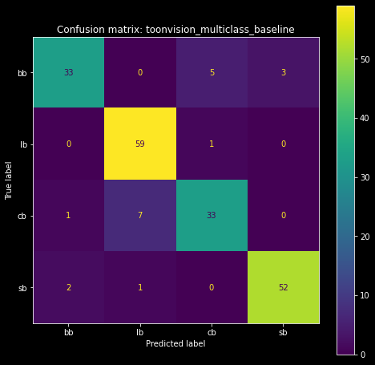
        </td>
        <td style="width:50.5%;">
            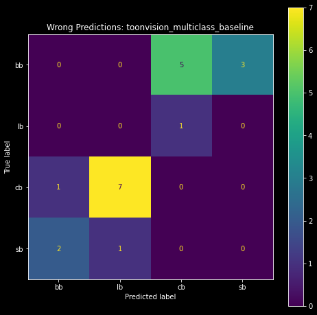
        </td>
    </tr>
    <tr >
        <td>
            <span style="text-align:center; display: block; margin-bottom: 2ch;margin-top: 0.5ch;">
                <small>
                    <i>Baseline model's confusion matrix</i>
                </small>
            </span>
        </td>
        <td>
            <span style="text-align:center; display: block; margin-bottom: 2ch;margin-top: 0.5ch;">
                <small>
                    <i>Baseline model's wrong predictions as a confusion matrix</i>
                </small>
            </span>
        </td>
    </tr>
</table>

We see that the most incorrect predictions are Cashbots predicted as Lawbots (7), and Bossbots predicted as Cashbots (5).
Surprisingly, the model has trouble classifying Cashbots.
I was wholly expecting the top-right and bottom-left cells - Bossbots predicted as Sellbots and vice-versa, respectively - to be lit up.
It seems like the baseline model is capable of differentiating between Bossbot and Sellbot suits.

Let's take a peek at the precision, recall, and F1-scores of each class.

#### Precision, recall, and F1-score

Using the confusion matrix, we can derive the precision, recall, and F1-score for each class.
Fortunately, scikit-learn simplified the calculations into a single function called `classification_report`.

If you're unfamiliar with these three performance measures, please read my previous article about [performance measures in classification problems][classification_performance_measures].

```python
>>> from sklearn.metrics import classification_report
>>> classification_report(onehot_to_suit(test_labels), preds_str)
              precision    recall  f1-score   support

          bb       0.92      0.80      0.86        41
          cb       0.85      0.80      0.83        41
          lb       0.88      0.98      0.93        60
          sb       0.95      0.95      0.95        55

    accuracy                           0.90       197
   macro avg       0.90      0.88      0.89       197
weighted avg       0.90      0.90      0.90       197
```

Let's break down the output.
First, we have four columns: precision, recall, F1-score, and support.
The first three columns are self-explanatory.
The fourth column, "support", is the number of samples in the test set.
These values match the values seen in our `plot_datasets_suits()` function, as seen in the figure's green boxes below.

<figure class="center">
    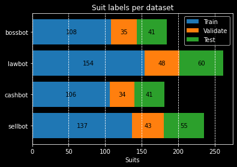
    <figcaption>Samples per dataset, grouped by suits</figcaption>
</figure>

The following four rows provide class-specific insight into the model's performance

```
    precision    recall  f1-score   support

bb       0.92      0.80      0.86        41
cb       0.85      0.80      0.83        41
lb       0.88      0.98      0.93        60
sb       0.95      0.95      0.95        55
```

Each row contains the precision, recall, F1-score, and sample size for each of the four classes: Bossbot, Cashbot, Lawbot, and Sellbot.
The highlights in this section are the low recall and F1-scores of `bb` and `cb`.
I suspect the model's low performance is due to the relatively smaller sample sizes of the two classes (41 vs 55 and 60).

Lastly, we have the remaining three rows: accuracy, macro average, and weighted average.

```
              precision    recall  f1-score   support

    accuracy                           0.90       197
   macro avg       0.90      0.88      0.89       197
weighted avg       0.90      0.90      0.90       197
```

Accuracy is straightforward, although it's rounded up to two decimal places - it should be 0.8984.

The macro average is the average value of precision, recall, and F1-score for all classes.
For instance, the macro precision average of 0.90 is the calculated as `(p_bb + p_cb + p_lb + p_sb) / 4`, where `p_*` are the precision values for each class.

The weighted average is the average of the precision, recall, and F1-score weighted by the sample size: `(p_bb * 41 + p_cb * 41 + p_lb * 60 + p_sb * 55) / 197`.
It considers the imbalance in the dataset, although the scores don't change much as a result.

Ideally, we would like to have a model with higher precision and recall scores and an F1-score nearing 1.0.
Let's see if we can do that.

---
## Training the optimized model

We can now fine-tune and optimize our model.
Remember, the goal is to create a smaller model that performs better than the baseline model.
The full details of this process are covered in my hyperparameter optimization [article][keras_tuner_tensorboard].

### Keras Tuner

`KerasTuner` is a tool that automates the hyperparameter optimization process.
Hyperparameters include the model's layers, layer sizes, and optimizer, among other things.
We will use this tool and save time from manually tuning the model and comparing the results.

First, we must write a function to define the model with various hyperparameter values.
We'll call the function `model_builder` and pass it a [HyperParameter](https://keras.io/api/keras_tuner/hyperparameters/) object, `hp`, as an argument.

We use the `hp` object to define the model's hyperparameter search space.
For instance, in the first Conv2D layer we use `hp.Int` to restrict the filter search space to 4, 8, 12, or 16.
In the same layer, we also use `hp.Choice` to restrict the kernel size search space to either 3 or 5.

```python
def model_builder(hp):
    model = keras.Sequential(
        [
            # Input and augmentation layers
            keras.layers.Rescaling(1.0 / 255),
            keras.layers.RandomFlip("horizontal"),

            # Block 1: Conv2D -> MaxPool2D -> MaxPool2D -> Dropout
            keras.layers.Conv2D(
                filters=hp.Int("conv_1_filters", min_value=4, max_value=16, step=4),
                kernel_size=hp.Choice("conv_1_kernel_size", values=[3, 5]),
                activation="relu",
                padding="same",
            ),
            keras.layers.MaxPooling2D(
                pool_size=hp.Int("pool_1_size", min_value=2, max_value=4, step=1),
            ),
            # Min value == 1 will void the second pooling layer
            keras.layers.MaxPooling2D(
                pool_size=hp.Int("pool_2_size", min_value=1, max_value=4, step=1),
            ),
            keras.layers.Dropout(
                rate=hp.Float("dropout_1_rate", min_value=0.0, max_value=0.9, step=0.1),
            ),
            ...  # Repeat for Block 2 (omitted for brevity)

            # Output layer
            keras.layers.Flatten(),
            keras.layers.Dense(units=4, activation="softmax"),
        ]
    )
    model.compile(
        optimizer=tf.keras.optimizers.Adam(
            learning_rate=hp.Choice("learning_rate", values=[1e-2, 1e-3, 1e-4])
        ),
        loss=tf.keras.losses.SparseCategoricalCrossentropy(),
        metrics=[tf.keras.metrics.SparseCategoricalAccuracy()],
    )
```

Then we'll pass the model builder function into the `keras_tuner.RandomSearch` constructor.
Random search is the least efficient search, but it provides valuable insights into the whereabouts of optimal hyperparameter values.
Refer to my KerasTuner [article][keras_tuner_tensorboard] for more information about efficient search algorithms, such as `Hyperband` or `BayesianOptimization` search.

Each trial of the search is a separate model with different hyperparameter values.
We can adjust the `max_trials` argument to increase or decrease the number of searches.
Given that this is the first search, I recommend increasing `max_trials` to a large number and decreasing `executions_per_trial` to 1.
This will provide a larger sample of hyperparameter values to analyze in TensorBoard.

```python
from keras_tuner import RandomSearch

tuner = RandomSearch(
    hypermodel=model_builder,
    objective="val_loss",
    max_trials=100,
    executions_per_trial=1,  # Increase to reduce variance of the results
    directory="models",
    project_name="tuned_multiclass_randomsearch",
    seed=42,
)
```

Finally, we'll launch the tuning process and save the results to `./tb_logs/randomsearch`.

We want a smaller model, so we must take into consideration how much time it will take to train.
Larger models can overfit in as little as 5-10 epochs.
Smaller models tend to take longer to converge because of how relatively few parameters they have.

We'll set the number of epochs to 75 and allow the models more time to train.
Hopefully, this will cause the majority of our highest-performing models to have a smaller number of parameters.

```python
import tensorflow as tf

tuner.search(
    train_images,
    train_labels,
    epochs=75,
    batch_size=64,
    validation_data=(val_images, val_labels),
    verbose=1,
    callbacks=[
        tf.keras.callbacks.EarlyStopping(
            monitor="val_loss", patience=3, restore_best_weights=True
        ),
        tf.keras.callbacks.TensorBoard("./tb_logs/randomsearch/"),
    ],
)
```

This specific search will take about 30-40 minutes to complete.
Following the random search, we'll review the highest performing parameters, tighten the search space, and then launch a more efficient `Hyperband` or `BayesianOptimization` search.
Let's see what the tuning results can tell us about the most optimal hyperparameter values.

### Tuning results

After 4 hours of repeated searching, tightening the search space, and training, we have a model with only 6,032 parameters!
The model architecture is the same as the baseline model, but the hyperparameters are tuned to achieve higher performance.

```
Model: "toonvision_multiclass_tuned"
_________________________________________________________________
 Layer (type)                Output Shape              Param #
=================================================================
 random_flip_1 (RandomFlip)  (None, 600, 200, 3)       0
 rescaling_1 (Rescaling)     (None, 600, 200, 3)       0
 conv2d_1 (Conv2D)           (None, 600, 200, 16)      448
 max_pooling2d_1             (None, 200, 66, 16)       0
 max_pooling2d_2             (None, 100, 33, 16)       0
 dropout_1 (Dropout)         (None, 100, 33, 16)       0
 conv2d_2 (Conv2D)           (None, 100, 33, 12)       1740
 max_pooling2d_2             (None, 50, 16, 12)        0
 max_pooling2d_3             (None, 16, 5, 12)         0
 flatten_1 (Flatten)         (None, 960)               0
 dropout_2 (Dropout)         (None, 960)               0
 dense_1 (Dense)             (None, 4)                 3844
=================================================================
Total params: 6,032
Trainable params: 6,032
Non-trainable params: 0
_________________________________________________________________
```

### Wrong predictions

<figure class="right" style="width:30%;">
    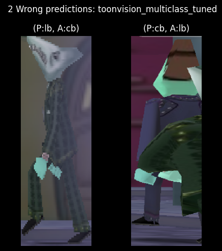
    <figcaption>Tuned model's wrong predictions</figcaption>
</figure>

The downside of small models is that their performance greatly varies based on their initial random weight values.
If we were to train a small model 10 times, each time with a different random weight initialization, the model would produce vastly different results.

Fortunately, the first training run produced a model with only two wrong predictions.
To be fair to the model, the second wrong prediction correctly identified the Cog in the foreground.
I should remove this sample from the dataset...
The first wrong prediction, however, will be looked at in depth in the following sections.

Subsequent training results ranged from 5 to 50 wrong predictions!
Sometimes the model could barely predict an entire class of images correctly.

The confusion matrices below visualize the predictions of the best and worst models.
The matrix on the left shows the predictions of the best model, and the matrix on the right shows the predictions of the worst model.
We can see the best model made only two wrong predictions - one Cashbot classified as a Lawbot and vice-versa.
The worst model, however, made a plethora of wrong predictions.
Most notably, it incorrectly classified 35 Cashbots as Lawbots!

<!-- TODO Correct the captions, and left figure's title -->
<table style='width:100%;'>
    <tr>
        <td style='width:50%;'>
            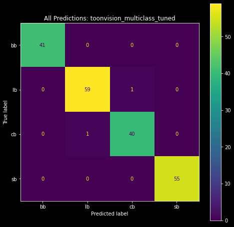**
        </td>
        <td style='width:50%;'>
            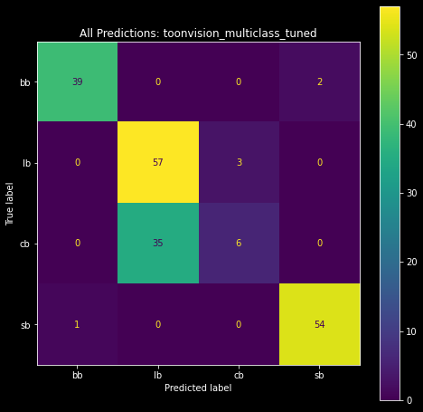
        </td>
    </tr>
    <tr >
        <td>
            <span style='text-align:center; display: block; margin-bottom: 2ch;margin-top: 0.5ch;'>
                <small>
                    <i>Good confusion matrix: 2 wrong predictions</i>
                </small>
            </span>
        </td>
        <td>
            <span style='text-align:center; display: block; margin-bottom: 2ch;margin-top: 0.5ch;'>
                <small>
                    <i>Bad confusion matrix: 35 Cashbots predicted as Lawbots</i>
                </small>
            </span>
        </td>
    </tr>
</table>

Enough with the confusion matrices.
Let's move on and look at the model's least confident predictions.

### Confidence levels

Recall that the model's output layer produces a probability distribution as a result of the softmax activation function.
The index of the highest probability is the predicted class.
For example, if we're given the probability distribution [0.1, 0.2, 0.6, 0.1], the predicted class is 2.

Using `matplotlib`, we can create [stacked horizontal bar charts](https://matplotlib.org/stable/gallery/lines_bars_and_markers/horizontal_barchart_distribution.html) and visualize the confidence levels of the model's predictions.
We can derive the lowest confidence levels, and their corresponding samples, by sorting the predictions by the lowest maximum probability.
Below is a stacked bar chart of the 10 least confident predictions.
Following the bar chart are the respective top 5 least confident samples.

<figure class="center" style="width:90%;">
    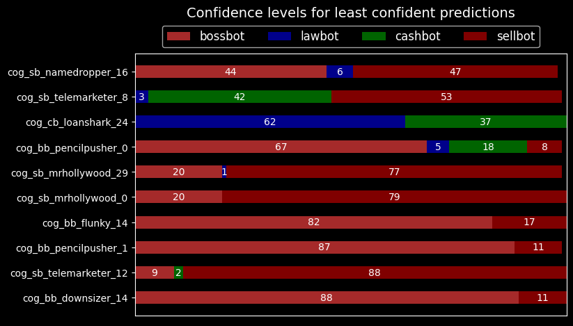
    <figcaption>Model's 10 least confident predictions</figcaption>
</figure>

The model is not confident in classifying Bossbots or Sellbots.
We can see the lack of confidence in the first sample image below.
The model correctly classifies the Sellbot with 44% confidence as a Bossbot, 6% as a Lawbot, and 47% as a Sellbot.

The second sample is more peculiar.
It correctly classifies the Sellbot with 53% confidence against a 42% confidence as a Cashbot.
I'm not sure where the model sees a Cashbot in that image, though.
Maybe the gray sliver in the middle of the image is a Cashbot?

<!-- TODO: Add image_fp titles to each image -->
<figure class="center" style="width:90%;">
    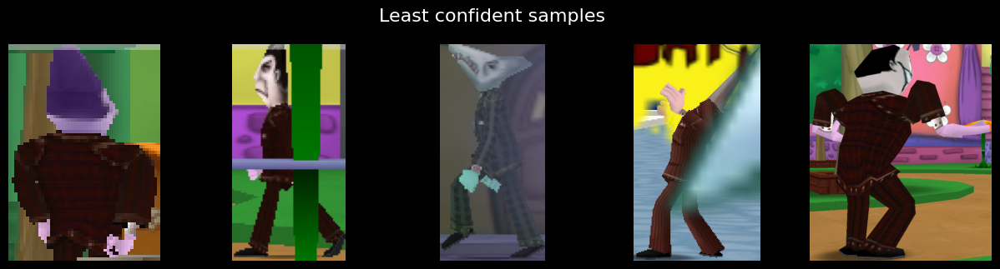
    <figcaption>Model's 5 least confident samples</figcaption>
</figure>

Let's make some heatmaps and visualize what the model sees in the wrong and least confident predictions.

---
## Model interpretation and visualization

Neural networks are considered magical, mathematical black boxes.
Convnets are quite the opposite.
We can visualize convnet activations - intermediate layer outputs - as heatmaps and visualize what a model sees in a sample.
These heatmaps are referred to as *class activation maps* (CAMs).

### Class activation heatmaps

Class activation maps are useful for understanding what parts of an image led to the predicted class.
This helps model authors debug wrong predictions and characterize the model's performance on any given image.

The technique involves scoring subsections of the sample based on how much they activate a class's feature detectors. We average the score across all feature maps to generate a heatmap of the sample, where the hotter the pixel, the more activation of the predicted class. Lastly, we superimpose the heatmap onto the sample to visualize the activation - visualize what parts of the image activate the class. The grid below shows heatmaps and superimposed images for the Bossbot, Lawbot, Cashbot, and Sellbot classes, respectively.

<figure class="center" style="width:60%;">
    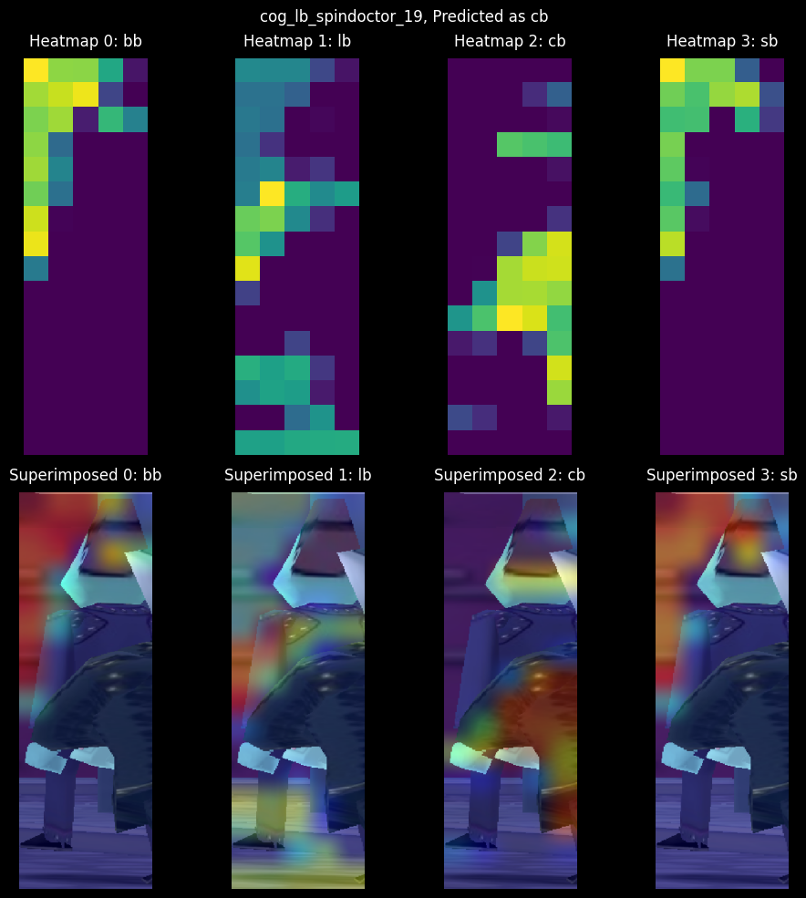
    <figcaption>CAM of all classes for cog_lb_spindoctor_19</figcaption>
</figure>

The correct class is Lawbot (lb), but the model predicted Cashbot (cb) with 97% confidence against a 2% Lawbot confidence!
Heatmap 1 shows the expected target's activations; they're highly activated on the Spin Doctor, but it's not enough to correctly identify the class.
Taking a look at Heatmap 2, the model displays high activations in the middle and right sides of the image.
These activations overlay the Cashbot's arm, which leads to the model correctly identifying the arm as a Cashbot.
All in all, it's a poor sample.
Let's look at the CAMs for the other wrong prediction.

<figure class="center" style="width:60%;">
    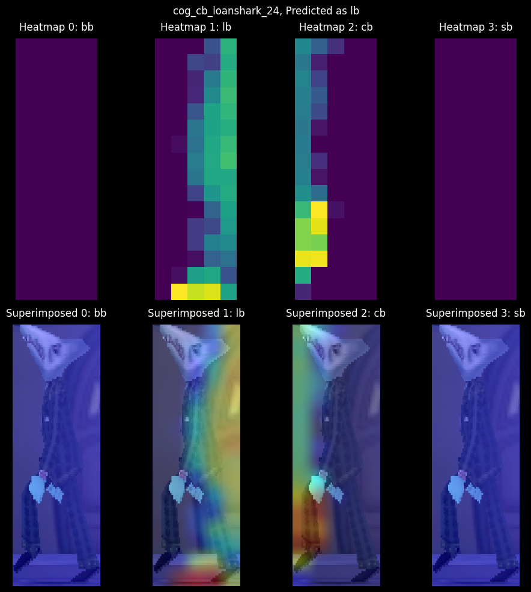
    <figcaption>CAM of all classes for cog_cb_loanshark_24</figcaption>
</figure>

Recall that this Loanshark sample had a 62/37 confidence split between the Lawbot and Cashbot classes, respectively.
Interestingly, the CAMs show zero activations in the Bossbot and Sellbot classes.
More interesting is the almost even split in activations between the Lawbot and Cashbot classes.

It seems the foggy occlusion in Donald's Dreamland discolored the Cog's suit, which led to high Lawbot activations and the model incorrectly identifying the Cog as a Lawbot.
Note how the model is highly attentive to the Cog's leg in the Cashbot activation map; the fog is not affecting the leg, and therefore the model correctly identifies the Cog's leg as a Cashbot.
We can address this issue by adding additional samples of Cogs in fog.
But we're not going to do that here.
Rather, I'll leave with one last peculiar CAM example.


<figure class="center" style="width:60%;">
    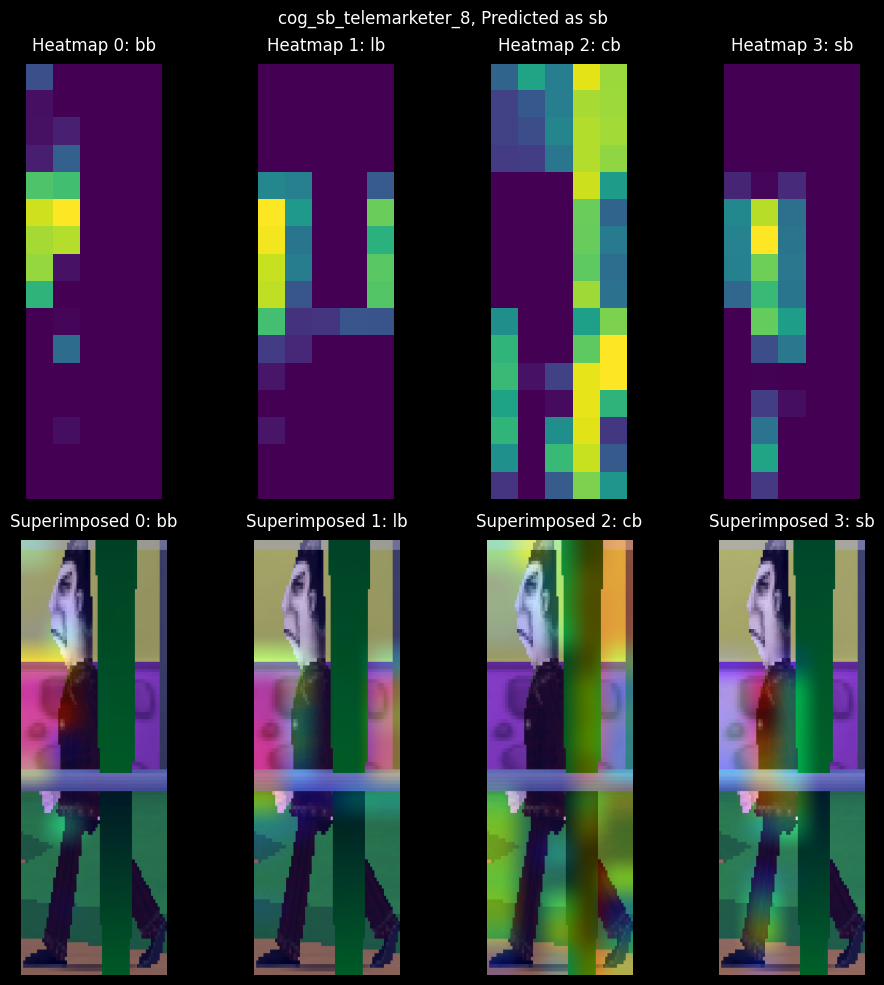
    <figcaption>CAM of all classes for cog_sb_telemarketer_8</figcaption>
</figure>

This sample had a 4/42/53 confidence split between the Lawbot, Cashbot, and Sellbot classes, respectively.
The model correctly identified the sample's target class, albeit with little confidence.
Surprisingly, the model was extremely confident in not identifying a Bossbot, despite the suit color similarities between Bossbots and Sellbots.

Why do you think the model was confident about the Cashbot class despite none of the activations landing on the Cog's suit?
*HINT: Refer to the class imbalances in the [Suits per Street chart](#dataset-balance)*.

---
## Conclusion

We've made an accurate and small convnet model capable of distinguishing between the four Cog suits.
Thanks to Keras-Tuner and Tensorboard, we compared different models and hyperparameters to create the most optimal model for our problem.
Furthermore, we learned about classification performance metrics, such as recall, precision, F1-score, and how they excel over accuracy in imbalanced datasets.
Finally, we visualized the model's activations and superimposed heatmaps (CAMs) to understand what the model sees in each sample.

### Next steps

The next step is to create a real-time object detection model.
I'm hoping to use this model to grow and balance the dataset by automatically labeling and extracting objects from images.
The growing dataset will be used to re-train and improve the binary and multiclass models.
We'll even use the dataset to create a 32-class Cog classifier.

These next steps will teach me ML pipeline skills necessary for expanding datasets and continuously improving models.
I can transfer these skills to expedite the image segmentation process, allowing me to teach a model to identify ToonTown's streets, roads, and obstacles.
OmniToon will be walking around ToonTown soon!

[classification_performance_measures]: https://fars.io/performance_classification/
[categorical_accuracy]: https://www.tensorflow.org/api_docs/python/tf/keras/metrics/CategoricalAccuracy
[precision]: https://www.tensorflow.org/api_docs/python/tf/keras/metrics/Precision
[recall]: https://www.tensorflow.org/api_docs/python/tf/keras/metrics/Recall
[keras_tuner_tensorboard]: https://fars.io/keras_tuner_tensorboard/