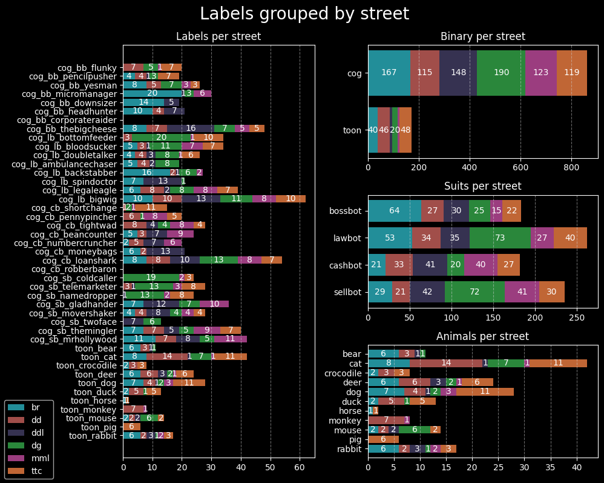
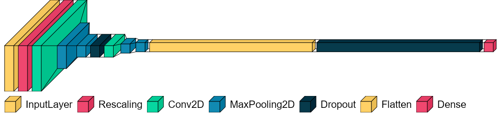
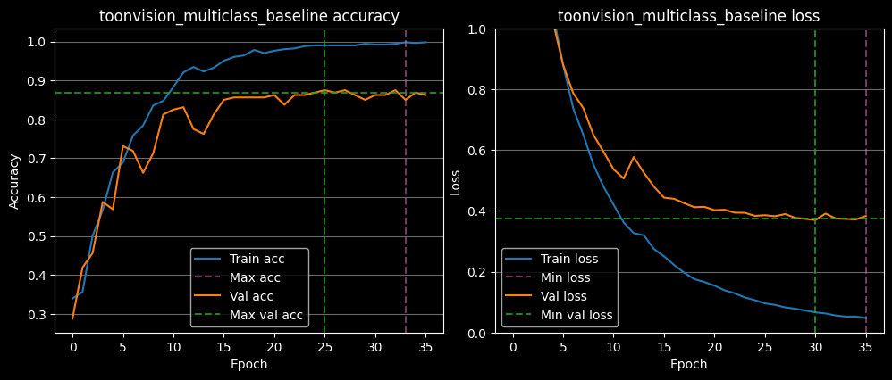
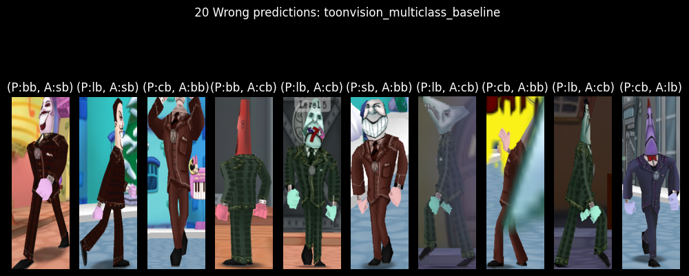

<title>ToonVision: Multiclass Classification</title>

# ToonVision - Multiclass Classification

This article is the second in a series on **ToonVision**.
The [first article](https://fars.io/toonvision/classification/) covered the basics of classification and binary classification of Toons and Cogs.
This article covers multiclass classification of Cogs: Cog suits (4 unique suits) and Cog entities (32 unique Cogs).

After reading this article, we'll have a better understanding of how to

- deal with a model overfitting to a small, imbalanced dataset
- utilize image augmentation and dropout to improve the model's generalization capability
- compare different models, optimizers, and hyperparameters
- automatically optimize hyperparameter values with Keras-tuner
- use classification performance measures such as precision, recall and f1-score
- interpret and visualize what the model is learning with confusion matrices

The following article will cover image segmentation of ToonTown's streets, roads, Cogs, and Cog buildings.
Afterwards, we'll implement real-time object detection and, if possible, image segmentation.
For now, let's focus on multiclass classification.

<details>
    <summary>Table of Contents</summary>

- [ToonVision - Multiclass Classification](#toonvision---multiclass-classification)
    - [ToonVision](#toonvision)
    - [Classification](#classification)
        - [Multiclass classification](#multiclass-classification)
    - [The ToonVision dataset](#the-toonvision-dataset)
        - [Dataset considerations](#dataset-considerations)
        - [Why does the street matter?](#why-does-the-street-matter)
        - [Dataset balance](#dataset-balance)
            - [Why does The Brrrgh have the most Bossbot samples?](#why-does-the-brrrgh-have-the-most-bossbot-samples)
            - [Why are there so many Lawbot and Sellbot samples in Daisy's Garden?](#why-are-there-so-many-lawbot-and-sellbot-samples-in-daisys-garden)
        - [Creating the datasets](#creating-the-datasets)
            - [Splitting images into train, validate, and test sets](#splitting-images-into-train-validate-and-test-sets)
    - [Compiling the model](#compiling-the-model)
        - [Loss function](#loss-function)
        - [Metrics](#metrics)
            - [Accuracy](#accuracy)
            - [Precision](#precision)
            - [Recall](#recall)
        - [Optimizer](#optimizer)
        - [Callbacks](#callbacks)
            - [EarlyStopping callback](#earlystopping-callback)
            - [Tensorboard callback](#tensorboard-callback)
        - [Defining the model](#defining-the-model)
    - [Training the baseline model](#training-the-baseline-model)
        - [Baseline loss and accuracy plots](#baseline-loss-and-accuracy-plots)
        - [Baseline wrong predictions](#baseline-wrong-predictions)
        - [Baseline confusion matrix](#baseline-confusion-matrix)
    - [Training the optimized model](#training-the-optimized-model)
        - [Keras Tuner](#keras-tuner)
        - [Preventing overfitting](#preventing-overfitting)
        - [Wrong predictions](#wrong-predictions)
        - [Baseline comparison: Training](#baseline-comparison-training)
        - [Baseline comparison: Evaluation](#baseline-comparison-evaluation)
    - [Model interpretation and visualization](#model-interpretation-and-visualization)
        - [Intermediate convnet outputs (intermediate activations)](#intermediate-convnet-outputs-intermediate-activations)
        - [Convnet filters](#convnet-filters)
        - [Class activation heatmaps](#class-activation-heatmaps)
    - [References](#references)
</details>

## ToonVision

ToonVision is my computer vision project for teaching a machine how to see in [ToonTown Online](https://en.wikipedia.org/wiki/Toontown_Online) - an MMORPG created by Disney in 2003.
The ultimate goal is to teach a machine (nicknamed **OmniToon**) how to play ToonTown and create a self-sustaining ecosystem where the bots progress through the game together.

---
## Classification

As discussed in the [previous article](https://fars.io/toonvision/classification/#classification), image classification is the process of assigning a label to an input image.
For instance, given a dog-vs-cat classification model and an image of a Pomeranian, the model will predict that the image is a dog.

There are a few variants of the image classification problem: binary, multiclass, multi-label, and so on.
We'll focus on [multiclass classification](https://fars.io/toonvision/classification/#multiclass-classification) in this article.

### Multiclass classification

Multiclass classification is a problem in which the model predicts which class an input image belongs.
For instance, the model could predict that an animal belongs to the class of dogs, cats, rabbits, horses, or any other animal.

We're building a model to predict which Cog suit a Cog belongs to - a 4-class classification problem.
We'll push the model further by also predicting which Cog entity a Cog belongs to - a 32-class classification problem.
Both multiclass classification problems require us to improve the ToonVision dataset.
The current dataset is imbalanced and does not contain samples of all the Cog suits and entities.
Let's look at how we can improve the dataset in the next section.

---
## The ToonVision dataset

### Dataset considerations

We'll tweak the existing dataset considerations to focus on balancing the dataset's Cog entity samples.
The current Cog dataset contains two glaring problems:

1. The samples do not account for *where* - on *which street* - the Cog is located.
1. There are no samples of the two highest-ranked Cogs

To address problem #1, the ToonVision dataset now requires a balanced number of samples from each of the 6 uniquely designed streets: The Brrrgh, Daisy's Garden, Donald's Dreamland, Donald's Dock, Minnie's Melodyland, and ToonTown Central.
Given that there are 6 streets, the sample images per Cog will increase from 20 to 30; we need 5 images of a Cog from each street.

We'll leverage Cog invasions to ensure we meet the new dataset requirement because some Cogs are not present in certain streets *unless* there's an ongoing invasion.
Cog invasions will solve both problems moving forward.

### Why does the street matter?

Each street in ToonTown has a unique design - colors, houses, floors, obstacles - resulting in unique backgrounds for our extracted objects.
In this case, our extracted objects are Cogs.
If we have a diverse dataset of Cogs with different backgrounds, we can teach our model to better recognize Cog features rather than background features.
Therefore, it's important to take screenshots of Cogs from each street so our model can generalize Cog features across all streets.

### Dataset balance

The Cog vs Toon dataset is imbalanced with a majority of the dataset belonging to the Cog class.
However, the Cog dataset is mostly balanced.
Our goal is ~30 samples per Cog entity with at least 5 samples per street.
We have achieved the 30 samples per Cog entity requirement, but we're not meeting the 5 samples per street requirement.

<figure class="center" style="width:95%">
    
    <figcaption>Dataset balance per street</figcaption>
</figure>

There image above shows two notable imbalances.
In the Suits per street graph, we can see:

1. Daisy's Garden (DG) has the most Lawbot and Sellbot samples.
2. The Brrrgh (BR) has the most Bossbot samples.

#### Why does The Brrrgh have the most Bossbot samples?

The street I frequented to acquire samples in The Brrrgh was [Walrus Way](https://toontown.fandom.com/wiki/Walrus_Way), where the Cog presence is split [90%, 10%] between Bossbots and Lawbots, respectively.
It's no surprise that the majority of the samples from the Brrrgh street are Bossbot samples.

#### Why are there so many Lawbot and Sellbot samples in Daisy's Garden?

The Lawbot imbalance is because the street I visited was majority Lawbot and I took too many screenshots of Bottom Feeders.
The Sellbot imbalance, on the other hand, is due to the Sellbot HQ being located near Daisy's Garden.
As a result, the majority of Sellbot Cogs reside in the [streets of DG](https://toontown.fandom.com/wiki/Daisy_Gardens#Streets).

I would not have noticed either of these imbalances without charting the samples per street.
Moving forward, we'll be more conscious of street imbalance and take screenshots of Cogs from other streets.

### Creating the datasets

We'll create simple tuples of images and labels instead of `Keras.dataset` objects.

```python
def create_suit_datasets(
    split_ratio: list[float, float, float] = None
) -> tuple[tuple[np.array[float], np.array[float]]]:
    """Create multiclass Cog suit datasets for training, validation, and testing

    Args:
        split_ratio (list[float, float, float], optional): Train/val/test split. Defaults to None.

    Returns:
        tuple[tuple, tuple, tuple]: Train, validate, and test datasets. Each tuple contains
                                    a numpy array of images and a numpy array of labels.
    """
    if split_ratio:
        split_data(split_ratio=split_ratio)

    data_dirs = [TRAIN_DIR, VALIDATE_DIR, TEST_DIR]
    suits = get_suits_from_dir(directories=data_dirs)
    result = {}
    for dir_name in data_dirs:
        filepaths, labels = suits[dir_name]
        labels = np.asarray(suit_to_integer(labels), dtype=np.float32)
        images = np.asarray(
            [get_img_array_from_filepath(fp) for fp in filepaths], dtype=np.float32
        )
        result[dir_name] = (images, labels)

    return (result[TRAIN_DIR], result[VALIDATE_DIR], result[TEST_DIR])
```

The datasets are now ready to be used by the model.
We can retrieve the datasets, and separate the images and labels, as follows:

```python
# Split unsorted images into train, validate, and test sets
ds_train, ds_validate, ds_test = create_suit_datasets(split_ratio=[0.6, 0.2, 0.2])
# Create the dataset
train_images, train_labels = ds_train
val_images, val_labels = ds_validate
test_images, test_labels = ds_test
```

#### Splitting images into train, validate, and test sets

Previously, we split the entire dataset into 60%/20%/20% train/validate/test sets.
This resulted in unbalanced suit samples in each set.
For instance, the Bossbot suit samples would contain a disproportionate number of sample from Flunkies relative to other Bossbots.

To maintain balanced datasets for each Cog suit, we split each individual Cog entity using the 60/20/20 split.
This ensures a representative sample of each Cog entity.

---
## Compiling the model

Now that we've created the datasets, we can compile the model.
Compiling the model requires choosing a loss function, optimizer, and metrics to monitor the model's performance during training.

```python
ONEHOT = True

model.compile(
    loss=LOSS,
    optimizer=OPTIMIZER,
    metrics=METRICS,
)
```

### Loss function

Our model is classifying multiple classes, so we'll have to choose between `categorical_crossentropy` or `sparse_categorical_crossentropy`.
There's one small, but important difference between the two loss functions: `categorical_crossentropy` requires one-hot encoded labels whereas `sparse_categorical_crossentropy` requires integer labels.

```python
LOSS = (
    tf.keras.losses.SparseCategoricalCrossentropy()
    if not ONEHOT
    else tf.keras.losses.CategoricalCrossentropy()
)
```

Given that our labels are one-hot encoded, we'll utilize the `categorical_crossentropy` loss function during our model's training.
The decision to one-hot encode our labels stemmed from the desire to utilize [precision][precision] and [recall][recall] metrics.
More on these metrics in the following section.

### Metrics

We'll track three metrics during training: [categorical_accuracy][categorical_accuracy], [precision][precision], and [recall][recall].
These metrics measure the model's correctness and quality.

```python
METRICS = [
    tf.keras.metrics.SparseCategoricalAccuracy()
    if not ONEHOT
    else tf.keras.metrics.CategoricalAccuracy(),
]
if ONEHOT:
    METRICS += [
        tf.keras.metrics.Precision(),
        tf.keras.metrics.Recall()
    ]
```

The difference between each metric is crucial to understanding model performance - especially on imbalanced datasets like the ToonVision dataset.
To read more about the differences and benefits of each metric, please read my previous article about [performance measures in classification problems](https://fars.io/performance_classification/).

#### Accuracy

Accuracy is the percentage of correct predictions.
Keras contains two built-in metrics for multiclass classification tasks: `categorical_accuracy` for categorical labels (one-hot encoded) and `sparse_categorical_accuracy` for integer labels.

`categorical_accuracy` is best used as a performance measure when working with balanced datasets.
It's a misleading metric when used with imbalanced datasets because it cannot account for class imbalances.
Unfortunately for us, the ToonVision dataset is imbalanced, so we must find other metrics to work with.

#### Precision

Precision answers the question of "what proportion of predicted class labels actually belong to the predicted class?".
To make the question more relevant to our problem, "what proportion of predicted Bossbot labels actually belong to the Bossbot class?".

We often refer to precision as the model's reliability.
When precision is high, we can trust the model to correctly classify a class.

#### Recall

Recall answers the question of "what proportion of a specific label was correctly identified?".
Relating to our ToonVision dataset, "what proportion of Bossbot labels were correctly identified?".

Recall is a powerful performance measure when working with highly imbalanced datasets.
It shines at identifying rare classes.
For instance, imagine if our ToonVision dataset contained 400 Bossbot samples and only 40 Sellbot samples.
Optimizing our model's Sellbot recall would ensure that Sellbot samples do not get incorrectly labeled as something else.

### Optimizer

Just like the binary classifier, we'll be using the `Adam` optimizer.
Please refer to the [previous article](https://fars.io/toonvision/classification/#optimizer) for detailed information about this decision.

Reasoning tl;dr: The `Adam` optimizer is an adaptive variant of the stochastic gradient descent (`SGD`) algorithm.
It's an effective optimizer with strong performance on the ToonVision dataset.
Realistically, however, the optimizer should not significantly influence training results - only training time.

### Callbacks

We're using only two callbacks: [EarlyStopping](https://keras.io/api/callbacks/early_stopping/) and [TensorBoard](https://keras.io/api/callbacks/tensorboard/).
The code block below demonstrates how to initialize each callback.

```python
callbacks = [
    tf.keras.callbacks.EarlyStopping(
        monitor="val_loss",
        mode="min",
        patience=5,
        restore_best_weights=True
    ),
    tf.keras.callbacks.TensorBoard("./tb_logs/toonvision_multiclass/"),
]
```

#### EarlyStopping callback

`EarlyStopping` stops training when a monitored metric has stopped improving.
We're training our model to minimize the validation loss, therefore we monitor `val_loss` and set the mode to `min`.
If desired, we could even monitor accuracy, precision, or recall metrics - but we would set the mode to `max`.

The `restore_best_weights` argument ensures that the weights from the best epoch are restored upon training termination.
If False, the model weights are obtained form the last step and epoch of training.

Training is terminated when no improvement is seen after 5 epochs; this value can be adjusted in the `patience` argument.

#### Tensorboard callback

The `TensorBoard` callback allows us to utilize TensorBoard to visualize our model's training progress.
This callback logs events for TensorBoard, including:

- Metrics summary plots
- Training graph visualization
- Weight histograms
- Sampled profiling

Please refer to my [Keras-Tuner and TensorBoard article](https://fars.io/keras_tuner_tensorboard/#tensorboard) to learn more about the benefits of TensorBoard and see how it's used to evaluate model performance.

### Defining the model

The model is a simple CNN (convolutional neural network).
It takes as input a tensor of shape (600, 200, 3) and outputs a probability distribution (softmax) of the predicted labels.
The figure below displays the model's layers and their corresponding sizes.

<figure class="center" style="width:98%;">
    
    <figcaption>Model architecture, visualized with python package "visualkeras"</figcaption>
</figure>

The model's hidden, intermediate layers consist of two "blocks".
Each block contains, in order, a Conv2D layer and two MaxPooling2D layers.

```python
def make_multiclass(
    name: str = "", augmentation: keras.Sequential = None, dropout: float = 0.5,
) -> keras.Model:
    inputs = keras.Input(shape=(600, 200, 3))  # Height, width, channels
    if augmentation:
        x = augmentation(inputs)
    x = layers.Rescaling(1.0 / 255)(inputs)
    # Block #1
    x = layers.Conv2D(filters=4, kernel_size=3, activation="relu", padding="same")(x)
    x = layers.MaxPooling2D(pool_size=2)(x)
    x = layers.MaxPooling2D(pool_size=2)(x)
    x = layers.Dropout(dropout)(x)
    # Block #2
    x = layers.Conv2D(filters=8, kernel_size=3, activation="relu", padding="same")(x)
    x = layers.MaxPooling2D(pool_size=2)(x)
    x = layers.MaxPooling2D(pool_size=2)(x)
    x = layers.Flatten()(x)
    x = layers.Dropout(dropout)(x)
    outputs = layers.Dense(units=4, activation="softmax")(x)
    model = keras.Model(name=name, inputs=inputs, outputs=outputs)
    return model
```

<details>
    <summary>Model summary</summary>

    Model: "toonvision_multiclass_baseline"
    _________________________________________________________________
    Layer (type)                Output Shape              Param #
    =================================================================
    input_1 (InputLayer)         [(None, 600, 200, 3)]     0
    rescaling (Rescaling)        (None, 600, 200, 3)       0
    conv2d (Conv2D)              (None, 600, 200, 4)       112
    max_pooling2d                (None, 300, 100, 4)       0
    max_pooling2d_1              (None, 150, 50, 4)        0
    dropout (Dropout)            (None, 150, 50, 4)        0
    conv2d_1 (Conv2D)            (None, 150, 50, 8)        296
    max_pooling2d_2              (None, 75, 25, 8)         0
    max_pooling2d_3              (None, 37, 12, 8)         0
    flatten (Flatten)            (None, 3552)              0
    dropout_1 (Dropout)          (None, 3552)              0
    dense (Dense)                (None, 4)                 14212

    =================================================================
    Total params: 14,620
    Trainable params: 14,620
    Non-trainable params: 0
    _________________________________________________________________
</details>

Notably, the multiclassification model has less parameters than the previous binary classification model.
My goal is to learn how to intuitively produce small, yet, effective, models.
I believe this model size can be reduced while still improving performance.

I opted for two MaxPooling2D layers in each block because the main class differentiation in the ToonVision Cog dataset is the suit color.
In using two MaxPooling2D layers, I hope the model will easily discern the color differences and correctly label the samples.
We'll put my theory to the test as we proceed!

---
## Training the baseline model

Before we draw conclusions and fine-tune our model architecture, we must develop a simple baseline.
After training the baseline model, we can tweak hyperparameters such as number of layers, layer sizes, learning rates, batch sizes, etc.
First, see what our baseline can do!

The code block below first initializes our baseline model as `model_baseline` and then trains it for 100 epochs.
Note how the model does not utilize optimizations such image augmentations or dropout.

```python
model_baseline = make_multiclass_model(
    name="toonvision_multiclass_baseline",
    augmentation=None,
    dropout=0.5
)
history = model_baseline.fit(
    train_images,
    train_labels,
    validation_data=(val_images, val_labels),
    epochs=100,
    batch_size=BATCH_SIZE,
    verbose=0,
    callbacks = [
        tf.keras.callbacks.EarlyStopping(
            monitor="val_loss",
            mode="min",
            patience=5,
            restore_best_weights=True
        ),
        tf.keras.callbacks.TensorBoard("./tb_logs/toonvision_multiclass/"),
    ],
)
```

Remember how we're using the `EarlyStopping` callback to terminate training early when no more performance improvements are shown?
No improvement was shown in the `validation_loss` metric over 5 epochs.
Therefore, the baseline model's training stopped after 35 epochs.

### Baseline loss and accuracy plots

The model's training progress can be seen plotted below.
We can see steady converging of the training loss, which is good.
The high validation loss score is of concern, though.

<figure class="center" style="width:90%;">
    
    <figcaption>Baseline model's training accuracy and loss</figcaption>
</figure>

The code block below demonstrates how to retrieve the peak accuracy and minimum loss values.
We see the training accuracy reaches 99.8% at 33 epochs, but the validation accuracy only reaches 87.5% at 25 epochs.
These are signs of overfitting to the training data and underfitting to the validation data.

The loss converges to 0.04 on the training set after 35 epochs, but only 0.37 on the validation set after 30 epochs.
Given the large `validation_loss` value, the model clearly has room for improvement.

```python
>>> h = history.history
>>> max(h['categorical_accuracy']), np.argmax(h['categorical_accuracy'])
(0.998019814491272, 33)

>>> max(h['val_categorical_accuracy']), np.argmax(h['val_categorical_accuracy'])
(0.875, 25)

>>> min(h['loss']), np.argmin(h['loss'])
(0.04749872535467148, 35)

>>> min(h['val_loss']), np.argmin(h['val_loss'])
(0.3700076937675476, 30)
```

### Baseline wrong predictions

I anticipated a significant number of Bossbots predicted as Sellbots, and vice-versa, because of the similarity in their suit colors (brown vs. maroon).
But, there's no obvious trend of wrong predictions here.

<figure class="center" style="width:90%;">
    
    <figcaption></figcaption>
</figure>

The model totaled 20 wrong predictions out of 197 test images, resulting in a whopping 89.84% accuracy.
Given how imbalanced our dataset is, however, accuracy as a performance measure is quite misleading.
Let's look at the model's confusion matrix, precision, and recall metrics instead.

### Baseline confusion matrix

---
## Training the optimized model

### Keras Tuner

`KerasTuner` is a tool for fine-tuning a model's hyperparameters.
Hyperparameters include the model's layers, layer sizes, and optimizer.
We can leverage this tool to find the best hyperparameters for our model instead of manually tuning the model and comparing the results.

### Preventing overfitting

### Wrong predictions

### Baseline comparison: Training

### Baseline comparison: Evaluation

---
## Model interpretation and visualization

### Intermediate convnet outputs (intermediate activations)

### Convnet filters

### Class activation heatmaps

---
## References

[categorical_accuracy]: https://www.tensorflow.org/api_docs/python/tf/keras/metrics/CategoricalAccuracy
[precision]: https://www.tensorflow.org/api_docs/python/tf/keras/metrics/Precision
[recall]: https://www.tensorflow.org/api_docs/python/tf/keras/metrics/Recall